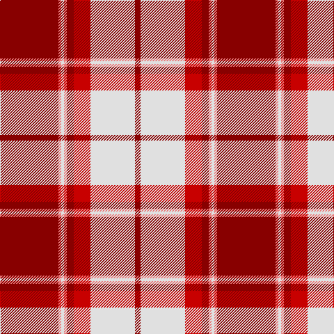

In pattern [RRWRRRWR](/stripes/rrwrrrwr/).

This was sourced from register-of-tartans.  It is a [8 stripe tartan](/stripes/stripes8/).

Original link https://www.tartanregister.gov.uk/tartanDetails.aspx?ref=2206

## Also known as

This cloth is also recorded under:

- Longniddry, Burgundy
- Longniddry, dress Burgundy

## Attestations

This cloth appears in 3 source records; the oldest owns this page.

- 01/01/2002 — Longniddry Burgundy (Dance) (register-of-tartans, [record](https://www.tartanregister.gov.uk/tartanDetails.aspx?ref=2206))
- pre 2002 — Longniddry, Burgundy (Dance) (tartans-authority, [record](http://www.tartansauthority.com/tartan-ferret/display/1651/))
- undated — Longniddry, dress Burgundy (weddslist, [record](http://www.weddslist.com/cgi-bin/tartans/pg.pl?source=sts))

## Register references

External register numbers recorded for this tartan.

- Scottish Register of Tartans: [2206](https://www.tartanregister.gov.uk/tartanDetails.aspx?ref=2206)
- Scottish Tartans Authority (ITI): 1651
- Scottish Tartans World Register: 1651

## Thread count
DR/84 LR4 LN4 LR4 DR10 R24 LN64 DR/8

## Palette
Each colour and the base-6 reference it is a variant of.

| Colour | Shade | Base |
|---|---|---|
| DR | <code style="background-color:#880000;">#880000</code> `oklch(39.4% 0.162 29.2)` <small>#880000</small> | R <code style="background-color:#CC0000;">#CC0000</code> |
| LN | <code style="background-color:#E0E0E0;">#E0E0E0</code> `oklch(90.7% 0.000 89.9)` <small>#E0E0E0</small> | W <code style="background-color:#F7F7F7;">#F7F7F7</code> |
| LR | <code style="background-color:#E87878;">#E87878</code> `oklch(70.0% 0.139 21.2)` <small>#E87878</small> | R <code style="background-color:#CC0000;">#CC0000</code> |
| R | <code style="background-color:#C80000;">#C80000</code> `oklch(52.3% 0.215 29.2)` <small>#C80000</small> | R <code style="background-color:#CC0000;">#CC0000</code> |

# Sample pattern

## Nearest tartans

The nearest existing variants by ΔTartan distance.

1. [Longniddry Dress, Red (Dance)](/setts/s8/r35db2w2db2r4r10w25r3~x2/) — ΔT 0.51
1. [Citylink Gold (Corporate)](/setts/s8/r25n2r3lo2r3n11w13lo1~x2/) — ΔT 0.93
1. [O'Meehan (Name)](/setts/s9/ly27k4w4r64w4r4k4r4k12~x2/) — ΔT 0.95
1. [Torridon, Cherry (Dance)](/setts/s7/r3r2db2r30w30db2w3~x2/) — ΔT 1.00
1. [Masai Shuka 14 (Artefact)](/setts/s8/r40w40k5w2k6w2k5w6~x2/) — ΔT 1.06
1. [MacFie Dress](/setts/s9/w1r12g2r2w16r2g2r12lo1~x4/) — ΔT 1.11
1. [FIRES Center of Excelence](/setts/s8/r50ly8k2w2k2ly8k22r3~x2/) — ΔT 1.22
1. [Hose #2](/setts/s8/r3r3lb23r3r3r23k2r3~x2/) — ΔT 1.23
1. [31, Tartan (The.. )](/setts/s9/db2r21db1w4db7w2db2w2r2~x2/) — ΔT 1.24
1. [Torridon, Burgundy (Dance)](/setts/s7/w3lg2w30r30n2r2lg3~x2/) — ΔT 1.24

## Neighbour map

Every grey dot is one of 14299 variants placed by the first two principal components of the ΔTartan feature space (44% of its variance). Red is this tartan; blue dots are its nearest — click one to open its page.

<svg viewBox="0 0 640 380" role="img" style="max-width:100%;height:auto;border:1px solid #e0e0e0;border-radius:4px;display:block" xmlns="http://www.w3.org/2000/svg"><image href="/nn/cloud.v1.png" width="640" height="380"/><a href="/setts/s8/r35db2w2db2r4r10w25r3~x2/"><circle cx="297.9" cy="122.1" r="4" fill="#3465a4"><title>Longniddry Dress, Red (Dance)</title></circle></a><a href="/setts/s8/r25n2r3lo2r3n11w13lo1~x2/"><circle cx="304.6" cy="128.0" r="4" fill="#3465a4"><title>Citylink Gold (Corporate)</title></circle></a><a href="/setts/s9/ly27k4w4r64w4r4k4r4k12~x2/"><circle cx="327.0" cy="109.6" r="4" fill="#3465a4"><title>O'Meehan (Name)</title></circle></a><a href="/setts/s7/r3r2db2r30w30db2w3~x2/"><circle cx="284.7" cy="126.3" r="4" fill="#3465a4"><title>Torridon, Cherry (Dance)</title></circle></a><a href="/setts/s8/r40w40k5w2k6w2k5w6~x2/"><circle cx="296.1" cy="125.8" r="4" fill="#3465a4"><title>Masai Shuka 14 (Artefact)</title></circle></a><a href="/setts/s9/w1r12g2r2w16r2g2r12lo1~x4/"><circle cx="309.4" cy="134.0" r="4" fill="#3465a4"><title>MacFie Dress</title></circle></a><a href="/setts/s8/r50ly8k2w2k2ly8k22r3~x2/"><circle cx="337.4" cy="107.2" r="4" fill="#3465a4"><title>FIRES Center of Excelence</title></circle></a><a href="/setts/s8/r3r3lb23r3r3r23k2r3~x2/"><circle cx="307.4" cy="149.7" r="4" fill="#3465a4"><title>Hose #2</title></circle></a><a href="/setts/s9/db2r21db1w4db7w2db2w2r2~x2/"><circle cx="347.6" cy="130.4" r="4" fill="#3465a4"><title>31, Tartan (The.. )</title></circle></a><a href="/setts/s7/w3lg2w30r30n2r2lg3~x2/"><circle cx="276.3" cy="128.5" r="4" fill="#3465a4"><title>Torridon, Burgundy (Dance)</title></circle></a><circle cx="301.7" cy="116.1" r="5" fill="#c00000"/></svg>

ID: /setts/s8/r42r2w2r2r5r12w32r4~x2/
