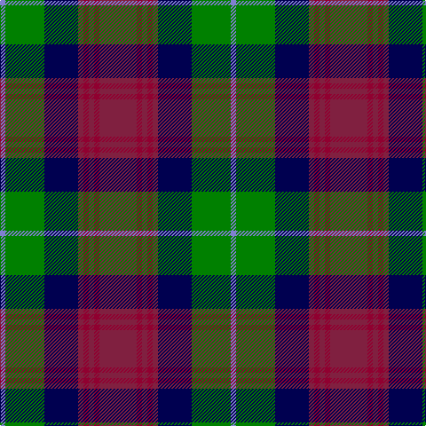

In pattern [BGBRRRRR](/patterns/bgbrrrrr/).

This was sourced from weddslist.  It is a [8 stripes tartan](/stripes/stripes8/).

Original link http://www.weddslist.com/cgi-bin/tartans/pg.pl?source=sts

## Thread count
B/6 G44 DB38 DR6 DRa6 DR6 DRa6 DR/42

## Palette
Each colour and its ΔE from the base-6 reference it is a variant of.

| Colour | Shade | Base | ΔE (OKLab) |
|---|---|---|---|
| B | <code style="background-color:#8080D0;">#8080D0</code> `#8080D0` | B <code style="background-color:#2C4084;">#2C4084</code> | 0.24 |
| DB | <code style="background-color:#000050;">#000050</code> `#000050` | B <code style="background-color:#2C4084;">#2C4084</code> | 0.20 |
| DR | <code style="background-color:#802040;">#802040</code> `#802040` | R <code style="background-color:#C80000;">#C80000</code> | 0.16 |
| DRa | <code style="background-color:#900030;">#900030</code> `#900030` | R <code style="background-color:#C80000;">#C80000</code> | 0.13 |
| G | <code style="background-color:#008000;">#008000</code> `#008000` | G <code style="background-color:#006400;">#006400</code> | 0.09 |

# Sample pattern

## Nearest tartans

The nearest existing variants by ΔTartan distance.

1. [Akins Clan (Personal)](/setts/s8/r42ra6r6ra6r6b38g44w6-b00008b-g008000-r800000-radc143c-w87cefa/) — ΔT 0.55
1. [Ryukoku University Heian JHS (Corp)](/setts/s10/r8k32ra10b16ra4ba4ra4ba4b16k6-b5c5c5c-ba780078-k101010-rb468ac-ra888888/) — ΔT 0.64
1. [Coffield-Limesand (Personal)](/setts/s9/b32k4g8k4ga8k24g32k4w8-b780078-g006818-ga604000-k101010-we0e0e0/) — ΔT 0.66
1. [Zangenberg (Personal)](/setts/s7/b4r4b32k34g32k4y4-b780078-g285800-k101010-rc80000-ye8c000/) — ΔT 0.68
1. [Heart of the Highlands](/setts/s9/r36k6r8w6r8k36b40k4ra8-b5c5c5c-k101010-r888888-raa00048-wc0c0c0/) — ΔT 0.71
1. [Curry (Personal)](/setts/s8/r6g4r12g40k30g6b36w4-b2c2c80-g00643c-k101010-rc80000-wfcfcfc/) — ΔT 0.73
1. [Swankie (Personal)](/setts/s7/k8b42g20ga8k40r12b6-b1474b4-g604000-ga8c7038-k101010-rc80000/) — ΔT 0.78
1. [Sikh](/setts/s8/r56k12r7k12r7g50b50y10-b2c2c80-g006818-k101010-rb84c00-ye8c000/) — ΔT 0.87
1. [Law Society of Scotland (Corporate)](/setts/s10/r6g3r24b7r4b7k18g4k7g3-b5c8ca8-g006428-k101010-r901c38/) — ΔT 0.88
1. [Rattray of Lude](/setts/s10/k4g32k16r4b32r4b4r32g4w4-b2c2c80-g006818-k101010-rc80000-wfcfcfc/) — ΔT 0.90

## Neighbour map

Every grey dot is one of 15726 variants placed by the first two principal components of the ΔTartan feature space (44% of its variance). Red is this tartan; blue dots are its nearest — click one to open its page.

<svg viewBox="0 0 640 380" role="img" style="max-width:100%;height:auto;border:1px solid #e0e0e0;border-radius:4px;display:block" xmlns="http://www.w3.org/2000/svg"><image href="/nn/cloud.v1.png" width="640" height="380"/><a href="/setts/s8/r42ra6r6ra6r6b38g44w6-b00008b-g008000-r800000-radc143c-w87cefa/"><circle cx="142.1" cy="180.3" r="4" fill="#3465a4"><title>Akins Clan (Personal)</title></circle></a><a href="/setts/s10/r8k32ra10b16ra4ba4ra4ba4b16k6-b5c5c5c-ba780078-k101010-rb468ac-ra888888/"><circle cx="155.5" cy="183.8" r="4" fill="#3465a4"><title>Ryukoku University Heian JHS (Corp)</title></circle></a><a href="/setts/s9/b32k4g8k4ga8k24g32k4w8-b780078-g006818-ga604000-k101010-we0e0e0/"><circle cx="124.8" cy="182.1" r="4" fill="#3465a4"><title>Coffield-Limesand (Personal)</title></circle></a><a href="/setts/s7/b4r4b32k34g32k4y4-b780078-g285800-k101010-rc80000-ye8c000/"><circle cx="168.9" cy="192.4" r="4" fill="#3465a4"><title>Zangenberg (Personal)</title></circle></a><a href="/setts/s9/r36k6r8w6r8k36b40k4ra8-b5c5c5c-k101010-r888888-raa00048-wc0c0c0/"><circle cx="157.2" cy="172.1" r="4" fill="#3465a4"><title>Heart of the Highlands</title></circle></a><a href="/setts/s8/r6g4r12g40k30g6b36w4-b2c2c80-g00643c-k101010-rc80000-wfcfcfc/"><circle cx="159.2" cy="184.8" r="4" fill="#3465a4"><title>Curry (Personal)</title></circle></a><a href="/setts/s7/k8b42g20ga8k40r12b6-b1474b4-g604000-ga8c7038-k101010-rc80000/"><circle cx="143.7" cy="210.9" r="4" fill="#3465a4"><title>Swankie (Personal)</title></circle></a><a href="/setts/s8/r56k12r7k12r7g50b50y10-b2c2c80-g006818-k101010-rb84c00-ye8c000/"><circle cx="139.3" cy="186.9" r="4" fill="#3465a4"><title>Sikh</title></circle></a><a href="/setts/s10/r6g3r24b7r4b7k18g4k7g3-b5c8ca8-g006428-k101010-r901c38/"><circle cx="161.1" cy="184.6" r="4" fill="#3465a4"><title>Law Society of Scotland (Corporate)</title></circle></a><a href="/setts/s10/k4g32k16r4b32r4b4r32g4w4-b2c2c80-g006818-k101010-rc80000-wfcfcfc/"><circle cx="119.8" cy="164.6" r="4" fill="#3465a4"><title>Rattray of Lude</title></circle></a><circle cx="155.0" cy="188.0" r="5" fill="#c00000"/></svg>

ID: /setts/s8/r42ra6r6ra6r6b38g44ba6-b000050-ba8080d0-g008000-r802040-ra900030/
