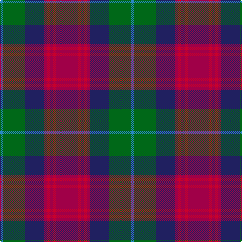

In pattern [BGBRRRRR](/patterns/bgbrrrrr/).

This was sourced from tartans-authority.  It is a [8 stripes tartan](/stripes/stripes8/).

Original link http://www.tartansauthority.com/tartan-ferret/display/2426/

## Thread count
B/6 G44 DB38 R6 Ra6 R6 Ra6 R/42

## Palette
Each colour and its ΔE from the base-6 reference it is a variant of.

| Colour | Shade | Base | ΔE (OKLab) |
|---|---|---|---|
| B | <code style="background-color:#2888C4;">#2888C4</code> `#2888C4` | B <code style="background-color:#2A418A;">#2A418A</code> | 0.21 |
| DB | <code style="background-color:#202060;">#202060</code> `#202060` | B <code style="background-color:#2A418A;">#2A418A</code> | 0.11 |
| G | <code style="background-color:#006818;">#006818</code> `#006818` | G <code style="background-color:#006100;">#006100</code> | 0.02 |
| R | <code style="background-color:#A00048;">#A00048</code> `#A00048` | R <code style="background-color:#CC0000;">#CC0000</code> | 0.12 |
| Ra | <code style="background-color:#C8002C;">#C8002C</code> `#C8002C` | R <code style="background-color:#CC0000;">#CC0000</code> | 0.03 |

# Sample pattern

## Nearest tartans

The nearest existing variants by ΔTartan distance.

1. [Law Society of Scotland (Corporate)](/setts/s10/r6g3r24b7r4b7k18g4k7g3-b5c8ca8-g006428-k101010-r901c38/) — ΔT 0.75
1. [Orkney](/setts/s8/r12g4b24k4g24r18k4y4-b304080-g607030-k000000-r802040-yd08010/) — ΔT 0.81
1. [Akins](/setts/s8/r42ra6r6ra6r6b38g44ba6-b000050-ba8080d0-g008000-r802040-ra900030/) — ΔT 0.94
1. [Ryukoku University Heian JHS (Corp)](/setts/s10/r8k32ra10b16ra4ba4ra4ba4b16k6-b5c5c5c-ba780078-k101010-rb468ac-ra888888/) — ΔT 1.00
1. [Zangenberg (Personal)](/setts/s7/b4r4b32k34g32k4y4-b780078-g285800-k101010-rc80000-ye8c000/) — ΔT 1.03
1. [Land's End Maroon](/setts/s9/b46y4r6ba14r6y4g30r42y10-b003c64-ba2c2c80-g006818-r901c38-ybc8c00/) — ΔT 1.08
1. [Kinloch Anderson](/setts/s12/r8g28y4g8y4k12g6k12b28r4b8r8-b2c2c80-g604000-k101010-rc80000-yd87c00/) — ΔT 1.12
1. [Dunbog Primary School Corporate Tartan Tartan Number: 954. Earliest known date: 1985 C. Armstrong is a pupil at the school. See products available Copyright © Blair Urquhart, Comrie, 2015](/setts/s6/r24b6g10ba32y4g4-b2c2c80-ba202060-g006818-rc80000-ye8c000/) — ΔT 1.13
1. [MacInroy (Rattray)](/setts/s10/k6g34k18r4b34r4b4r34g4w4-b202060-g003820-k101010-rc80000-wfcfcfc/) — ΔT 1.18
1. [Little's Chauffeur Drive](/setts/s6/b6ba48w6b24r48w6-b141e46-ba505050-r781c38-we0e0e0/) — ΔT 1.19

## Neighbour map

Every grey dot is one of 15726 variants placed by the first two principal components of the ΔTartan feature space (44% of its variance). Red is this tartan; blue dots are its nearest — click one to open its page.

<svg viewBox="0 0 640 380" role="img" style="max-width:100%;height:auto;border:1px solid #e0e0e0;border-radius:4px;display:block" xmlns="http://www.w3.org/2000/svg"><image href="/nn/cloud.v1.png" width="640" height="380"/><a href="/setts/s10/r6g3r24b7r4b7k18g4k7g3-b5c8ca8-g006428-k101010-r901c38/"><circle cx="161.1" cy="184.6" r="4" fill="#3465a4"><title>Law Society of Scotland (Corporate)</title></circle></a><a href="/setts/s8/r12g4b24k4g24r18k4y4-b304080-g607030-k000000-r802040-yd08010/"><circle cx="138.2" cy="214.4" r="4" fill="#3465a4"><title>Orkney</title></circle></a><a href="/setts/s8/r42ra6r6ra6r6b38g44ba6-b000050-ba8080d0-g008000-r802040-ra900030/"><circle cx="155.0" cy="188.0" r="4" fill="#3465a4"><title>Akins</title></circle></a><a href="/setts/s10/r8k32ra10b16ra4ba4ra4ba4b16k6-b5c5c5c-ba780078-k101010-rb468ac-ra888888/"><circle cx="155.5" cy="183.8" r="4" fill="#3465a4"><title>Ryukoku University Heian JHS (Corp)</title></circle></a><a href="/setts/s7/b4r4b32k34g32k4y4-b780078-g285800-k101010-rc80000-ye8c000/"><circle cx="168.9" cy="192.4" r="4" fill="#3465a4"><title>Zangenberg (Personal)</title></circle></a><a href="/setts/s9/b46y4r6ba14r6y4g30r42y10-b003c64-ba2c2c80-g006818-r901c38-ybc8c00/"><circle cx="181.8" cy="178.5" r="4" fill="#3465a4"><title>Land's End Maroon</title></circle></a><a href="/setts/s12/r8g28y4g8y4k12g6k12b28r4b8r8-b2c2c80-g604000-k101010-rc80000-yd87c00/"><circle cx="134.8" cy="189.4" r="4" fill="#3465a4"><title>Kinloch Anderson</title></circle></a><a href="/setts/s6/r24b6g10ba32y4g4-b2c2c80-ba202060-g006818-rc80000-ye8c000/"><circle cx="177.9" cy="198.2" r="4" fill="#3465a4"><title>Dunbog Primary School Corporate Tartan Tartan Number: 954. Earliest known date: 1985 C. Armstrong is a pupil at the school. See products available Copyright © Blair Urquhart, Comrie, 2015</title></circle></a><a href="/setts/s10/k6g34k18r4b34r4b4r34g4w4-b202060-g003820-k101010-rc80000-wfcfcfc/"><circle cx="129.2" cy="169.5" r="4" fill="#3465a4"><title>MacInroy (Rattray)</title></circle></a><a href="/setts/s6/b6ba48w6b24r48w6-b141e46-ba505050-r781c38-we0e0e0/"><circle cx="205.8" cy="225.5" r="4" fill="#3465a4"><title>Little's Chauffeur Drive</title></circle></a><circle cx="177.0" cy="191.3" r="5" fill="#c00000"/></svg>

ID: /setts/s8/r42ra6r6ra6r6b38g44ba6-b202060-ba2888c4-g006818-ra00048-rac8002c/
