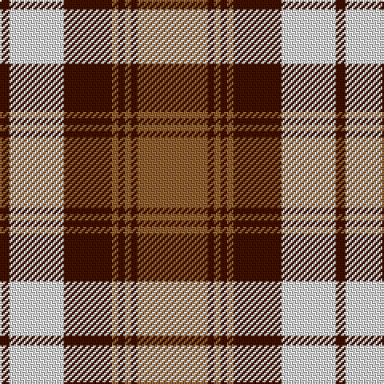

In pattern [BWBRBRBR](/patterns/bwbrbrbr/).

This was sourced from weddslist.  It is a [8 stripes tartan](/stripes/stripes8/).

Original link http://www.weddslist.com/cgi-bin/tartans/pg.pl?source=sts

## Thread count
DR/6 LN34 DR30 LT4 DR4 LT4 DR4 LT/44

## Palette
Each colour and its ΔE from the base-6 reference it is a variant of.

| Colour | Shade | Base | ΔE (OKLab) |
|---|---|---|---|
| DR | <code style="background-color:#401000;">#401000</code> `#401000` | B <code style="background-color:#2C4084;">#2C4084</code> | 0.23 |
| LN | <code style="background-color:#E0E0E0;">#E0E0E0</code> `#E0E0E0` | W <code style="background-color:#F4F4F0;">#F4F4F0</code> | 0.06 |
| LT | <code style="background-color:#906030;">#906030</code> `#906030` | R <code style="background-color:#C80000;">#C80000</code> | 0.15 |

# Sample pattern

## Nearest tartans

The nearest existing variants by ΔTartan distance.

1. [Turnberry Manx Snaefell Family Tartan Tartan Number: 1749. Earliest known date: 1981 A coincidence. See products available Copyright © Blair Urquhart, Comrie, 2015](/setts/s8/y44b4y4b4y4b30w34b6-b441800-we0e0e0-ya08858/) — ΔT 0.54
1. [Kildonan Brown (Fashion)](/setts/s9/g44b6g6b6g6b18w56b6w12-b441800-g604000-wc0c0c0/) — ΔT 0.65
1. [Lindsay](/setts/s9/g40b4g4b4g4b16r48b4r6-b000080-g006818-rff0000/) — ΔT 0.75
1. [Lindsay Dress Red](/setts/s9/g52r6g6r6g6r22w54r6w10-g005020-rdc0000-we0e0e0/) — ΔT 1.00
1. [Snaefell (District)](/setts/s8/g44ga4g4ga4g4ga28w32ga6-g685838-ga604000-we8e4d0/) — ΔT 1.05
1. [Orange Fanaticos (Corporate)](/setts/s7/b12y75k22w12k22w16b8-b5c788c-k101010-we0e0e0-yd87c00/) — ΔT 1.11
1. [Napier Rose](/setts/s11/k16w8k8w8k8w16k8w8k16y48w4-k101010-we0e0e0-ye08070/) — ΔT 1.12
1. [Glassary #2](/setts/s8/b16r4y48r8y8r48y4b16-b2c2c80-rc80000-ye8c000/) — ΔT 1.19
1. [Bannockbane](/setts/s8/b4y4b30y2w20r30y4r4-b401000-r906030-we0e0e0-yff8500/) — ΔT 1.19
1. [Bannockbane Orange Stripes](/setts/s8/b4y4b30y2w20ya30y4ya4-b441800-we0e0e0-yd87c00-yaa08858/) — ΔT 1.23

## Neighbour map

Every grey dot is one of 15726 variants placed by the first two principal components of the ΔTartan feature space (44% of its variance). Red is this tartan; blue dots are its nearest — click one to open its page.

<svg viewBox="0 0 640 380" role="img" style="max-width:100%;height:auto;border:1px solid #e0e0e0;border-radius:4px;display:block" xmlns="http://www.w3.org/2000/svg"><image href="/nn/cloud.v1.png" width="640" height="380"/><a href="/setts/s8/y44b4y4b4y4b30w34b6-b441800-we0e0e0-ya08858/"><circle cx="221.3" cy="176.9" r="4" fill="#3465a4"><title>Turnberry Manx Snaefell Family Tartan Tartan Number: 1749. Earliest known date: 1981 A coincidence. See products available Copyright © Blair Urquhart, Comrie, 2015</title></circle></a><a href="/setts/s9/g44b6g6b6g6b18w56b6w12-b441800-g604000-wc0c0c0/"><circle cx="234.3" cy="180.8" r="4" fill="#3465a4"><title>Kildonan Brown (Fashion)</title></circle></a><a href="/setts/s9/g40b4g4b4g4b16r48b4r6-b000080-g006818-rff0000/"><circle cx="252.2" cy="162.6" r="4" fill="#3465a4"><title>Lindsay</title></circle></a><a href="/setts/s9/g52r6g6r6g6r22w54r6w10-g005020-rdc0000-we0e0e0/"><circle cx="202.9" cy="172.0" r="4" fill="#3465a4"><title>Lindsay Dress Red</title></circle></a><a href="/setts/s8/g44ga4g4ga4g4ga28w32ga6-g685838-ga604000-we8e4d0/"><circle cx="246.1" cy="189.5" r="4" fill="#3465a4"><title>Snaefell (District)</title></circle></a><a href="/setts/s7/b12y75k22w12k22w16b8-b5c788c-k101010-we0e0e0-yd87c00/"><circle cx="197.6" cy="174.5" r="4" fill="#3465a4"><title>Orange Fanaticos (Corporate)</title></circle></a><a href="/setts/s11/k16w8k8w8k8w16k8w8k16y48w4-k101010-we0e0e0-ye08070/"><circle cx="186.1" cy="162.2" r="4" fill="#3465a4"><title>Napier Rose</title></circle></a><a href="/setts/s8/b16r4y48r8y8r48y4b16-b2c2c80-rc80000-ye8c000/"><circle cx="235.9" cy="172.9" r="4" fill="#3465a4"><title>Glassary #2</title></circle></a><a href="/setts/s8/b4y4b30y2w20r30y4r4-b401000-r906030-we0e0e0-yff8500/"><circle cx="184.2" cy="151.1" r="4" fill="#3465a4"><title>Bannockbane</title></circle></a><a href="/setts/s8/b4y4b30y2w20ya30y4ya4-b441800-we0e0e0-yd87c00-yaa08858/"><circle cx="183.4" cy="152.4" r="4" fill="#3465a4"><title>Bannockbane Orange Stripes</title></circle></a><circle cx="224.4" cy="177.6" r="5" fill="#c00000"/></svg>

ID: /setts/s8/r44b4r4b4r4b30w34b6-b401000-r906030-we0e0e0/
