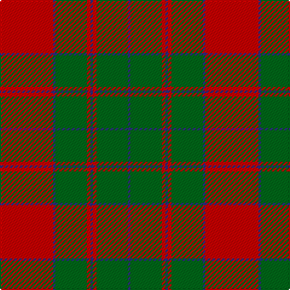

In pattern [BGRBRGBR](/stripes/bgrbrgbr/).

This was sourced from register-of-tartans.  It is a [8 stripe tartan](/stripes/stripes8/).

Original link https://www.tartanregister.gov.uk/tartanDetails.aspx?ref=4909

## Register references

External register numbers recorded for this tartan.

- Scottish Register of Tartans: [4909](https://www.tartanregister.gov.uk/tartanDetails.aspx?ref=4909)
- Scottish Tartans Authority (ITI): 3920

## Thread count
R/44 DB2 Ga26 R3 DB2 R3 Ga26 DB/2

## Palette
Each colour and the base-6 reference it is a variant of.

| Colour | Shade | Base |
|---|---|---|
| DB | <code style="background-color:#2C2C80;">#2C2C80</code> `oklch(35.0% 0.138 276.6)` <small>#2C2C80</small> | B <code style="background-color:#2A418A;">#2A418A</code> |
| G | <code style="background-color:#285800;">#285800</code> `oklch(41.0% 0.122 135.8)` <small>#285800</small> | G <code style="background-color:#006100;">#006100</code> |
| Ga | <code style="background-color:#006818;">#006818</code> `oklch(45.0% 0.142 145.0)` <small>#006818</small> | G <code style="background-color:#006100;">#006100</code> |
| R | <code style="background-color:#C80000;">#C80000</code> `oklch(52.3% 0.215 29.2)` <small>#C80000</small> | R <code style="background-color:#CC0000;">#CC0000</code> |

# Sample pattern

## Nearest tartans

The nearest existing variants by ΔTartan distance, with this tartan at the top so the swatches line up against it.

ΔTartan

Tartan

Sett

—

<a href="/ttd/edit/#slug=r44db2g26r3db2">Unidentified Cant #09</a> <a class="nn-out" href="/setts/s8/r44db2g26r3db2/" title="open its dictionary page">↗</a>

0.76

<a href="/ttd/edit/#slug=g18r3g2r2db6r2g2r24g1r2g6~x2">MacDonell of Glengarry</a> <a class="nn-out" href="/setts/s11/g18r3g2r2db6r2g2r24g1r2g6~x2/" title="open its dictionary page">↗</a>

0.78

<a href="/ttd/edit/#slug=r2db1g2db1g19db2r27g2~x2">Thomas of Wales</a> <a class="nn-out" href="/setts/s8/r2db1g2db1g19db2r27g2~x2/" title="open its dictionary page">↗</a>

0.97

<a href="/ttd/edit/#slug=r4g4lo4g12r22lo1g4~x4">Spice Apple</a> <a class="nn-out" href="/setts/s7/r4g4lo4g12r22lo1g4~x4/" title="open its dictionary page">↗</a>

1.03

<a href="/ttd/edit/#slug=dg18r3dg2r2db6r2dg2r24dg1r2dg6~x2">MacDonell of Glengarry #4</a> <a class="nn-out" href="/setts/s11/dg18r3dg2r2db6r2dg2r24dg1r2dg6~x2/" title="open its dictionary page">↗</a>

1.06

<a href="/ttd/edit/#slug=g12r4k1r2k1r4g16r20g2r8~x2">Livingstone #2</a> <a class="nn-out" href="/setts/s10/g12r4k1r2k1r4g16r20g2r8~x2/" title="open its dictionary page">↗</a>

1.14

<a href="/setts/s10/r32lo1g8lo1g8lo1~x2/">Unidentified #62</a>

1.16

<a href="/ttd/edit/#slug=r1g10r1db4r18g1~x4">Robertson 6</a> <a class="nn-out" href="/setts/s6/r1g10r1db4r18g1~x4/" title="open its dictionary page">↗</a>

1.18

<a href="/ttd/edit/#slug=g5w2r27g27r5w2~x2">MacDonald of Glenaladale (symmetrical)</a> <a class="nn-out" href="/setts/s6/g5w2r27g27r5w2~x2/" title="open its dictionary page">↗</a>

1.18

<a href="/ttd/edit/#slug=r12db2r3g20k4g20r30k2r1~x2">Oriel #1 (District)</a> <a class="nn-out" href="/setts/s9/r12db2r3g20k4g20r30k2r1~x2/" title="open its dictionary page">↗</a>

1.22

<a href="/ttd/edit/#slug=g18r3g2r2n6r2g2r24g2r2g6~x2">MacDonald of Vallay (Uist) (?)</a> <a class="nn-out" href="/setts/s11/g18r3g2r2n6r2g2r24g2r2g6~x2/" title="open its dictionary page">↗</a>

## Neighbour map

Every grey dot is one of 14299 variants placed by the first two principal components of the ΔTartan feature space (44% of its variance). Red is this tartan; blue dots are its nearest — click one to open its page.

<svg viewBox="0 0 640 380" role="img" style="max-width:100%;height:auto;border:1px solid #e0e0e0;border-radius:4px;display:block" xmlns="http://www.w3.org/2000/svg"><image href="/nn/cloud.v1.png" width="640" height="380"/><a href="/setts/s11/g18r3g2r2db6r2g2r24g1r2g6~x2/"><circle cx="363.3" cy="147.3" r="4" fill="#3465a4"><title>MacDonell of Glengarry</title></circle></a><a href="/setts/s8/r2db1g2db1g19db2r27g2~x2/"><circle cx="404.9" cy="146.8" r="4" fill="#3465a4"><title>Thomas of Wales</title></circle></a><a href="/setts/s7/r4g4lo4g12r22lo1g4~x4/"><circle cx="368.7" cy="184.3" r="4" fill="#3465a4"><title>Spice Apple</title></circle></a><a href="/setts/s11/dg18r3dg2r2db6r2dg2r24dg1r2dg6~x2/"><circle cx="360.9" cy="142.6" r="4" fill="#3465a4"><title>MacDonell of Glengarry #4</title></circle></a><a href="/setts/s10/g12r4k1r2k1r4g16r20g2r8~x2/"><circle cx="387.9" cy="176.2" r="4" fill="#3465a4"><title>Livingstone #2</title></circle></a><a href="/setts/s10/r32lo1g8lo1g8lo1~x2/"><circle cx="399.3" cy="150.2" r="4" fill="#3465a4"><title>Unidentified #62</title></circle></a><a href="/setts/s6/r1g10r1db4r18g1~x4/"><circle cx="397.7" cy="186.3" r="4" fill="#3465a4"><title>Robertson 6</title></circle></a><a href="/setts/s6/g5w2r27g27r5w2~x2/"><circle cx="335.2" cy="199.1" r="4" fill="#3465a4"><title>MacDonald of Glenaladale (symmetrical)</title></circle></a><a href="/setts/s9/r12db2r3g20k4g20r30k2r1~x2/"><circle cx="345.2" cy="146.0" r="4" fill="#3465a4"><title>Oriel #1 (District)</title></circle></a><a href="/setts/s11/g18r3g2r2n6r2g2r24g2r2g6~x2/"><circle cx="349.5" cy="180.3" r="4" fill="#3465a4"><title>MacDonald of Vallay (Uist) (?)</title></circle></a><circle cx="376.6" cy="170.3" r="5" fill="#c00000"/></svg>

ID: /setts/s8/r44db2g26r3db2/
