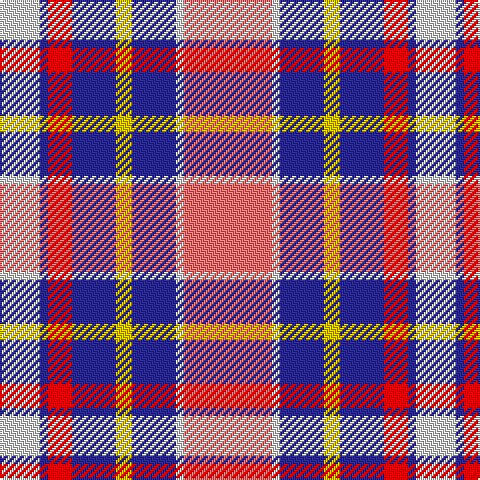

In pattern [RWBYBRBW](/patterns/rwbybrbw/).

This was sourced from tartans-authority.  It is a [8 stripes tartan](/stripes/stripes8/).

Original link http://www.tartansauthority.com/tartan-ferret/display/8027/

## Thread count
LN/20 DB4 R12 DB22 Y8 DB22 LN4 LR/44

## Palette
Each colour and its ΔE from the base-6 reference it is a variant of.

| Colour | Shade | Base | ΔE (OKLab) |
|---|---|---|---|
| DB | <code style="background-color:#2C2C80;">#2C2C80</code> `#2C2C80` | B <code style="background-color:#2A418A;">#2A418A</code> | 0.06 |
| LN | <code style="background-color:#E0E0E0;">#E0E0E0</code> `#E0E0E0` | W <code style="background-color:#F7F7F7;">#F7F7F7</code> | 0.07 |
| LR | <code style="background-color:#E87878;">#E87878</code> `#E87878` | R <code style="background-color:#CC0000;">#CC0000</code> | 0.19 |
| R | <code style="background-color:#C80000;">#C80000</code> `#C80000` | R <code style="background-color:#CC0000;">#CC0000</code> | 0.01 |
| Y | <code style="background-color:#E8C000;">#E8C000</code> `#E8C000` | Y <code style="background-color:#F2BF00;">#F2BF00</code> | 0.02 |

# Sample pattern

## Nearest tartans

The nearest existing variants by ΔTartan distance.

1. [Gigha, Lilac (Dance)](/setts/s8/r8w4r2w36b36ra36g6ra8-b640064-g006818-r800028-ra9874a8-wf0e0c8/) — ΔT 0.96
1. [Culloden Dress Old Tartan Tartan Number: 1322. Earliest known date: 1983 Worn by a member of Prince Charles' staff during the battle but it is not known with which family or district it was first connected. It was first illustrated in Old & Rare in 1893 by D W Stewart whose son D C Stewart was a founder member of the Scottish Tartans Society. Now firmly established as a district tartan. See products available Copyright © Blair Urquhart, Comrie, 2015](/setts/s8/r12b4ba42w6g38w52g6w10-b2c2c80-ba780078-g003820-rc80000-we0e0e0/) — ΔT 1.02
1. [Culloden, dress Ancient](/setts/s8/r12b4ba42w6g38w52g6w10-b304080-ba800080-g003000-rc00000-we0e0e0/) — ΔT 1.07
1. [Wcwm 1893-11](/setts/s9/b4y28w4r12w4r28b16ba52w4-b202020-ba6400e0-ra0783c-wf0f0b0-yfc9494/) — ΔT 1.12
1. [Oliver, dress](/setts/s9/w10g6r6g6r6b40r32w42k6-b304080-g008000-k000000-rd03030-we0e0e0/) — ΔT 1.13
1. [Culloden, Red (dress)](/setts/s8/g16b8r45w6b45w44b6w12-b800080-g008000-rc00000-we0e0e0/) — ΔT 1.20
1. [Wild Rose (Commemorative)](/setts/s9/b24ba6r26b8r20w4wa36ba44r8-b780078-ba5c5c5c-rc80000-we0e0e0-wa98c8e8/) — ΔT 1.22
1. [Brunnbauer (2015)](/setts/s8/w8b64w24k10r18y16r8w8-b5f749c-k1c1714-rc8002c-wf8f8f8-ye0a126/) — ΔT 1.24
1. [Culloden Dress Ancient](/setts/s8/r12b4ba42w6g38w52g6w10-b2c4084-ba5a008c-g002814-rdc0000-we0e0e0/) — ΔT 1.25
1. [Humming Bird (Fashion)](/setts/s8/r12b6ra40y4k40w40k4w10-b5c8ca8-k101010-rc80000-raa00470-we0e0e0-ye8c000/) — ΔT 1.25

## Neighbour map

Every grey dot is one of 15726 variants placed by the first two principal components of the ΔTartan feature space (44% of its variance). Red is this tartan; blue dots are its nearest — click one to open its page.

<svg viewBox="0 0 640 380" role="img" style="max-width:100%;height:auto;border:1px solid #e0e0e0;border-radius:4px;display:block" xmlns="http://www.w3.org/2000/svg"><image href="/nn/cloud.v1.png" width="640" height="380"/><a href="/setts/s8/r8w4r2w36b36ra36g6ra8-b640064-g006818-r800028-ra9874a8-wf0e0c8/"><circle cx="152.5" cy="131.8" r="4" fill="#3465a4"><title>Gigha, Lilac (Dance)</title></circle></a><a href="/setts/s8/r12b4ba42w6g38w52g6w10-b2c2c80-ba780078-g003820-rc80000-we0e0e0/"><circle cx="154.2" cy="142.7" r="4" fill="#3465a4"><title>Culloden Dress Old Tartan Tartan Number: 1322. Earliest known date: 1983 Worn by a member of Prince Charles' staff during the battle but it is not known with which family or district it was first connected. It was first illustrated in Old &amp; Rare in 1893 by D W Stewart whose son D C Stewart was a founder member of the Scottish Tartans Society. Now firmly established as a district tartan. See products available Copyright © Blair Urquhart, Comrie, 2015</title></circle></a><a href="/setts/s8/r12b4ba42w6g38w52g6w10-b304080-ba800080-g003000-rc00000-we0e0e0/"><circle cx="152.8" cy="142.1" r="4" fill="#3465a4"><title>Culloden, dress Ancient</title></circle></a><a href="/setts/s9/b4y28w4r12w4r28b16ba52w4-b202020-ba6400e0-ra0783c-wf0f0b0-yfc9494/"><circle cx="134.3" cy="135.9" r="4" fill="#3465a4"><title>Wcwm 1893-11</title></circle></a><a href="/setts/s9/w10g6r6g6r6b40r32w42k6-b304080-g008000-k000000-rd03030-we0e0e0/"><circle cx="108.0" cy="156.5" r="4" fill="#3465a4"><title>Oliver, dress</title></circle></a><a href="/setts/s8/g16b8r45w6b45w44b6w12-b800080-g008000-rc00000-we0e0e0/"><circle cx="141.1" cy="182.6" r="4" fill="#3465a4"><title>Culloden, Red (dress)</title></circle></a><a href="/setts/s9/b24ba6r26b8r20w4wa36ba44r8-b780078-ba5c5c5c-rc80000-we0e0e0-wa98c8e8/"><circle cx="133.1" cy="171.7" r="4" fill="#3465a4"><title>Wild Rose (Commemorative)</title></circle></a><a href="/setts/s8/w8b64w24k10r18y16r8w8-b5f749c-k1c1714-rc8002c-wf8f8f8-ye0a126/"><circle cx="149.7" cy="157.0" r="4" fill="#3465a4"><title>Brunnbauer (2015)</title></circle></a><a href="/setts/s8/r12b4ba42w6g38w52g6w10-b2c4084-ba5a008c-g002814-rdc0000-we0e0e0/"><circle cx="149.4" cy="143.3" r="4" fill="#3465a4"><title>Culloden Dress Ancient</title></circle></a><a href="/setts/s8/r12b6ra40y4k40w40k4w10-b5c8ca8-k101010-rc80000-raa00470-we0e0e0-ye8c000/"><circle cx="87.9" cy="135.5" r="4" fill="#3465a4"><title>Humming Bird (Fashion)</title></circle></a><circle cx="131.5" cy="160.6" r="5" fill="#c00000"/></svg>

ID: /setts/s8/r44w4b22y8b22ra12b4w20-b2c2c80-re87878-rac80000-we0e0e0-ye8c000/
