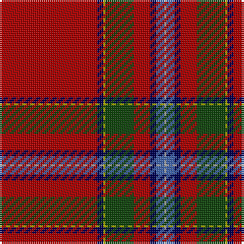

In pattern [RBYGRBBY](/stripes/rbygrbby/).

This was sourced from weddslist.  It is a [8 stripe tartan](/stripes/stripes8/).

Original link http://www.weddslist.com/cgi-bin/tartans/pg.pl?source=x

## Register references

External register numbers recorded for this tartan.

- Scottish Register of Tartans: [1166](https://www.tartanregister.gov.uk/tartanDetails.aspx?ref=1166)
- Scottish Register of Tartans: [1758](https://www.tartanregister.gov.uk/tartanDetails.aspx?ref=1758)
- Scottish Register of Tartans: [2307](https://www.tartanregister.gov.uk/tartanDetails.aspx?ref=2307)
- Scottish Register of Tartans: [2540](https://www.tartanregister.gov.uk/tartanDetails.aspx?ref=2540)
- Scottish Register of Tartans: [2625](https://www.tartanregister.gov.uk/tartanDetails.aspx?ref=2625)
- Scottish Register of Tartans: [2862](https://www.tartanregister.gov.uk/tartanDetails.aspx?ref=2862)
- Scottish Register of Tartans: [982](https://www.tartanregister.gov.uk/tartanDetails.aspx?ref=982)
- Scottish Tartans Authority (ITI): 1429
- Scottish Tartans Authority (ITI): 218
- Scottish Tartans World Register: 1042
- Scottish Tartans World Register: 127
- Scottish Tartans World Register: 1429
- Scottish Tartans World Register: 218
- Scottish Tartans World Register: 2218
- Scottish Tartans World Register: 737
- Scottish Tartans World Register: 897

## Thread count
DR/48 DB3 LG1 DG14 DR8 DB3 B4 N/1

## Palette
Each colour and its ΔE from the base-6 reference it is a variant of.

| Colour | Shade | Base | ΔE (OKLab) |
|---|---|---|---|
| B | <code style="background-color:#4367AE;">#4367AE</code> `#4367AE` | B <code style="background-color:#2A418A;">#2A418A</code> | 0.12 |
| DB | <code style="background-color:#000052;">#000052</code> `#000052` | B <code style="background-color:#2A418A;">#2A418A</code> | 0.20 |
| DG | <code style="background-color:#11450D;">#11450D</code> `#11450D` | G <code style="background-color:#006100;">#006100</code> | 0.09 |
| DR | <code style="background-color:#AA0000;">#AA0000</code> `#AA0000` | R <code style="background-color:#CC0000;">#CC0000</code> | 0.07 |
| LG | <code style="background-color:#AAAA00;">#AAAA00</code> `#AAAA00` | Y <code style="background-color:#F2BF00;">#F2BF00</code> | 0.13 |
| N | <code style="background-color:#AAAAAA;">#AAAAAA</code> `#AAAAAA` | Y <code style="background-color:#F2BF00;">#F2BF00</code> | 0.19 |

# Sample pattern

## Nearest tartans

The nearest existing variants by ΔTartan distance.

1. [Prince Charles Cloak](/setts/s8/r48db3ly1dg14r8db3b4lr1~x2/) — ΔT 0.00
1. [Drummond of Perth](/setts/s9/r36lr1db3ly1dg16r8db3b2lr1~x2/) — ΔT 0.99
1. [Drummond of Perth](/setts/s9/r36lr1db3ly1dg16r8db3b2lr1/) — ΔT 0.99
1. [Stewart of Fingask - 1745 (Clan?)](/setts/s8/r72g3ly2g26r14db6t6w2/) — ΔT 0.99
1. [Prince Charles Cloak](/setts/s8/r48db3ly1dg14r8db3lb4lr1/) — ΔT 1.15
1. [MacIngust](/setts/s8/r70k2ly1dg18r10k4t4w1~x2/) — ΔT 1.16
1. [Drummond, Ancient](/setts/s9/r38ly1db3w1g13r6db3t3w1~x2/) — ΔT 1.17
1. [Perthshire or Drummond of Perth](/setts/s9/r36w1db3ly1dg16r8db3t2w1~x2/) — ΔT 1.18
1. [Stuart/Stewart of Fingask](/setts/s8/r72dg3ly2dg26r14db6t6w2/) — ΔT 1.18
1. [Inverness Cathedral (Corporate)](/setts/s9/r72db6ly1db12k4w1n4w1k5~x2/) — ΔT 1.24

## Neighbour map

Every grey dot is one of 14299 variants placed by the first two principal components of the ΔTartan feature space (44% of its variance). Red is this tartan; blue dots are its nearest — click one to open its page.

<svg viewBox="0 0 640 380" role="img" style="max-width:100%;height:auto;border:1px solid #e0e0e0;border-radius:4px;display:block" xmlns="http://www.w3.org/2000/svg"><image href="/nn/cloud.v1.png" width="640" height="380"/><a href="/setts/s8/r48db3ly1dg14r8db3b4lr1~x2/"><circle cx="471.9" cy="80.6" r="4" fill="#3465a4"><title>Prince Charles Cloak</title></circle></a><a href="/setts/s9/r36lr1db3ly1dg16r8db3b2lr1~x2/"><circle cx="404.3" cy="85.2" r="4" fill="#3465a4"><title>Drummond of Perth</title></circle></a><a href="/setts/s9/r36lr1db3ly1dg16r8db3b2lr1/"><circle cx="404.3" cy="85.2" r="4" fill="#3465a4"><title>Drummond of Perth</title></circle></a><a href="/setts/s8/r72g3ly2g26r14db6t6w2/"><circle cx="431.8" cy="84.5" r="4" fill="#3465a4"><title>Stewart of Fingask - 1745 (Clan?)</title></circle></a><a href="/setts/s8/r48db3ly1dg14r8db3lb4lr1/"><circle cx="444.4" cy="60.8" r="4" fill="#3465a4"><title>Prince Charles Cloak</title></circle></a><a href="/setts/s8/r70k2ly1dg18r10k4t4w1~x2/"><circle cx="503.7" cy="60.4" r="4" fill="#3465a4"><title>MacIngust</title></circle></a><a href="/setts/s9/r38ly1db3w1g13r6db3t3w1~x2/"><circle cx="412.0" cy="69.8" r="4" fill="#3465a4"><title>Drummond, Ancient</title></circle></a><a href="/setts/s9/r36w1db3ly1dg16r8db3t2w1~x2/"><circle cx="398.3" cy="75.5" r="4" fill="#3465a4"><title>Perthshire or Drummond of Perth</title></circle></a><a href="/setts/s8/r72dg3ly2dg26r14db6t6w2/"><circle cx="424.0" cy="77.6" r="4" fill="#3465a4"><title>Stuart/Stewart of Fingask</title></circle></a><a href="/setts/s9/r72db6ly1db12k4w1n4w1k5~x2/"><circle cx="467.4" cy="43.0" r="4" fill="#3465a4"><title>Inverness Cathedral (Corporate)</title></circle></a><circle cx="471.9" cy="80.6" r="5" fill="#c00000"/></svg>

ID: /setts/s8/r48db3ly1dg14r8db3b4lr1/
