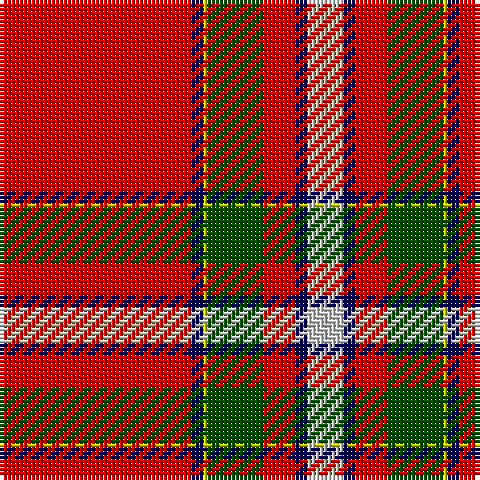

This page is one **sett** — a single exact thread-count. It belongs to the [tartan](/tartans/r48db3ly1dg14r8db3lb4lr1/)
(the same proportion at any scale), whose colour order is pattern [RBYGRBWY](/stripes/rbygrbwy/).

Sourced from weddslist.  It is a [8 stripe tartan](/stripes/stripes8/).

Original link http://www.weddslist.com/cgi-bin/tartans/pg.pl?source=rb

## Thread count
R/48 DB3 Y1 G14 R8 DB3 N4 Na/1

## Palette

Palette: <strong>Tartan Register</strong> <small style="color:#888">(3 of 6 colours)</small>
<table><thead><tr><th>Colour</th><th>Threads</th><th>Shade</th><th>Base</th><th>OKLCh</th></tr></thead><tbody><tr><td>R/</td><td style="text-align:right;font-variant-numeric:tabular-nums">48</td><td><code style="background-color:#C80000;">#C80000</code> <small style="color:#888">#C80000</small></td><td>R <code style="background-color:#CC0000;">#CC0000</code></td><td><small style="color:#888">oklch(52.3% 0.215 29.2)</small></td></tr><tr><td>DB</td><td style="text-align:right;font-variant-numeric:tabular-nums">3</td><td><code style="background-color:#00004C;">#00004C</code> <small style="color:#888">#00004C</small></td><td>B <code style="background-color:#2A418A;">#2A418A</code></td><td><small style="color:#888">oklch(18.8% 0.130 264.1)</small></td></tr><tr><td>Y</td><td style="text-align:right;font-variant-numeric:tabular-nums">1</td><td><code style="background-color:#C8C800;">#C8C800</code> <small style="color:#888">#C8C800</small></td><td>Y <code style="background-color:#F2BF00;">#F2BF00</code></td><td><small style="color:#888">oklch(80.6% 0.176 109.8)</small></td></tr><tr><td>G</td><td style="text-align:right;font-variant-numeric:tabular-nums">14</td><td><code style="background-color:#004C00;">#004C00</code> <small style="color:#888">#004C00</small></td><td>G <code style="background-color:#006100;">#006100</code></td><td><small style="color:#888">oklch(36.1% 0.123 142.5)</small></td></tr><tr><td>R</td><td style="text-align:right;font-variant-numeric:tabular-nums">8</td><td><code style="background-color:#C80000;">#C80000</code> <small style="color:#888">#C80000</small></td><td>R <code style="background-color:#CC0000;">#CC0000</code></td><td><small style="color:#888">oklch(52.3% 0.215 29.2)</small></td></tr><tr><td>DB</td><td style="text-align:right;font-variant-numeric:tabular-nums">3</td><td><code style="background-color:#00004C;">#00004C</code> <small style="color:#888">#00004C</small></td><td>B <code style="background-color:#2A418A;">#2A418A</code></td><td><small style="color:#888">oklch(18.8% 0.130 264.1)</small></td></tr><tr><td>N</td><td style="text-align:right;font-variant-numeric:tabular-nums">4</td><td><code style="background-color:#D0D0D0;">#D0D0D0</code> <small style="color:#888">#D0D0D0</small></td><td>W <code style="background-color:#F7F7F7;">#F7F7F7</code></td><td><small style="color:#888">oklch(85.8% 0.000 89.9)</small></td></tr><tr><td>Na/</td><td style="text-align:right;font-variant-numeric:tabular-nums">1</td><td><code style="background-color:#B0B0B0;">#B0B0B0</code> <small style="color:#888">#B0B0B0</small></td><td>Y <code style="background-color:#F2BF00;">#F2BF00</code></td><td><small style="color:#888">oklch(75.7% 0.000 89.9)</small></td></tr></tbody></table>

# Sample pattern

## Nearest tartans

The nearest existing variants by ΔTartan distance, with this tartan at the top so the swatches line up against it.

ΔTartan

Tartan

Sett

—

<a href="/ttd/edit/#slug=r48db3ly1dg14r8db3lb4lr1">Prince Charles Cloak</a> <a class="nn-out" href="/setts/s8/r48db3ly1dg14r8db3lb4lr1/" title="open its dictionary page">↗</a>

0.70

<a href="/ttd/edit/#slug=r72dg3ly2dg26r14db6t6w2">Stuart/Stewart of Fingask</a> <a class="nn-out" href="/setts/s8/r72dg3ly2dg26r14db6t6w2/" title="open its dictionary page">↗</a>

0.89

<a href="/ttd/edit/#slug=r70k2ly1dg18r10k4t4w1~x2">MacIngust</a> <a class="nn-out" href="/setts/s8/r70k2ly1dg18r10k4t4w1~x2/" title="open its dictionary page">↗</a>

0.94

<a href="/ttd/edit/#slug=r72g3ly2g26r14db6t6w2">Stewart of Fingask - 1745 (Clan?)</a> <a class="nn-out" href="/setts/s8/r72g3ly2g26r14db6t6w2/" title="open its dictionary page">↗</a>

0.97

<a href="/ttd/edit/#slug=r64k10ly4m5w2k2db3ly4~x2">Conroy Family Tartan Tartan Number: 1626. Earliest known date: 1986 See products available Copyright © Blair Urquhart, Comrie, 2015</a> <a class="nn-out" href="/setts/s8/r64k10ly4m5w2k2db3ly4~x2/" title="open its dictionary page">↗</a>

1.04

<a href="/ttd/edit/#slug=r38ly1db3w1g13r6db3t3w1~x2">Drummond, Ancient</a> <a class="nn-out" href="/setts/s9/r38ly1db3w1g13r6db3t3w1~x2/" title="open its dictionary page">↗</a>

1.05

<a href="/ttd/edit/#slug=r72db6ly1db12k4w1n4w1k5~x2">Inverness Cathedral (Corporate)</a> <a class="nn-out" href="/setts/s9/r72db6ly1db12k4w1n4w1k5~x2/" title="open its dictionary page">↗</a>

1.07

<a href="/ttd/edit/#slug=r87db8k11ly2k3w2k3g13r11k2r5w3">Stewart/Stuart, Royal</a> <a class="nn-out" href="/setts/s12/r87db8k11ly2k3w2k3g13r11k2r5w3/" title="open its dictionary page">↗</a>

1.09

<a href="/ttd/edit/#slug=r36w1db3ly1dg16r8db3t2w1~x2">Perthshire or Drummond of Perth</a> <a class="nn-out" href="/setts/s9/r36w1db3ly1dg16r8db3t2w1~x2/" title="open its dictionary page">↗</a>

1.10

<a href="/ttd/edit/#slug=r36w1db3ly1g16r8db3b2w1~x2">Drummond of Perth (Clan)</a> <a class="nn-out" href="/setts/s9/r36w1db3ly1g16r8db3b2w1~x2/" title="open its dictionary page">↗</a>

1.12

<a href="/ttd/edit/#slug=r64k10ly4ri5w2k2db3ly4~x2">Conroy</a> <a class="nn-out" href="/setts/s8/r64k10ly4ri5w2k2db3ly4~x2/" title="open its dictionary page">↗</a>

## Neighbour map

Every grey dot is one of 14359 variants placed by the first two principal components of the ΔTartan feature space (44% of its variance). Red is this tartan; blue dots are its nearest — click one to open its page.

<svg viewBox="0 0 640 380" role="img" style="max-width:100%;height:auto;border:1px solid #e0e0e0;border-radius:4px;display:block" xmlns="http://www.w3.org/2000/svg"><image href="/nn/cloud.v1.png" width="640" height="380"/><a href="/setts/s8/r72dg3ly2dg26r14db6t6w2/"><circle cx="422.5" cy="77.6" r="4" fill="#3465a4"><title>Stuart/Stewart of Fingask</title></circle></a><a href="/setts/s8/r70k2ly1dg18r10k4t4w1~x2/"><circle cx="501.9" cy="60.2" r="4" fill="#3465a4"><title>MacIngust</title></circle></a><a href="/setts/s8/r72g3ly2g26r14db6t6w2/"><circle cx="430.4" cy="84.5" r="4" fill="#3465a4"><title>Stewart of Fingask - 1745 (Clan?)</title></circle></a><a href="/setts/s8/r64k10ly4m5w2k2db3ly4~x2/"><circle cx="436.0" cy="60.0" r="4" fill="#3465a4"><title>Conroy Family Tartan Tartan Number: 1626. Earliest known date: 1986 See products available Copyright © Blair Urquhart, Comrie, 2015</title></circle></a><a href="/setts/s9/r38ly1db3w1g13r6db3t3w1~x2/"><circle cx="410.5" cy="69.7" r="4" fill="#3465a4"><title>Drummond, Ancient</title></circle></a><a href="/setts/s9/r72db6ly1db12k4w1n4w1k5~x2/"><circle cx="465.8" cy="42.8" r="4" fill="#3465a4"><title>Inverness Cathedral (Corporate)</title></circle></a><a href="/setts/s12/r87db8k11ly2k3w2k3g13r11k2r5w3/"><circle cx="447.1" cy="31.3" r="4" fill="#3465a4"><title>Stewart/Stuart, Royal</title></circle></a><a href="/setts/s9/r36w1db3ly1dg16r8db3t2w1~x2/"><circle cx="396.9" cy="75.5" r="4" fill="#3465a4"><title>Perthshire or Drummond of Perth</title></circle></a><a href="/setts/s9/r36w1db3ly1g16r8db3b2w1~x2/"><circle cx="392.6" cy="74.4" r="4" fill="#3465a4"><title>Drummond of Perth (Clan)</title></circle></a><a href="/setts/s8/r64k10ly4ri5w2k2db3ly4~x2/"><circle cx="418.5" cy="53.7" r="4" fill="#3465a4"><title>Conroy</title></circle></a><circle cx="442.7" cy="60.6" r="5" fill="#c00000"/></svg>

ID: /setts/s8/r48db3ly1dg14r8db3lb4lr1/
