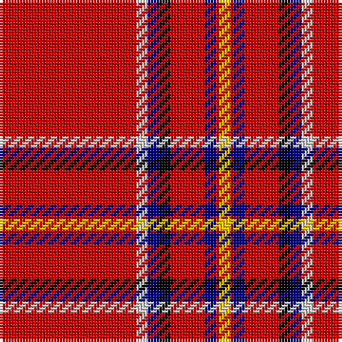

**Bands:** [RWBKRBRY](/stripes/rwbkrbry/) · **Stripes:** [R LB DB K R DB R LY](/stripes/stripes8/) R LB DB K R DB R LY

This was sourced from weddslist.  It is a [8 band tartan](/bands/bands8/).

Original link http://www.weddslist.com/cgi-bin/tartans/pg.pl?source=rb

## Register references

External register numbers recorded for this tartan.

- Scottish Register of Tartans: [1166](https://www.tartanregister.gov.uk/tartanDetails.aspx?ref=1166)
- Scottish Register of Tartans: [1758](https://www.tartanregister.gov.uk/tartanDetails.aspx?ref=1758)
- Scottish Register of Tartans: [2307](https://www.tartanregister.gov.uk/tartanDetails.aspx?ref=2307)
- Scottish Register of Tartans: [2540](https://www.tartanregister.gov.uk/tartanDetails.aspx?ref=2540)
- Scottish Register of Tartans: [2666](https://www.tartanregister.gov.uk/tartanDetails.aspx?ref=2666)
- Scottish Register of Tartans: [2862](https://www.tartanregister.gov.uk/tartanDetails.aspx?ref=2862)
- Scottish Register of Tartans: [3808](https://www.tartanregister.gov.uk/tartanDetails.aspx?ref=3808)
- Scottish Register of Tartans: [982](https://www.tartanregister.gov.uk/tartanDetails.aspx?ref=982)
- Scottish Tartans Authority (ITI): 218
- Scottish Tartans World Register: 1010
- Scottish Tartans World Register: 1042
- Scottish Tartans World Register: 127
- Scottish Tartans World Register: 1585
- Scottish Tartans World Register: 218
- Scottish Tartans World Register: 2218
- Scottish Tartans World Register: 737
- Scottish Tartans World Register: 897

## Thread count
R/48 N4 DB4 K4 R12 DB4 R1 Y/4

## Palette
Each colour and its ΔE from the base-6 reference it is a variant of.

| Colour | Shade | Base | ΔE (OKLab) |
|---|---|---|---|
| DB | <code style="background-color:#000080;">#000080</code> `#000080` | B <code style="background-color:#2A418A;">#2A418A</code> | 0.14 |
| K | <code style="background-color:#000000;">#000000</code> `#000000` | K <code style="background-color:#000000;">#000000</code> | 0.00 |
| N | <code style="background-color:#D0D0D0;">#D0D0D0</code> `#D0D0D0` | W <code style="background-color:#F7F7F7;">#F7F7F7</code> | 0.12 |
| R | <code style="background-color:#C80000;">#C80000</code> `#C80000` | R <code style="background-color:#CC0000;">#CC0000</code> | 0.01 |
| Y | <code style="background-color:#FFC800;">#FFC800</code> `#FFC800` | Y <code style="background-color:#F2BF00;">#F2BF00</code> | 0.03 |

# Sample pattern

## Nearest tartans

The nearest existing variants by ΔTartan distance.

1. [Brodie (W & A Smith)](/setts/s8/r48w4db4k4r12db4r1ly4~x2/) — ΔT 0.22
1. [Brodie](/setts/s8/r48lr4db4k4r12db4r1ly4~x2/) — ΔT 0.83
1. [Brodie](/setts/s8/r48lr4db4k4r12db4r1ly4/) — ΔT 0.83
1. [Princess Elizabeth](/setts/s8/r42k4w1k6ly1db1ly1r12~x2/) — ΔT 0.98
1. [Braemar Castle](/setts/s9/r52k5ly5lo5do5k2r6k1ly2~x2/) — ΔT 1.08
1. [Hackston, or Halkerston](/setts/s8/r56w2k12ly3r12ly3r12g3~x2/) — ΔT 1.09
1. [Junor (Personal)](/setts/s9/r72db6ly2db11t2db2t2r9k2~x2/) — ΔT 1.11
1. [Princess Elizabeth (Royal)](/setts/s8/r72k6lb2k11ly2db2ly2r18~x2/) — ΔT 1.12
1. [Earl of Inverness (Royal)](/setts/s8/r100db10w5db14ly4db8ly4r24/) — ΔT 1.20
1. [Zamzam (Personal)](/setts/s8/r70b1r2g12k2g1k10w1~x2/) — ΔT 1.25

## Neighbour map

Every grey dot is one of 14299 variants placed by the first two principal components of the ΔTartan feature space (44% of its variance). Red is this tartan; blue dots are its nearest — click one to open its page.

<svg viewBox="0 0 640 380" role="img" style="max-width:100%;height:auto;border:1px solid #e0e0e0;border-radius:4px;display:block" xmlns="http://www.w3.org/2000/svg"><image href="/nn/cloud.v1.png" width="640" height="380"/><a href="/setts/s8/r48w4db4k4r12db4r1ly4~x2/"><circle cx="499.0" cy="65.9" r="4" fill="#3465a4"><title>Brodie (W &amp; A Smith)</title></circle></a><a href="/setts/s8/r48lr4db4k4r12db4r1ly4~x2/"><circle cx="517.7" cy="81.3" r="4" fill="#3465a4"><title>Brodie</title></circle></a><a href="/setts/s8/r48lr4db4k4r12db4r1ly4/"><circle cx="517.7" cy="81.3" r="4" fill="#3465a4"><title>Brodie</title></circle></a><a href="/setts/s8/r42k4w1k6ly1db1ly1r12~x2/"><circle cx="544.7" cy="72.2" r="4" fill="#3465a4"><title>Princess Elizabeth</title></circle></a><a href="/setts/s9/r52k5ly5lo5do5k2r6k1ly2~x2/"><circle cx="470.4" cy="52.7" r="4" fill="#3465a4"><title>Braemar Castle</title></circle></a><a href="/setts/s8/r56w2k12ly3r12ly3r12g3~x2/"><circle cx="499.5" cy="95.7" r="4" fill="#3465a4"><title>Hackston, or Halkerston</title></circle></a><a href="/setts/s9/r72db6ly2db11t2db2t2r9k2~x2/"><circle cx="528.2" cy="70.6" r="4" fill="#3465a4"><title>Junor (Personal)</title></circle></a><a href="/setts/s8/r72k6lb2k11ly2db2ly2r18~x2/"><circle cx="551.5" cy="84.7" r="4" fill="#3465a4"><title>Princess Elizabeth (Royal)</title></circle></a><a href="/setts/s8/r100db10w5db14ly4db8ly4r24/"><circle cx="484.7" cy="99.6" r="4" fill="#3465a4"><title>Earl of Inverness (Royal)</title></circle></a><a href="/setts/s8/r70b1r2g12k2g1k10w1~x2/"><circle cx="527.3" cy="67.7" r="4" fill="#3465a4"><title>Zamzam (Personal)</title></circle></a><circle cx="504.0" cy="68.1" r="5" fill="#c00000"/></svg>

ID: /setts/s8/r48lb4db4k4r12db4r1ly4/
