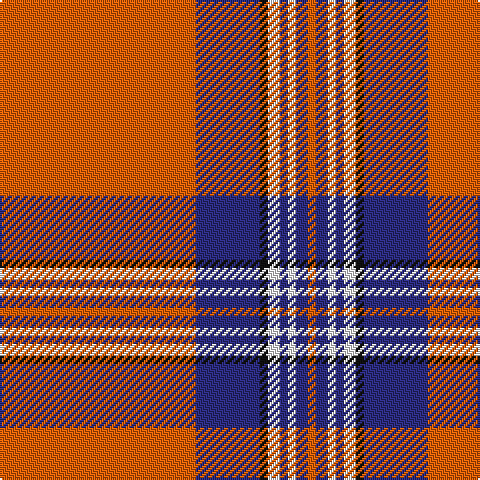

In pattern [RBKWBWBR](/patterns/rbkwbwbr/).

This was sourced from tartans-authority.  It is a [8 stripes tartan](/stripes/stripes8/).

Original link http://www.tartansauthority.com/tartan-ferret/display/2395/

## Thread count
O/98 DB32 K4 W6 DB4 W4 DB6 O/4

## Palette
Each colour and its ΔE from the base-6 reference it is a variant of.

| Colour | Shade | Base | ΔE (OKLab) |
|---|---|---|---|
| DB | <code style="background-color:#2C2C80;">#2C2C80</code> `#2C2C80` | B <code style="background-color:#2A418A;">#2A418A</code> | 0.06 |
| K | <code style="background-color:#101010;">#101010</code> `#101010` | K <code style="background-color:#000000;">#000000</code> | 0.17 |
| O | <code style="background-color:#E86008;">#E86008</code> `#E86008` | R <code style="background-color:#CC0000;">#CC0000</code> | 0.14 |
| W | <code style="background-color:#FCFCFC;">#FCFCFC</code> `#FCFCFC` | W <code style="background-color:#F7F7F7;">#F7F7F7</code> | 0.01 |

# Sample pattern

## Nearest tartans

The nearest existing variants by ΔTartan distance.

1. [Irn Bru Corporate Tartan Tartan Number: 2395. Earliest known date: Sep 1998 Irn Bru (Iron Brew) was first produced in 1901 by A.G. Barr and has been Scotland's favourite fizzy drink ever since. The colours are based on the brand label. Irn Bru was famously advertised on TV as 'being made in Scotland . . . from GIRDERS!" which was the subject of a complaint to the Advertising Standards Authority because it was 'untrue' !!! See products available Copyright © Blair Urquhart, Comrie, 2015](/setts/s8/y49b16k2w3b2w2b3y2~b2c2c80-k101010-wfcfcfc-yd87c00~x2/) — ΔT 0.84
1. [Irn Bru](/setts/s8/y98b32k3w6b4w4b6y4~b304080-k000000-we0e0e0-yff8500/) — ΔT 0.93
1. [Irn Bru](/setts/s8/r49b16k2w3b2w2b3r2~b0000ff-k101010-rff5f04-wfcfcfc~x2/) — ΔT 1.07
1. [Brock University Alumni Association](/setts/s6/r52y2b16y2b3w5~b000080-rc80000-wfcfcfc-yd87c00~x2/) — ΔT 1.25
1. [Stuart of Bute](/setts/s9/r12g6k1g2k1g1k6r24w2~g789484-k101010-rc80000-wffffff~x4/) — ΔT 1.34
1. [Galway](/setts/s10/r4ra2k4ra40k3ra3k4ra3g13ra4~g008000-k000030-r906030-rad00000~x2/) — ΔT 1.35
1. [Lantern, The](/setts/s9/w6k2r32y2k6y2r4k2w3~k101010-rc80000-wc0c0c0-yd09800~x2/) — ΔT 1.38
1. [Davet (2014)](/setts/s6/b5k1w11k1r42k1~b5c8ca8-k101010-rc80000-wfcfcfc~x2/) — ΔT 1.41
1. [National Defense](/setts/s6/r40w2b2w2r1y20~b0000cd-r8b0000-wffffff-ye6b426~x2/) — ΔT 1.42
1. [Fueglistal](/setts/s9/k3y6w13r2w2r32w1r2w1~k101010-rc80000-wc0c0c0-ybc8c00~x2/) — ΔT 1.42

## Neighbour map

Every grey dot is one of 15726 variants placed by the first two principal components of the ΔTartan feature space (44% of its variance). Red is this tartan; blue dots are its nearest — click one to open its page.

<svg viewBox="0 0 640 380" role="img" style="max-width:100%;height:auto;border:1px solid #e0e0e0;border-radius:4px;display:block" xmlns="http://www.w3.org/2000/svg"><image href="/nn/cloud.v1.png" width="640" height="380"/><a href="/setts/s8/y49b16k2w3b2w2b3y2~b2c2c80-k101010-wfcfcfc-yd87c00~x2/"><circle cx="413.5" cy="108.9" r="4" fill="#3465a4"><title>Irn Bru Corporate Tartan Tartan Number: 2395. Earliest known date: Sep 1998 Irn Bru (Iron Brew) was first produced in 1901 by A.G. Barr and has been Scotland's favourite fizzy drink ever since. The colours are based on the brand label. Irn Bru was famously advertised on TV as 'being made in Scotland . . . from GIRDERS!&quot; which was the subject of a complaint to the Advertising Standards Authority because it was 'untrue' !!! See products available Copyright © Blair Urquhart, Comrie, 2015</title></circle></a><a href="/setts/s8/y98b32k3w6b4w4b6y4~b304080-k000000-we0e0e0-yff8500/"><circle cx="428.4" cy="93.3" r="4" fill="#3465a4"><title>Irn Bru</title></circle></a><a href="/setts/s8/r49b16k2w3b2w2b3r2~b0000ff-k101010-rff5f04-wfcfcfc~x2/"><circle cx="402.5" cy="98.5" r="4" fill="#3465a4"><title>Irn Bru</title></circle></a><a href="/setts/s6/r52y2b16y2b3w5~b000080-rc80000-wfcfcfc-yd87c00~x2/"><circle cx="420.8" cy="127.2" r="4" fill="#3465a4"><title>Brock University Alumni Association</title></circle></a><a href="/setts/s9/r12g6k1g2k1g1k6r24w2~g789484-k101010-rc80000-wffffff~x4/"><circle cx="414.6" cy="126.2" r="4" fill="#3465a4"><title>Stuart of Bute</title></circle></a><a href="/setts/s10/r4ra2k4ra40k3ra3k4ra3g13ra4~g008000-k000030-r906030-rad00000~x2/"><circle cx="411.5" cy="119.4" r="4" fill="#3465a4"><title>Galway</title></circle></a><a href="/setts/s9/w6k2r32y2k6y2r4k2w3~k101010-rc80000-wc0c0c0-yd09800~x2/"><circle cx="370.3" cy="122.9" r="4" fill="#3465a4"><title>Lantern, The</title></circle></a><a href="/setts/s6/b5k1w11k1r42k1~b5c8ca8-k101010-rc80000-wfcfcfc~x2/"><circle cx="465.6" cy="100.1" r="4" fill="#3465a4"><title>Davet (2014)</title></circle></a><a href="/setts/s6/r40w2b2w2r1y20~b0000cd-r8b0000-wffffff-ye6b426~x2/"><circle cx="409.7" cy="111.8" r="4" fill="#3465a4"><title>National Defense</title></circle></a><a href="/setts/s9/k3y6w13r2w2r32w1r2w1~k101010-rc80000-wc0c0c0-ybc8c00~x2/"><circle cx="396.2" cy="100.6" r="4" fill="#3465a4"><title>Fueglistal</title></circle></a><circle cx="419.7" cy="105.9" r="5" fill="#c00000"/></svg>

ID: /setts/s8/r49b16k2w3b2w2b3r2~b2c2c80-k101010-re86008-wfcfcfc~x2/
