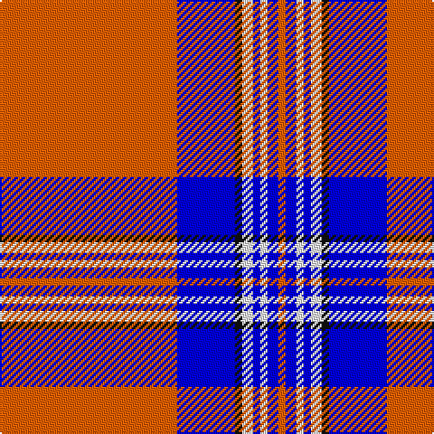

In pattern [RBKWBWBR](/stripes/rbkwbwbr/).

This was sourced from register-of-tartans.  It is a [8 stripe tartan](/stripes/stripes8/).

Original link https://www.tartanregister.gov.uk/tartanDetails.aspx?ref=1856

## Register references

External register numbers recorded for this tartan.

- Scottish Register of Tartans: [1856](https://www.tartanregister.gov.uk/tartanDetails.aspx?ref=1856)
- Scottish Tartans Authority (ITI): 2395
- Scottish Tartans World Register: 2395

## Thread count
R/98 B32 K4 W6 B4 W4 B6 R/4

## Palette
Each colour and its ΔE from the base-6 reference it is a variant of.

| Colour | Shade | Base | ΔE (OKLab) |
|---|---|---|---|
| B | <code style="background-color:#0000FF;">#0000FF</code> `#0000FF` | B <code style="background-color:#2A418A;">#2A418A</code> | 0.20 |
| K | <code style="background-color:#101010;">#101010</code> `#101010` | K <code style="background-color:#000000;">#000000</code> | 0.17 |
| R | <code style="background-color:#FF5F04;">#FF5F04</code> `#FF5F04` | R <code style="background-color:#CC0000;">#CC0000</code> | 0.16 |
| W | <code style="background-color:#FCFCFC;">#FCFCFC</code> `#FCFCFC` | W <code style="background-color:#F7F7F7;">#F7F7F7</code> | 0.01 |

# Sample pattern

## Nearest tartans

The nearest existing variants by ΔTartan distance.

1. [Irn Bru (Corporate)](/setts/s8/o49db16k2w3db2w2db3o2~x2/) — ΔT 1.07
1. [Irn Bru Corporate Tartan Tartan Number: 2395. Earliest known date: Sep 1998 Irn Bru (Iron Brew) was first produced in 1901 by A.G. Barr and has been Scotland's favourite fizzy drink ever since. The colours are based on the brand label. Irn Bru was famously advertised on TV as 'being made in Scotland . . . from GIRDERS!" which was the subject of a complaint to the Advertising Standards Authority because it was 'untrue' !!! See products available Copyright © Blair Urquhart, Comrie, 2015](/setts/s8/lo49db16k2w3db2w2db3lo2~x2/) — ΔT 1.42
1. [Texas Lone Star](/setts/s7/r50db14w6db9ly3db4r4~x2/) — ΔT 1.52
1. [Irn Bru](/setts/s8/lo98db32k3w6db4w4db6lo4/) — ΔT 1.53
1. [Brock University Alumni Association](/setts/s6/r52lo2db16lo2db3w5~x2/) — ΔT 1.58
1. [Rothesay, Dress (VS)](/setts/s10/r2w28db4w2k6w2r4k1r2w1~x2/) — ΔT 1.66
1. [Dunlop, dress](/setts/s8/w3db1w30db1p28w1p1w3~x2/) — ΔT 1.78
1. [Davet (2014)](/setts/s6/t5k1w11k1r42k1~x2/) — ΔT 1.88
1. [Texas Lone Star (Fashion)](/setts/s7/r50db14w6db9lo3db4r4~x2/) — ΔT 1.88
1. [O'Meehan (Name)](/setts/s9/ly27k4w4r64w4r4k4r4k12~x2/) — ΔT 1.89

## Neighbour map

Every grey dot is one of 14299 variants placed by the first two principal components of the ΔTartan feature space (44% of its variance). Red is this tartan; blue dots are its nearest — click one to open its page.

<svg viewBox="0 0 640 380" role="img" style="max-width:100%;height:auto;border:1px solid #e0e0e0;border-radius:4px;display:block" xmlns="http://www.w3.org/2000/svg"><image href="/nn/cloud.v1.png" width="640" height="380"/><a href="/setts/s8/o49db16k2w3db2w2db3o2~x2/"><circle cx="419.6" cy="98.9" r="4" fill="#3465a4"><title>Irn Bru (Corporate)</title></circle></a><a href="/setts/s8/lo49db16k2w3db2w2db3lo2~x2/"><circle cx="413.9" cy="102.6" r="4" fill="#3465a4"><title>Irn Bru Corporate Tartan Tartan Number: 2395. Earliest known date: Sep 1998 Irn Bru (Iron Brew) was first produced in 1901 by A.G. Barr and has been Scotland's favourite fizzy drink ever since. The colours are based on the brand label. Irn Bru was famously advertised on TV as 'being made in Scotland . . . from GIRDERS!&quot; which was the subject of a complaint to the Advertising Standards Authority because it was 'untrue' !!! See products available Copyright © Blair Urquhart, Comrie, 2015</title></circle></a><a href="/setts/s7/r50db14w6db9ly3db4r4~x2/"><circle cx="350.1" cy="123.4" r="4" fill="#3465a4"><title>Texas Lone Star</title></circle></a><a href="/setts/s8/lo98db32k3w6db4w4db6lo4/"><circle cx="428.3" cy="86.1" r="4" fill="#3465a4"><title>Irn Bru</title></circle></a><a href="/setts/s6/r52lo2db16lo2db3w5~x2/"><circle cx="420.6" cy="119.5" r="4" fill="#3465a4"><title>Brock University Alumni Association</title></circle></a><a href="/setts/s10/r2w28db4w2k6w2r4k1r2w1~x2/"><circle cx="362.4" cy="78.1" r="4" fill="#3465a4"><title>Rothesay, Dress (VS)</title></circle></a><a href="/setts/s8/w3db1w30db1p28w1p1w3~x2/"><circle cx="376.5" cy="107.4" r="4" fill="#3465a4"><title>Dunlop, dress</title></circle></a><a href="/setts/s6/t5k1w11k1r42k1~x2/"><circle cx="464.5" cy="90.9" r="4" fill="#3465a4"><title>Davet (2014)</title></circle></a><a href="/setts/s7/r50db14w6db9lo3db4r4~x2/"><circle cx="372.5" cy="138.9" r="4" fill="#3465a4"><title>Texas Lone Star (Fashion)</title></circle></a><a href="/setts/s9/ly27k4w4r64w4r4k4r4k12~x2/"><circle cx="327.0" cy="109.6" r="4" fill="#3465a4"><title>O'Meehan (Name)</title></circle></a><circle cx="402.7" cy="90.2" r="5" fill="#c00000"/></svg>

ID: /setts/s8/r49b16k2w3b2w2b3r2~x2/
