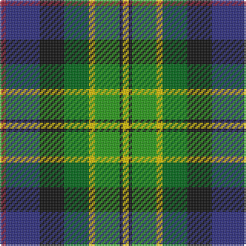

In pattern [RBKGYGKY](/patterns/rbkgygky/).

This was sourced from tartans-authority.  It is a [8 stripes tartan](/stripes/stripes8/).

Original link http://www.tartansauthority.com/tartan-ferret/display/3823/

## Thread count
DR/4 DB22 K16 Ga16 Y4 G16 K2 Y/4

## Palette
Each colour and its ΔE from the base-6 reference it is a variant of.

| Colour | Shade | Base | ΔE (OKLab) |
|---|---|---|---|
| DB | <code style="background-color:#2C2C80;">#2C2C80</code> `#2C2C80` | B <code style="background-color:#2C4084;">#2C4084</code> | 0.05 |
| DR | <code style="background-color:#901C38;">#901C38</code> `#901C38` | R <code style="background-color:#C80000;">#C80000</code> | 0.12 |
| G | <code style="background-color:#289C18;">#289C18</code> `#289C18` | G <code style="background-color:#006400;">#006400</code> | 0.18 |
| Ga | <code style="background-color:#006818;">#006818</code> `#006818` | G <code style="background-color:#006400;">#006400</code> | 0.02 |
| K | <code style="background-color:#101010;">#101010</code> `#101010` | K <code style="background-color:#000000;">#000000</code> | 0.17 |
| Y | <code style="background-color:#E8C000;">#E8C000</code> `#E8C000` | Y <code style="background-color:#E8C000;">#E8C000</code> | 0.00 |

# Sample pattern

## Nearest tartans

The nearest existing variants by ΔTartan distance.

1. [National Trade Tartan Tartan Number: 1775. Earliest known date: 1934 This sett was designed by the National Association of Scottish Woollen Manufacturers in 1934. (STS archives) Some 60 years later (1994) a new 'National' tartan has been developed. See 'Scottish National' and 'Scottish National Dress'. See products available Copyright © Blair Urquhart, Comrie, 2015](/setts/s9/w4b6r12k16g24y2b8k4w4-b2c2c80-g006818-k101010-rc80000-we0e0e0-ye8c000/) — ΔT 0.98
1. [National (1934), The](/setts/s9/w4b6r12k16g24y2b8k4w4-b1c0070-g006818-k101010-rc80000-wfcfcfc-yd09800/) — ΔT 1.10
1. [National](/setts/s9/w4b6r12k16g24y2b8k4w4-b304080-g008000-k000000-rc00000-we0e0e0-yf0c000/) — ΔT 1.15
1. [Rutledge](/setts/s10/k12b40k8w4k8g40k8ga40r4ga4-b2c2c80-g289c18-ga003820-k101010-rc80000-we0e0e0/) — ΔT 1.17
1. [Comyn/Cumming](/setts/s9/b16k8b16k40y4g40r16w4r16-b3c82af-g005020-k101010-rdc0000-we0e0e0-ye8c000/) — ΔT 1.17
1. [Council of Scottish Clans & Ass. (Co](/setts/s7/w4r4b32k28g30r4y4-b2c2c80-g289c18-k101010-rc80000-wfcfcfc-yfccc00/) — ΔT 1.17
1. [Manderson Family Tartan Tartan Number: 2230. Earliest known date: 1993 A Family Tartan designed for Mr N. Manderson of Edinburgh. See products available Copyright © Blair Urquhart, Comrie, 2015](/setts/s11/k8r20k8g16k24ra10g32b32ra10b12w4-b5c8ca8-g006818-k101010-r888888-ra901c38-we0e0e0/) — ΔT 1.18
1. [Birch (Personal) (Estimated threadcount)](/setts/s9/g4b4g20k12r4k12ba20k2w4-b64008c-ba788cb4-g007800-k000000-r8c0000-wc8c8c8/) — ΔT 1.18
1. [Scout Mapping Service #2](/setts/s14/b22k16g16y4ga16k2y4k2ga16y4g16k16b22r4-b2c2c80-g006818-ga289c18-k101010-r901c38-ye8c000/) — ΔT 1.18
1. [South Africa 1994 (Fashion)](/setts/s7/k40y8b26w8g60w8r26-b2c2c80-g006818-k101010-rc80000-we0e0e0-ye8c000/) — ΔT 1.19

## Neighbour map

Every grey dot is one of 15726 variants placed by the first two principal components of the ΔTartan feature space (44% of its variance). Red is this tartan; blue dots are its nearest — click one to open its page.

<svg viewBox="0 0 640 380" role="img" style="max-width:100%;height:auto;border:1px solid #e0e0e0;border-radius:4px;display:block" xmlns="http://www.w3.org/2000/svg"><image href="/nn/cloud.v1.png" width="640" height="380"/><a href="/setts/s9/w4b6r12k16g24y2b8k4w4-b2c2c80-g006818-k101010-rc80000-we0e0e0-ye8c000/"><circle cx="76.7" cy="147.9" r="4" fill="#3465a4"><title>National Trade Tartan Tartan Number: 1775. Earliest known date: 1934 This sett was designed by the National Association of Scottish Woollen Manufacturers in 1934. (STS archives) Some 60 years later (1994) a new 'National' tartan has been developed. See 'Scottish National' and 'Scottish National Dress'. See products available Copyright © Blair Urquhart, Comrie, 2015</title></circle></a><a href="/setts/s9/w4b6r12k16g24y2b8k4w4-b1c0070-g006818-k101010-rc80000-wfcfcfc-yd09800/"><circle cx="70.0" cy="145.3" r="4" fill="#3465a4"><title>National (1934), The</title></circle></a><a href="/setts/s9/w4b6r12k16g24y2b8k4w4-b304080-g008000-k000000-rc00000-we0e0e0-yf0c000/"><circle cx="60.7" cy="142.8" r="4" fill="#3465a4"><title>National</title></circle></a><a href="/setts/s10/k12b40k8w4k8g40k8ga40r4ga4-b2c2c80-g289c18-ga003820-k101010-rc80000-we0e0e0/"><circle cx="86.8" cy="154.3" r="4" fill="#3465a4"><title>Rutledge</title></circle></a><a href="/setts/s9/b16k8b16k40y4g40r16w4r16-b3c82af-g005020-k101010-rdc0000-we0e0e0-ye8c000/"><circle cx="81.9" cy="161.5" r="4" fill="#3465a4"><title>Comyn/Cumming</title></circle></a><a href="/setts/s7/w4r4b32k28g30r4y4-b2c2c80-g289c18-k101010-rc80000-wfcfcfc-yfccc00/"><circle cx="80.0" cy="166.7" r="4" fill="#3465a4"><title>Council of Scottish Clans &amp; Ass. (Co</title></circle></a><a href="/setts/s11/k8r20k8g16k24ra10g32b32ra10b12w4-b5c8ca8-g006818-k101010-r888888-ra901c38-we0e0e0/"><circle cx="49.4" cy="183.6" r="4" fill="#3465a4"><title>Manderson Family Tartan Tartan Number: 2230. Earliest known date: 1993 A Family Tartan designed for Mr N. Manderson of Edinburgh. See products available Copyright © Blair Urquhart, Comrie, 2015</title></circle></a><a href="/setts/s9/g4b4g20k12r4k12ba20k2w4-b64008c-ba788cb4-g007800-k000000-r8c0000-wc8c8c8/"><circle cx="71.7" cy="157.7" r="4" fill="#3465a4"><title>Birch (Personal) (Estimated threadcount)</title></circle></a><a href="/setts/s14/b22k16g16y4ga16k2y4k2ga16y4g16k16b22r4-b2c2c80-g006818-ga289c18-k101010-r901c38-ye8c000/"><circle cx="47.1" cy="154.3" r="4" fill="#3465a4"><title>Scout Mapping Service #2</title></circle></a><a href="/setts/s7/k40y8b26w8g60w8r26-b2c2c80-g006818-k101010-rc80000-we0e0e0-ye8c000/"><circle cx="76.0" cy="178.8" r="4" fill="#3465a4"><title>South Africa 1994 (Fashion)</title></circle></a><circle cx="52.5" cy="169.6" r="5" fill="#c00000"/></svg>

ID: /setts/s8/r4b22k16g16y4ga16k2y4-b2c2c80-g006818-ga289c18-k101010-r901c38-ye8c000/
