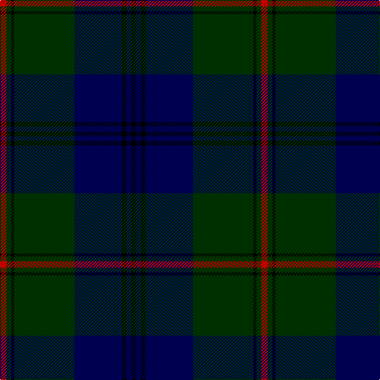

This page is one **sett** — a single exact thread-count. It belongs to the [tartan](/tartans/r4dg3k2dg38db30k3db3k3/)
(the same proportion at any scale), whose colour order is pattern [KBKBGKGR](/stripes/kbkbgkgr/).

Sourced from weddslist.  It is a [8 stripe tartan](/stripes/stripes8/).

Original link http://www.weddslist.com/cgi-bin/tartans/pg.pl?source=sts

2 attestations — the source records this cloth was collapsed from (oldest owns this page)

<ul>
<li>undated — Peter of Lee (weddslist, <a href="http://www.weddslist.com/cgi-bin/tartans/pg.pl?source=sts">record</a>)</li>
<li>undated — Peter of Lee Family Tartan Tartan Number: 1055. Earliest known date: 1988 Designed by Harry Lindley for E. Leslie Peter. The sett was accredited by the Scottish Tartans Society in 1988. See products available Copyright © Blair Urquhart, Comrie, 2015 (house-of-tartan, <a href="http://www.house-of-tartan.scotland.net/house/TartanViewjs.asp?colr=Def&tnam=1055">record</a>)</li>
</ul>

## Thread count
R/8 DG6 K4 DG76 DB60 K6 DB6 K/6

## Palette

Palette: <strong>Ingles Buchan</strong> <small style="color:#888">(1 of 4 colours)</small>
<table><thead><tr><th>Colour</th><th>Threads</th><th>Shade</th><th>Base</th><th>OKLCh</th></tr></thead><tbody><tr><td>R/</td><td style="text-align:right;font-variant-numeric:tabular-nums">8</td><td><code style="background-color:#C00000;">#C00000</code> <small style="color:#888">#C00000</small></td><td>R <code style="background-color:#CC0000;">#CC0000</code></td><td><small style="color:#888">oklch(50.7% 0.208 29.2)</small></td></tr><tr><td>DG</td><td style="text-align:right;font-variant-numeric:tabular-nums">6</td><td><code style="background-color:#003000;">#003000</code> <small style="color:#888">#003000</small></td><td>G <code style="background-color:#006100;">#006100</code></td><td><small style="color:#888">oklch(26.8% 0.091 142.5)</small></td></tr><tr><td>K</td><td style="text-align:right;font-variant-numeric:tabular-nums">4</td><td><code style="background-color:#000000;">#000000</code> <small style="color:#888">#000000</small></td><td>K <code style="background-color:#000000;">#000000</code></td><td><small style="color:#888">oklch(0.0% 0.000 0.0)</small></td></tr><tr><td>DG</td><td style="text-align:right;font-variant-numeric:tabular-nums">76</td><td><code style="background-color:#003000;">#003000</code> <small style="color:#888">#003000</small></td><td>G <code style="background-color:#006100;">#006100</code></td><td><small style="color:#888">oklch(26.8% 0.091 142.5)</small></td></tr><tr><td>DB</td><td style="text-align:right;font-variant-numeric:tabular-nums">60</td><td><code style="background-color:#000050;">#000050</code> <small style="color:#888">#000050</small></td><td>B <code style="background-color:#2A418A;">#2A418A</code></td><td><small style="color:#888">oklch(19.5% 0.135 264.1)</small></td></tr><tr><td>K</td><td style="text-align:right;font-variant-numeric:tabular-nums">6</td><td><code style="background-color:#000000;">#000000</code> <small style="color:#888">#000000</small></td><td>K <code style="background-color:#000000;">#000000</code></td><td><small style="color:#888">oklch(0.0% 0.000 0.0)</small></td></tr><tr><td>DB</td><td style="text-align:right;font-variant-numeric:tabular-nums">6</td><td><code style="background-color:#000050;">#000050</code> <small style="color:#888">#000050</small></td><td>B <code style="background-color:#2A418A;">#2A418A</code></td><td><small style="color:#888">oklch(19.5% 0.135 264.1)</small></td></tr><tr><td>K/</td><td style="text-align:right;font-variant-numeric:tabular-nums">6</td><td><code style="background-color:#000000;">#000000</code> <small style="color:#888">#000000</small></td><td>K <code style="background-color:#000000;">#000000</code></td><td><small style="color:#888">oklch(0.0% 0.000 0.0)</small></td></tr></tbody></table>

# Sample pattern

## Nearest tartans

The nearest existing variants by ΔTartan distance, with this tartan at the top so the swatches line up against it.

ΔTartan

Tartan

Sett

—

<a href="/ttd/edit/#slug=r4dg3k2dg38db30k3db3k3~x2">Peter of Lee</a> <a class="nn-out" href="/setts/s8/r4dg3k2dg38db30k3db3k3~x2/" title="open its dictionary page">↗</a>

1.21

<a href="/ttd/edit/#slug=k10db4k34dt2k2dt30w3~x2">Patriot, The (Fashion)</a> <a class="nn-out" href="/setts/s7/k10db4k34dt2k2dt30w3~x2/" title="open its dictionary page">↗</a>

1.33

<a href="/ttd/edit/#slug=k20r1dg3k8dg2k2dg20w2~x2">Scottish Chieftain (Universal)</a> <a class="nn-out" href="/setts/s8/k20r1dg3k8dg2k2dg20w2~x2/" title="open its dictionary page">↗</a>

1.33

<a href="/ttd/edit/#slug=ly3dg2k1dg30db24k2db2k2~x2">Johnston</a> <a class="nn-out" href="/setts/s8/ly3dg2k1dg30db24k2db2k2~x2/" title="open its dictionary page">↗</a>

1.34

<a href="/ttd/edit/#slug=db16g1db1g1db1k12g1db1g1db1g6dp2~x4">Stephen-Mathieson</a> <a class="nn-out" href="/setts/s12/db16g1db1g1db1k12g1db1g1db1g6dp2~x4/" title="open its dictionary page">↗</a>

1.35

<a href="/ttd/edit/#slug=db4k4db24dg32lr1dg2~x2">Oliphant</a> <a class="nn-out" href="/setts/s6/db4k4db24dg32lr1dg2~x2/" title="open its dictionary page">↗</a>

1.39

<a href="/ttd/edit/#slug=db6t3db3t15dg7db7dg5db17dg46dg4">Jones (Welsh Name)</a> <a class="nn-out" href="/setts/s10/db6t3db3t15dg7db7dg5db17dg46dg4/" title="open its dictionary page">↗</a>

1.41

<a href="/ttd/edit/#slug=k4r1k4r1dg14n1dg1~x4">Pinehurst Resort</a> <a class="nn-out" href="/setts/s7/k4r1k4r1dg14n1dg1~x4/" title="open its dictionary page">↗</a>

1.44

<a href="/ttd/edit/#slug=dt23k2dt2k2dt2k28r2k4n2~x2">Trotter (Personal)</a> <a class="nn-out" href="/setts/s9/dt23k2dt2k2dt2k28r2k4n2~x2/" title="open its dictionary page">↗</a>

1.44

<a href="/ttd/edit/#slug=k12r1k1r1k1r4dg12ly1dg2~x4">Durie</a> <a class="nn-out" href="/setts/s9/k12r1k1r1k1r4dg12ly1dg2~x4/" title="open its dictionary page">↗</a>

1.45

<a href="/ttd/edit/#slug=dg2k3ly1k3dg2db8dg16k1~x4">Harley (Leslie), Robert</a> <a class="nn-out" href="/setts/s8/dg2k3ly1k3dg2db8dg16k1~x4/" title="open its dictionary page">↗</a>

## Neighbour map

Every grey dot is one of 14299 variants placed by the first two principal components of the ΔTartan feature space (44% of its variance). Red is this tartan; blue dots are its nearest — click one to open its page.

<svg viewBox="0 0 640 380" role="img" style="max-width:100%;height:auto;border:1px solid #e0e0e0;border-radius:4px;display:block" xmlns="http://www.w3.org/2000/svg"><image href="/nn/cloud.v1.png" width="640" height="380"/><a href="/setts/s7/k10db4k34dt2k2dt30w3~x2/"><circle cx="388.7" cy="210.9" r="4" fill="#3465a4"><title>Patriot, The (Fashion)</title></circle></a><a href="/setts/s8/k20r1dg3k8dg2k2dg20w2~x2/"><circle cx="393.1" cy="205.7" r="4" fill="#3465a4"><title>Scottish Chieftain (Universal)</title></circle></a><a href="/setts/s8/ly3dg2k1dg30db24k2db2k2~x2/"><circle cx="354.7" cy="156.0" r="4" fill="#3465a4"><title>Johnston</title></circle></a><a href="/setts/s12/db16g1db1g1db1k12g1db1g1db1g6dp2~x4/"><circle cx="328.5" cy="173.2" r="4" fill="#3465a4"><title>Stephen-Mathieson</title></circle></a><a href="/setts/s6/db4k4db24dg32lr1dg2~x2/"><circle cx="389.7" cy="190.9" r="4" fill="#3465a4"><title>Oliphant</title></circle></a><a href="/setts/s10/db6t3db3t15dg7db7dg5db17dg46dg4/"><circle cx="349.4" cy="198.1" r="4" fill="#3465a4"><title>Jones (Welsh Name)</title></circle></a><a href="/setts/s7/k4r1k4r1dg14n1dg1~x4/"><circle cx="393.3" cy="207.2" r="4" fill="#3465a4"><title>Pinehurst Resort</title></circle></a><a href="/setts/s9/dt23k2dt2k2dt2k28r2k4n2~x2/"><circle cx="404.6" cy="198.9" r="4" fill="#3465a4"><title>Trotter (Personal)</title></circle></a><a href="/setts/s9/k12r1k1r1k1r4dg12ly1dg2~x4/"><circle cx="275.8" cy="192.3" r="4" fill="#3465a4"><title>Durie</title></circle></a><a href="/setts/s8/dg2k3ly1k3dg2db8dg16k1~x4/"><circle cx="346.2" cy="196.2" r="4" fill="#3465a4"><title>Harley (Leslie), Robert</title></circle></a><circle cx="358.5" cy="190.9" r="5" fill="#c00000"/></svg>

ID: /setts/s8/r4dg3k2dg38db30k3db3k3~x2/
