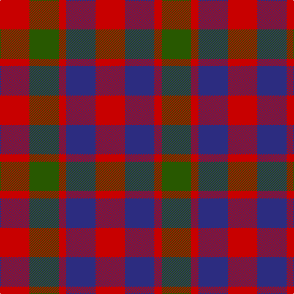

In pattern [GRBRBRGR](/stripes/grbrbrgr/).

This was sourced from register-of-tartans.  It is a [8 stripe tartan](/stripes/stripes8/).

Original link https://www.tartanregister.gov.uk/tartanDetails.aspx?ref=1472

## Also known as

This cloth is also recorded under:

- Gow

## Register references

External register numbers recorded for this tartan.

- Scottish Register of Tartans: [1472](https://www.tartanregister.gov.uk/tartanDetails.aspx?ref=1472)
- Scottish Tartans Authority (ITI): 5916

## Thread count
R/48 G48 R12 DB48 R48 DB48 R12 G/48

## Palette
Each colour and the base-6 reference it is a variant of.

| Colour | Shade | Base |
|---|---|---|
| DB | <code style="background-color:#2C2C80;">#2C2C80</code> `oklch(35.0% 0.138 276.6)` <small>#2C2C80</small> | B <code style="background-color:#2A418A;">#2A418A</code> |
| DG | <code style="background-color:#003820;">#003820</code> `oklch(30.0% 0.070 158.3)` <small>#003820</small> | G <code style="background-color:#006100;">#006100</code> |
| G | <code style="background-color:#285800;">#285800</code> `oklch(41.0% 0.122 135.8)` <small>#285800</small> | G <code style="background-color:#006100;">#006100</code> |
| Ga | <code style="background-color:#006818;">#006818</code> `oklch(45.0% 0.142 145.0)` <small>#006818</small> | G <code style="background-color:#006100;">#006100</code> |
| Gb | <code style="background-color:#289C18;">#289C18</code> `oklch(60.6% 0.191 141.6)` <small>#289C18</small> | G <code style="background-color:#006100;">#006100</code> |
| R | <code style="background-color:#C80000;">#C80000</code> `oklch(52.3% 0.215 29.2)` <small>#C80000</small> | R <code style="background-color:#CC0000;">#CC0000</code> |

# Sample pattern

## Nearest tartans

The nearest existing variants by ΔTartan distance.

1. [Gow (Portrait)](/setts/s8/r5dp5r1g5r5~x8/) — ΔT 0.89
1. [Fiddes](/setts/s11/g16r12db16r6db4r6db7r20db8g8db12~x2/) — ΔT 0.93
1. [Fiddes #2](/setts/s11/dg16r12db16r6db4r6db7r20db8dg8db12~x2/) — ΔT 0.97
1. [Tulsa, City of](/setts/s6/dg14db8dg14r14k3r14~x2/) — ΔT 1.22
1. [Glasgow District Tartan Tartan Number: 534. Earliest known date: pre 1992 Originally from the Sindex cards and now woven by House of Edgar in their Old and Rare collection. Need to check if it actually appears in the Old and Rare book. See products available Copyright © Blair Urquhart, Comrie, 2015](/setts/s8/o10g14o3db14o10g14o3db4~x2/) — ΔT 1.33
1. [McCaslin](/setts/s11/db13r4db4r9db14r4db14g15r8g8r4~x2/) — ΔT 1.34
1. [Wilson's No.223](/setts/s8/dg6dp6y1r6dg6r6y1dp6~x4/) — ΔT 1.34
1. [Flora MacDonald](/setts/s8/r3dg3r3dg10db10r3db3r3~x2/) — ΔT 1.35
1. [Wilson's No.137](/setts/s8/g6dp3k3dp3k3dp3g6r2~x2/) — ΔT 1.40
1. [Gleneagles Group](/setts/s7/r5g6ly2g6r5b6r2~x2/) — ΔT 1.40

## Neighbour map

Every grey dot is one of 14299 variants placed by the first two principal components of the ΔTartan feature space (44% of its variance). Red is this tartan; blue dots are its nearest — click one to open its page.

<svg viewBox="0 0 640 380" role="img" style="max-width:100%;height:auto;border:1px solid #e0e0e0;border-radius:4px;display:block" xmlns="http://www.w3.org/2000/svg"><image href="/nn/cloud.v1.png" width="640" height="380"/><a href="/setts/s8/r5dp5r1g5r5~x8/"><circle cx="188.0" cy="279.0" r="4" fill="#3465a4"><title>Gow (Portrait)</title></circle></a><a href="/setts/s11/g16r12db16r6db4r6db7r20db8g8db12~x2/"><circle cx="195.3" cy="265.8" r="4" fill="#3465a4"><title>Fiddes</title></circle></a><a href="/setts/s11/dg16r12db16r6db4r6db7r20db8dg8db12~x2/"><circle cx="192.8" cy="262.5" r="4" fill="#3465a4"><title>Fiddes #2</title></circle></a><a href="/setts/s6/dg14db8dg14r14k3r14~x2/"><circle cx="182.4" cy="290.0" r="4" fill="#3465a4"><title>Tulsa, City of</title></circle></a><a href="/setts/s8/o10g14o3db14o10g14o3db4~x2/"><circle cx="180.5" cy="273.0" r="4" fill="#3465a4"><title>Glasgow District Tartan Tartan Number: 534. Earliest known date: pre 1992 Originally from the Sindex cards and now woven by House of Edgar in their Old and Rare collection. Need to check if it actually appears in the Old and Rare book. See products available Copyright © Blair Urquhart, Comrie, 2015</title></circle></a><a href="/setts/s11/db13r4db4r9db14r4db14g15r8g8r4~x2/"><circle cx="201.9" cy="275.0" r="4" fill="#3465a4"><title>McCaslin</title></circle></a><a href="/setts/s8/dg6dp6y1r6dg6r6y1dp6~x4/"><circle cx="142.7" cy="255.5" r="4" fill="#3465a4"><title>Wilson's No.223</title></circle></a><a href="/setts/s8/r3dg3r3dg10db10r3db3r3~x2/"><circle cx="175.3" cy="275.0" r="4" fill="#3465a4"><title>Flora MacDonald</title></circle></a><a href="/setts/s8/g6dp3k3dp3k3dp3g6r2~x2/"><circle cx="131.9" cy="295.3" r="4" fill="#3465a4"><title>Wilson's No.137</title></circle></a><a href="/setts/s7/r5g6ly2g6r5b6r2~x2/"><circle cx="138.3" cy="310.0" r="4" fill="#3465a4"><title>Gleneagles Group</title></circle></a><circle cx="170.8" cy="295.3" r="5" fill="#c00000"/></svg>

ID: /setts/s8/r4dg4r1db4r4~x12/
