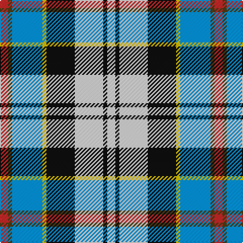

In pattern [RGBYKWKW](/stripes/rgbykwkw/).

This was sourced from register-of-tartans.  It is a [8 stripe tartan](/stripes/stripes8/).

Original link https://www.tartanregister.gov.uk/tartanDetails.aspx?ref=821

## Register references

External register numbers recorded for this tartan.

- Scottish Register of Tartans: [821](https://www.tartanregister.gov.uk/tartanDetails.aspx?ref=821)
- Scottish Tartans World Register: 1655

## Thread count
R/8 T4 B30 Y4 K28 LN28 K4 LN/8

## Palette
Each colour and the base-6 reference it is a variant of.

| Colour | Shade | Base |
|---|---|---|
| B | <code style="background-color:#0596FA;">#0596FA</code> `oklch(66.0% 0.180 248.9)` <small>#0596FA</small> | B <code style="background-color:#2A418A;">#2A418A</code> |
| K | <code style="background-color:#101010;">#101010</code> `oklch(17.3% 0.000 89.9)` <small>#101010</small> | K <code style="background-color:#000000;">#000000</code> |
| LN | <code style="background-color:#E0E0E0;">#E0E0E0</code> `oklch(90.7% 0.000 89.9)` <small>#E0E0E0</small> | W <code style="background-color:#F7F7F7;">#F7F7F7</code> |
| R | <code style="background-color:#C82828;">#C82828</code> `oklch(54.2% 0.196 26.8)` <small>#C82828</small> | R <code style="background-color:#CC0000;">#CC0000</code> |
| T | <code style="background-color:#503C14;">#503C14</code> `oklch(37.0% 0.062 81.8)` <small>#503C14</small> | G <code style="background-color:#006100;">#006100</code> |
| Y | <code style="background-color:#E8C000;">#E8C000</code> `oklch(81.9% 0.168 93.7)` <small>#E8C000</small> | Y <code style="background-color:#F2BF00;">#F2BF00</code> |

# Sample pattern

## Nearest tartans

The nearest existing variants by ΔTartan distance.

1. [Culloden - 2000 (Fashion)](/setts/s8/r4dy2t15ly2k14w14k2w4~x2/) — ΔT 0.36
1. [Culloden, Stirling](/setts/s8/r4o2b15ly2k14w14k2w4~x2/) — ΔT 0.78
1. [Curd (2013)](/setts/s8/db1t9w3ly3db9ly1g1r1~x4/) — ΔT 0.87
1. [Sound of Iona](/setts/s9/w30t4db6dp4db6g6db12g13lb4~x2/) — ΔT 0.87
1. [Elora (District)](/setts/s8/dt2g2dt11o2w8t12ly2t2~x2/) — ΔT 0.96
1. [Gillies, dress Blue](/setts/s10/ly6k2t15r5t9k13w25db2w3db2~x2/) — ΔT 1.05
1. [Haymarket, dress Blue](/setts/s9/g5db22g6k10w24ly2db2w2r2~x2/) — ΔT 1.15
1. [Sound of Iona](/setts/s9/w30lb4dt6m4dt6g6dt12g13lt4~x2/) — ΔT 1.15
1. [Iowa Dress (District)](/setts/s8/r4ly3w12k16g5db20k4w2~x2/) — ΔT 1.15
1. [Kagame (Personal)](/setts/s10/ly5lb14k3ly7g3k3g7k6db24w3~x2/) — ΔT 1.17

## Neighbour map

Every grey dot is one of 14299 variants placed by the first two principal components of the ΔTartan feature space (44% of its variance). Red is this tartan; blue dots are its nearest — click one to open its page.

<svg viewBox="0 0 640 380" role="img" style="max-width:100%;height:auto;border:1px solid #e0e0e0;border-radius:4px;display:block" xmlns="http://www.w3.org/2000/svg"><image href="/nn/cloud.v1.png" width="640" height="380"/><a href="/setts/s8/r4dy2t15ly2k14w14k2w4~x2/"><circle cx="59.7" cy="148.9" r="4" fill="#3465a4"><title>Culloden - 2000 (Fashion)</title></circle></a><a href="/setts/s8/r4o2b15ly2k14w14k2w4~x2/"><circle cx="62.0" cy="148.2" r="4" fill="#3465a4"><title>Culloden, Stirling</title></circle></a><a href="/setts/s8/db1t9w3ly3db9ly1g1r1~x4/"><circle cx="109.3" cy="143.5" r="4" fill="#3465a4"><title>Curd (2013)</title></circle></a><a href="/setts/s9/w30t4db6dp4db6g6db12g13lb4~x2/"><circle cx="77.4" cy="142.8" r="4" fill="#3465a4"><title>Sound of Iona</title></circle></a><a href="/setts/s8/dt2g2dt11o2w8t12ly2t2~x2/"><circle cx="82.4" cy="170.1" r="4" fill="#3465a4"><title>Elora (District)</title></circle></a><a href="/setts/s10/ly6k2t15r5t9k13w25db2w3db2~x2/"><circle cx="87.5" cy="114.8" r="4" fill="#3465a4"><title>Gillies, dress Blue</title></circle></a><a href="/setts/s9/g5db22g6k10w24ly2db2w2r2~x2/"><circle cx="105.3" cy="117.6" r="4" fill="#3465a4"><title>Haymarket, dress Blue</title></circle></a><a href="/setts/s9/w30lb4dt6m4dt6g6dt12g13lt4~x2/"><circle cx="82.3" cy="146.0" r="4" fill="#3465a4"><title>Sound of Iona</title></circle></a><a href="/setts/s8/r4ly3w12k16g5db20k4w2~x2/"><circle cx="68.7" cy="148.9" r="4" fill="#3465a4"><title>Iowa Dress (District)</title></circle></a><a href="/setts/s10/ly5lb14k3ly7g3k3g7k6db24w3~x2/"><circle cx="52.4" cy="140.5" r="4" fill="#3465a4"><title>Kagame (Personal)</title></circle></a><circle cx="63.7" cy="152.2" r="5" fill="#c00000"/></svg>

ID: /setts/s8/r4dy2b15ly2k14w14k2w4~x2/
