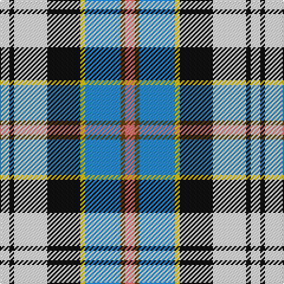

In pattern [RGBYKWKW](/stripes/rgbykwkw/).

This was sourced from tartans-authority.  It is a [8 stripe tartan](/stripes/stripes8/).

Original link http://www.tartansauthority.com/tartan-ferret/display/1655/

## Thread count
W/8 K4 W28 K28 Y4 B30 T4 LR/8

## Palette
Each colour and the base-6 reference it is a variant of.

| Colour | Shade | Base |
|---|---|---|
| B | <code style="background-color:#2888C4;">#2888C4</code> `oklch(60.1% 0.125 241.5)` <small>#2888C4</small> | B <code style="background-color:#2A418A;">#2A418A</code> |
| K | <code style="background-color:#101010;">#101010</code> `oklch(17.3% 0.000 89.9)` <small>#101010</small> | K <code style="background-color:#000000;">#000000</code> |
| LR | <code style="background-color:#E87878;">#E87878</code> `oklch(70.0% 0.139 21.2)` <small>#E87878</small> | R <code style="background-color:#CC0000;">#CC0000</code> |
| T | <code style="background-color:#604000;">#604000</code> `oklch(39.8% 0.083 76.8)` <small>#604000</small> | G <code style="background-color:#006100;">#006100</code> |
| W | <code style="background-color:#FCFCFC;">#FCFCFC</code> `oklch(99.1% 0.000 89.9)` <small>#FCFCFC</small> | W <code style="background-color:#F7F7F7;">#F7F7F7</code> |
| Y | <code style="background-color:#E8C000;">#E8C000</code> `oklch(81.9% 0.168 93.7)` <small>#E8C000</small> | Y <code style="background-color:#F2BF00;">#F2BF00</code> |

# Sample pattern

## Nearest tartans

The nearest existing variants by ΔTartan distance, with this tartan at the top so the swatches line up against it.

ΔTartan

Tartan

Sett

—

<a href="/ttd/edit/#slug=r4dy2t15ly2k14w14k2w4~x2">Culloden - 2000 (Fashion)</a> <a class="nn-out" href="/setts/s8/r4dy2t15ly2k14w14k2w4~x2/" title="open its dictionary page">↗</a>

0.36

<a href="/ttd/edit/#slug=r4dy2b15ly2k14w14k2w4~x2">Culloden Blue, Stirling</a> <a class="nn-out" href="/setts/s8/r4dy2b15ly2k14w14k2w4~x2/" title="open its dictionary page">↗</a>

0.85

<a href="/ttd/edit/#slug=r4o2b15ly2k14w14k2w4~x2">Culloden, Stirling</a> <a class="nn-out" href="/setts/s8/r4o2b15ly2k14w14k2w4~x2/" title="open its dictionary page">↗</a>

0.96

<a href="/ttd/edit/#slug=w30t4db6dp4db6g6db12g13lb4~x2">Sound of Iona</a> <a class="nn-out" href="/setts/s9/w30t4db6dp4db6g6db12g13lb4~x2/" title="open its dictionary page">↗</a>

0.98

<a href="/ttd/edit/#slug=w30lb4dt6m4dt6g6dt12g13lt4~x2">Sound of Iona</a> <a class="nn-out" href="/setts/s9/w30lb4dt6m4dt6g6dt12g13lt4~x2/" title="open its dictionary page">↗</a>

0.99

<a href="/ttd/edit/#slug=ly6k2t15r5t9k13w25db2w3db2~x2">Gillies, dress Blue</a> <a class="nn-out" href="/setts/s10/ly6k2t15r5t9k13w25db2w3db2~x2/" title="open its dictionary page">↗</a>

1.05

<a href="/ttd/edit/#slug=dt2g2dt11o2w8t12ly2t2~x2">Elora (District)</a> <a class="nn-out" href="/setts/s8/dt2g2dt11o2w8t12ly2t2~x2/" title="open its dictionary page">↗</a>

1.10

<a href="/ttd/edit/#slug=db1t9w3ly3db9ly1g1r1~x4">Curd (2013)</a> <a class="nn-out" href="/setts/s8/db1t9w3ly3db9ly1g1r1~x4/" title="open its dictionary page">↗</a>

1.15

<a href="/ttd/edit/#slug=g5db22g6k10w24ly2db2w2r2~x2">Haymarket, dress Blue</a> <a class="nn-out" href="/setts/s9/g5db22g6k10w24ly2db2w2r2~x2/" title="open its dictionary page">↗</a>

1.16

<a href="/ttd/edit/#slug=g5ly2t20w2k20w20k2w5~x2">Alexander Brothers - 2007? (Corp.)</a> <a class="nn-out" href="/setts/s8/g5ly2t20w2k20w20k2w5~x2/" title="open its dictionary page">↗</a>

1.16

<a href="/ttd/edit/#slug=ly5lb14k3ly7g3k3g7k6db24w3~x2">Kagame (Personal)</a> <a class="nn-out" href="/setts/s10/ly5lb14k3ly7g3k3g7k6db24w3~x2/" title="open its dictionary page">↗</a>

## Neighbour map

Every grey dot is one of 14299 variants placed by the first two principal components of the ΔTartan feature space (44% of its variance). Red is this tartan; blue dots are its nearest — click one to open its page.

<svg viewBox="0 0 640 380" role="img" style="max-width:100%;height:auto;border:1px solid #e0e0e0;border-radius:4px;display:block" xmlns="http://www.w3.org/2000/svg"><image href="/nn/cloud.v1.png" width="640" height="380"/><a href="/setts/s8/r4dy2b15ly2k14w14k2w4~x2/"><circle cx="63.7" cy="152.2" r="4" fill="#3465a4"><title>Culloden Blue, Stirling</title></circle></a><a href="/setts/s8/r4o2b15ly2k14w14k2w4~x2/"><circle cx="62.0" cy="148.2" r="4" fill="#3465a4"><title>Culloden, Stirling</title></circle></a><a href="/setts/s9/w30t4db6dp4db6g6db12g13lb4~x2/"><circle cx="77.4" cy="142.8" r="4" fill="#3465a4"><title>Sound of Iona</title></circle></a><a href="/setts/s9/w30lb4dt6m4dt6g6dt12g13lt4~x2/"><circle cx="82.3" cy="146.0" r="4" fill="#3465a4"><title>Sound of Iona</title></circle></a><a href="/setts/s10/ly6k2t15r5t9k13w25db2w3db2~x2/"><circle cx="87.5" cy="114.8" r="4" fill="#3465a4"><title>Gillies, dress Blue</title></circle></a><a href="/setts/s8/dt2g2dt11o2w8t12ly2t2~x2/"><circle cx="82.4" cy="170.1" r="4" fill="#3465a4"><title>Elora (District)</title></circle></a><a href="/setts/s8/db1t9w3ly3db9ly1g1r1~x4/"><circle cx="109.3" cy="143.5" r="4" fill="#3465a4"><title>Curd (2013)</title></circle></a><a href="/setts/s9/g5db22g6k10w24ly2db2w2r2~x2/"><circle cx="105.3" cy="117.6" r="4" fill="#3465a4"><title>Haymarket, dress Blue</title></circle></a><a href="/setts/s8/g5ly2t20w2k20w20k2w5~x2/"><circle cx="120.7" cy="153.5" r="4" fill="#3465a4"><title>Alexander Brothers - 2007? (Corp.)</title></circle></a><a href="/setts/s10/ly5lb14k3ly7g3k3g7k6db24w3~x2/"><circle cx="52.4" cy="140.5" r="4" fill="#3465a4"><title>Kagame (Personal)</title></circle></a><circle cx="59.7" cy="148.9" r="5" fill="#c00000"/></svg>

ID: /setts/s8/r4dy2t15ly2k14w14k2w4~x2/
