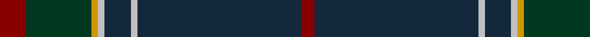

In pattern [RBWBWYGR](/patterns/rbwbwygr/).

This was sourced from register-of-tartans.  It is a [8 stripes tartan](/stripes/stripes8/).

Original link https://www.tartanregister.gov.uk/tartanDetails.aspx?ref=3469

## Attestations

This cloth appears in 2 source records; the oldest owns this page.

- 01/01/1997 — Raymond of Doune (register-of-tartans, [record](https://www.tartanregister.gov.uk/tartanDetails.aspx?ref=3469))
- 1997 — Raymond of Doune (Corporate) (tartans-authority, [record](http://www.tartansauthority.com/tartan-ferret/display/5437/))

## Register references

External register numbers recorded for this tartan.

- Scottish Register of Tartans: [3469](https://www.tartanregister.gov.uk/tartanDetails.aspx?ref=3469)
- Scottish Tartans Authority (ITI): 5437

## Thread count
DR/8 DG20 DY2 N2 DN8 N2 DN50 DR/4

## Palette
Each colour and its ΔE from the base-6 reference it is a variant of.

| Colour | Shade | Base | ΔE (OKLab) |
|---|---|---|---|
| DG | <code style="background-color:#003820;">#003820</code> `#003820` | G <code style="background-color:#006100;">#006100</code> | 0.15 |
| DN | <code style="background-color:#14283C;">#14283C</code> `#14283C` | B <code style="background-color:#2A418A;">#2A418A</code> | 0.15 |
| DR | <code style="background-color:#880000;">#880000</code> `#880000` | R <code style="background-color:#CC0000;">#CC0000</code> | 0.15 |
| DY | <code style="background-color:#D09800;">#D09800</code> `#D09800` | Y <code style="background-color:#F2BF00;">#F2BF00</code> | 0.12 |
| N | <code style="background-color:#C0C0C0;">#C0C0C0</code> `#C0C0C0` | W <code style="background-color:#F7F7F7;">#F7F7F7</code> | 0.17 |

# Sample pattern

## Nearest tartans

The nearest existing variants by ΔTartan distance.

1. [Unidentified, Toy Bear](/setts/s8/g47y2g5y2g4k15b19r2~b141e46-g003c14-k101010-rdc0000-ye8c000~x2/) — ΔT 1.03
1. [Carbon](/setts/s9/b68k4b18ba20k3w3k10y8ya4~b3c3232-ba434546-k101010-wd2d2d2-y919598-yaf8880e/) — ΔT 1.06
1. [Barrance, Paul and Kelly (Personal)](/setts/s7/b3ba42k2g17ba9b3w2~b64008c-ba14283c-g005448-k101010-wffffff~x2/) — ΔT 1.06
1. [Hebridean Heather Fashion Tartan Tartan Number: 6820. Earliest known date: 2005 Designed for new House of Edgar Collection in wedding grays. Originally called Balmoral but this was disallowed in recording as Balmoral tartans are restricted to the Royal Family. See products available Copyright © Blair Urquhart, Comrie, 2015](/setts/s9/b4ba2b7bb30b8bb7r5ba1w2~b5c5c5c-ba003c64-bb1c1c1c-r800028-we0e0e0~x2/) — ΔT 1.06
1. [Green Swamp Youth Campers](/setts/s6/k8r2k13y2g48b6~b2c2c80-g003820-k101010-rc80000-ye8c000~x2/) — ΔT 1.13
1. [Suttle (Personal)](/setts/s8/b36k18b5ba7b5k7r1g2~b5c5c5c-ba003c64-g006818-k101010-rc80000~x2/) — ΔT 1.14
1. [Klappert Original Name Tartan Tartan Number: 10475. Earliest known date: 2011 This tartan was designed to commemorate the original family of Klapperts in Denmark. The colours chosen represent the Klappert family heritage and their enviroment. The black symbolises the dark Nordic winter and the dark grey is the cold sea which embraces the vast Danish coastline. The dark red symbolises this family's Danish origins. The brown is a reference to the longships which brought the Vikings to Scotland, representing the connection between the Nordic and Scottish cultures. This tartan may only be worn/used by members/descendants of the original Klappert family from Odsherred in Denmark. See products available Copyright © Blair Urquhart, Comrie, 2015](/setts/s9/r1k1b30k6b1k6g8k1r1~b3c4440-g5c381c-k000410-rb42430~x2/) — ΔT 1.18
1. [Hebridean Heather](/setts/s9/b4ba2b7bb30b8bb7r5ba1w2~b5c5c5c-ba003c64-bb1c1c1c-r800028-wf8f8f8~x2/) — ΔT 1.22
1. [Glen and Son, William (Corporate)](/setts/s11/r6k3b4k10b5ra3k2b31w1b2w2~b3c3c3c-k101010-r880000-ra888888-we0e0e0~x2/) — ΔT 1.25
1. [Vonarb, Alfred (Personal)](/setts/s7/b6ba3bb10bc2ba2bd45y2~b5c8ca8-ba1c1c1c-bb5c5c5c-bc1c1c50-bd14283c-ya0a0a0~x2/) — ΔT 1.25

## Neighbour map

Every grey dot is one of 15726 variants placed by the first two principal components of the ΔTartan feature space (44% of its variance). Red is this tartan; blue dots are its nearest — click one to open its page.

<svg viewBox="0 0 640 380" role="img" style="max-width:100%;height:auto;border:1px solid #e0e0e0;border-radius:4px;display:block" xmlns="http://www.w3.org/2000/svg"><image href="/nn/cloud.v1.png" width="640" height="380"/><a href="/setts/s8/g47y2g5y2g4k15b19r2~b141e46-g003c14-k101010-rdc0000-ye8c000~x2/"><circle cx="389.7" cy="164.1" r="4" fill="#3465a4"><title>Unidentified, Toy Bear</title></circle></a><a href="/setts/s9/b68k4b18ba20k3w3k10y8ya4~b3c3232-ba434546-k101010-wd2d2d2-y919598-yaf8880e/"><circle cx="402.1" cy="135.6" r="4" fill="#3465a4"><title>Carbon</title></circle></a><a href="/setts/s7/b3ba42k2g17ba9b3w2~b64008c-ba14283c-g005448-k101010-wffffff~x2/"><circle cx="448.6" cy="178.5" r="4" fill="#3465a4"><title>Barrance, Paul and Kelly (Personal)</title></circle></a><a href="/setts/s9/b4ba2b7bb30b8bb7r5ba1w2~b5c5c5c-ba003c64-bb1c1c1c-r800028-we0e0e0~x2/"><circle cx="374.0" cy="140.8" r="4" fill="#3465a4"><title>Hebridean Heather Fashion Tartan Tartan Number: 6820. Earliest known date: 2005 Designed for new House of Edgar Collection in wedding grays. Originally called Balmoral but this was disallowed in recording as Balmoral tartans are restricted to the Royal Family. See products available Copyright © Blair Urquhart, Comrie, 2015</title></circle></a><a href="/setts/s6/k8r2k13y2g48b6~b2c2c80-g003820-k101010-rc80000-ye8c000~x2/"><circle cx="436.3" cy="183.9" r="4" fill="#3465a4"><title>Green Swamp Youth Campers</title></circle></a><a href="/setts/s8/b36k18b5ba7b5k7r1g2~b5c5c5c-ba003c64-g006818-k101010-rc80000~x2/"><circle cx="395.7" cy="147.1" r="4" fill="#3465a4"><title>Suttle (Personal)</title></circle></a><a href="/setts/s9/r1k1b30k6b1k6g8k1r1~b3c4440-g5c381c-k000410-rb42430~x2/"><circle cx="438.2" cy="154.8" r="4" fill="#3465a4"><title>Klappert Original Name Tartan Tartan Number: 10475. Earliest known date: 2011 This tartan was designed to commemorate the original family of Klapperts in Denmark. The colours chosen represent the Klappert family heritage and their enviroment. The black symbolises the dark Nordic winter and the dark grey is the cold sea which embraces the vast Danish coastline. The dark red symbolises this family's Danish origins. The brown is a reference to the longships which brought the Vikings to Scotland, representing the connection between the Nordic and Scottish cultures. This tartan may only be worn/used by members/descendants of the original Klappert family from Odsherred in Denmark. See products available Copyright © Blair Urquhart, Comrie, 2015</title></circle></a><a href="/setts/s9/b4ba2b7bb30b8bb7r5ba1w2~b5c5c5c-ba003c64-bb1c1c1c-r800028-wf8f8f8~x2/"><circle cx="366.9" cy="138.0" r="4" fill="#3465a4"><title>Hebridean Heather</title></circle></a><a href="/setts/s11/r6k3b4k10b5ra3k2b31w1b2w2~b3c3c3c-k101010-r880000-ra888888-we0e0e0~x2/"><circle cx="400.8" cy="120.0" r="4" fill="#3465a4"><title>Glen and Son, William (Corporate)</title></circle></a><a href="/setts/s7/b6ba3bb10bc2ba2bd45y2~b5c8ca8-ba1c1c1c-bb5c5c5c-bc1c1c50-bd14283c-ya0a0a0~x2/"><circle cx="432.8" cy="145.7" r="4" fill="#3465a4"><title>Vonarb, Alfred (Personal)</title></circle></a><circle cx="414.5" cy="155.3" r="5" fill="#c00000"/></svg>

ID: /setts/s8/r4g10y1w1b4w1b25r2~b14283c-g003820-r880000-wc0c0c0-yd09800~x2/
