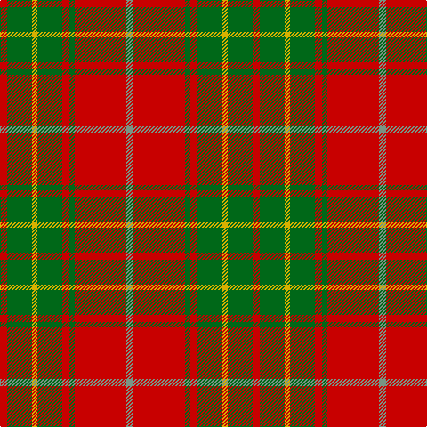

**Bands:** [RGYGRGRG](/stripes/rgygrgrg/) · **Stripes:** [R G LY G R G R Y](/stripes/stripes8/) R G LY G R G R Y

This was sourced from register-of-tartans.  It is a [8 band tartan](/bands/bands8/).

Original link https://www.tartanregister.gov.uk/tartanDetails.aspx?ref=443

## Attestations

This cloth appears in 2 source records; the oldest owns this page.

- 01/01/2002 — Burnett (register-of-tartans, [record](https://www.tartanregister.gov.uk/tartanDetails.aspx?ref=443))
- pre 2002 — Burnett (Name) (tartans-authority, [record](http://www.tartansauthority.com/tartan-ferret/display/2355/))

## Register references

External register numbers recorded for this tartan.

- Scottish Register of Tartans: [443](https://www.tartanregister.gov.uk/tartanDetails.aspx?ref=443)
- Scottish Tartans Authority (ITI): 2355
- Scottish Tartans World Register: 2355

## Thread count
R/8 G28 Y6 G28 R8 G6 R58 LG/8

## Palette
Each colour and its ΔE from the base-6 reference it is a variant of.

| Colour | Shade | Base | ΔE (OKLab) |
|---|---|---|---|
| DG | <code style="background-color:#003820;">#003820</code> `#003820` | G <code style="background-color:#006100;">#006100</code> | 0.15 |
| G | <code style="background-color:#006818;">#006818</code> `#006818` | G <code style="background-color:#006100;">#006100</code> | 0.02 |
| LG | <code style="background-color:#789484;">#789484</code> `#789484` | G <code style="background-color:#006100;">#006100</code> | 0.24 |
| R | <code style="background-color:#C80000;">#C80000</code> `#C80000` | R <code style="background-color:#CC0000;">#CC0000</code> | 0.01 |
| Y | <code style="background-color:#D8B000;">#D8B000</code> `#D8B000` | Y <code style="background-color:#F2BF00;">#F2BF00</code> | 0.06 |

# Sample pattern

## Nearest tartans

The nearest existing variants by ΔTartan distance.

1. [Lennox](/setts/s7/r2r1r10r2g10lr1g2~x4/) — ΔT 0.75
1. [MacNab 6](/setts/s7/g28r7m7g14m7r48k4~x2/) — ΔT 0.77
1. [Lennox](/setts/s7/r2r1r10r2g10w1g2~x2/) — ΔT 0.79
1. [MacNab 5](/setts/s7/g6r2r2g4r2r12k1~x2/) — ΔT 0.88
1. [Cetoloni (Personal)](/setts/s6/db1r12g6ly1g6db1~x4/) — ΔT 0.94
1. [MacKinnon 7](/setts/s11/w2r4g8r16t2r3g16r4t2r4w2~x2/) — ΔT 0.99
1. [Comyn](/setts/s8/k1r9dg2r2dg4lr1dg4r1~x2/) — ΔT 1.03
1. [Chisholm, The](/setts/s8/r12db2w1db2r3g8r3db1~x2/) — ΔT 1.06
1. [Bruce (Vestiarium)](/setts/s11/w1r8g2r2g6r1g6r2g2r8ly1~x4/) — ΔT 1.10
1. [Comyn](/setts/s8/k1r9dg2r2dg4lb1dg4r1~x2/) — ΔT 1.13

## Neighbour map

Every grey dot is one of 14299 variants placed by the first two principal components of the ΔTartan feature space (44% of its variance). Red is this tartan; blue dots are its nearest — click one to open its page.

<svg viewBox="0 0 640 380" role="img" style="max-width:100%;height:auto;border:1px solid #e0e0e0;border-radius:4px;display:block" xmlns="http://www.w3.org/2000/svg"><image href="/nn/cloud.v1.png" width="640" height="380"/><a href="/setts/s7/r2r1r10r2g10lr1g2~x4/"><circle cx="285.0" cy="198.1" r="4" fill="#3465a4"><title>Lennox</title></circle></a><a href="/setts/s7/g28r7m7g14m7r48k4~x2/"><circle cx="289.3" cy="186.9" r="4" fill="#3465a4"><title>MacNab 6</title></circle></a><a href="/setts/s7/r2r1r10r2g10w1g2~x2/"><circle cx="270.0" cy="191.3" r="4" fill="#3465a4"><title>Lennox</title></circle></a><a href="/setts/s7/g6r2r2g4r2r12k1~x2/"><circle cx="288.0" cy="190.4" r="4" fill="#3465a4"><title>MacNab 5</title></circle></a><a href="/setts/s6/db1r12g6ly1g6db1~x4/"><circle cx="288.3" cy="197.8" r="4" fill="#3465a4"><title>Cetoloni (Personal)</title></circle></a><a href="/setts/s11/w2r4g8r16t2r3g16r4t2r4w2~x2/"><circle cx="265.2" cy="179.4" r="4" fill="#3465a4"><title>MacKinnon 7</title></circle></a><a href="/setts/s8/k1r9dg2r2dg4lr1dg4r1~x2/"><circle cx="305.4" cy="206.2" r="4" fill="#3465a4"><title>Comyn</title></circle></a><a href="/setts/s8/r12db2w1db2r3g8r3db1~x2/"><circle cx="324.2" cy="178.1" r="4" fill="#3465a4"><title>Chisholm, The</title></circle></a><a href="/setts/s11/w1r8g2r2g6r1g6r2g2r8ly1~x4/"><circle cx="304.8" cy="195.4" r="4" fill="#3465a4"><title>Bruce (Vestiarium)</title></circle></a><a href="/setts/s8/k1r9dg2r2dg4lb1dg4r1~x2/"><circle cx="283.3" cy="191.8" r="4" fill="#3465a4"><title>Comyn</title></circle></a><circle cx="308.6" cy="193.9" r="5" fill="#c00000"/></svg>

ID: /setts/s8/r4g14ly3g14r4g3r29y4~x2/
