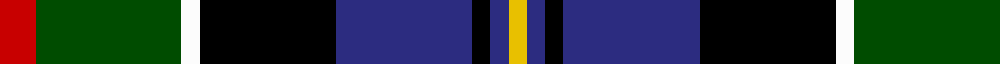

In pattern [RGWKBKBY](/patterns/rgwkbkby/).

This was sourced from register-of-tartans.  It is a [8 stripes tartan](/stripes/stripes8/).

Original link https://www.tartanregister.gov.uk/tartanDetails.aspx?ref=781

## Attestations

This cloth appears in 2 source records; the oldest owns this page.

- 01/01/1982 — Cowan of Inveresk (Personal) (register-of-tartans, [record](https://www.tartanregister.gov.uk/tartanDetails.aspx?ref=781))
- 1982 — Cowan of Inveresk (Personal) (tartans-authority, [record](http://www.tartansauthority.com/tartan-ferret/display/1549/))

## Thread count
R/8 G32 W4 K30 DBa30 K4 DBa4 Y/4

## Palette
Each colour and its ΔE from the base-6 reference it is a variant of.

| Colour | Shade | Base | ΔE (OKLab) |
|---|---|---|---|
| DB | <code style="background-color:#000088;">#000088</code> `#000088` | B <code style="background-color:#2A418A;">#2A418A</code> | 0.14 |
| DBa | <code style="background-color:#2C2C80;">#2C2C80</code> `#2C2C80` | B <code style="background-color:#2A418A;">#2A418A</code> | 0.06 |
| G | <code style="background-color:#004C00;">#004C00</code> `#004C00` | G <code style="background-color:#006100;">#006100</code> | 0.07 |
| K | <code style="background-color:#000000;">#000000</code> `#000000` | K <code style="background-color:#000000;">#000000</code> | 0.00 |
| LG | <code style="background-color:#9C9C00;">#9C9C00</code> `#9C9C00` | Y <code style="background-color:#F2BF00;">#F2BF00</code> | 0.17 |
| R | <code style="background-color:#C80000;">#C80000</code> `#C80000` | R <code style="background-color:#CC0000;">#CC0000</code> | 0.01 |
| W | <code style="background-color:#FCFCFC;">#FCFCFC</code> `#FCFCFC` | W <code style="background-color:#F7F7F7;">#F7F7F7</code> | 0.01 |
| Y | <code style="background-color:#E8C000;">#E8C000</code> `#E8C000` | Y <code style="background-color:#F2BF00;">#F2BF00</code> | 0.02 |

# Sample pattern

## Nearest tartans

The nearest existing variants by ΔTartan distance.

1. [Cowan, of Inveresk](/setts/s8/r4g16w2k15b15k2b2y2x2~b304080-g008000-k000000-rc00000-we0e0e0-yf0c000/) — ΔT 0.69
1. [MacCraig](/setts/s9/b2w1g7r1k7g1ba7r1g2x8~b4c0000-ba1c0070-g006818-k000000-r880000-wa8ace8/) — ΔT 0.71
1. [Cowan of Inveresk Family Tartan Tartan Number: 1549. Earliest known date: 1979 This is a modern family tartan designed by the representer of the family of Cowan of Inveresk, in the parish of that name in Musselburgh, Mr Robert Cowan of Atlanta, Georgia. Cowans are a Sept of the Colquhouns, variously spelt Macillechomhghain, Comhain, Comhan and Cowen. Cowans not associated with the Inveresk branch of the family may wear the Colquhoun tartan on which this design is based. See products available Copyright © Blair Urquhart, Comrie, 2015](/setts/s8/r4g16w2k15b15k2b2y2x2~b2c2c80-g006818-k101010-rc80000-we0e0e0-ye8c000/) — ΔT 0.94
1. [Cumming LO](/setts/s9/b4k2b4k10g1ga10r4y1r4x2~b4367ae-g7f5200-ga11450d-k000000-raa0000-yaaaaaa/) — ΔT 0.95
1. [Cumming LO](/setts/s9/b4k2b4k10g1ga10r4y1r4~b4367ae-g7f5200-ga11450d-k000000-raa0000-yaaaaaa/) — ΔT 0.95
1. [Blairmore](/setts/s8/b34w5b5r5b5ba26g33ra6x2~b000050-ba401000-g008000-rc00000-ra806050-we0e0e0/) — ΔT 0.97
1. [Harvey of Cornwall (Personal)](/setts/s7/w10k52b52g24y10g5r5~b2c4084-g003c14-k101010-rdc0000-we0e0e0-ye8c000/) — ΔT 0.97
1. [Scottish Cultural Society (Corporate](/setts/s9/b2g4k8y1k1ba4w1ba1w2x8~b6c0070-ba1c0070-g006818-k101010-wc0c0c0-yd09800/) — ΔT 0.99
1. [Veere (District)](/setts/s11/b6k2ba2b8k18y2g20b8ba3k10w6x2~b2c2c80-ba346488-g006818-k000000-wc8c8c8-yc88c00/) — ΔT 1.01
1. [MacDonald of Borrodale (Clan)](/setts/s8/r6b3r3b32k30g30y3r3x2~b2c2c80-g006818-k000000-rc80000-ye8c000/) — ΔT 1.03

## Neighbour map

Every grey dot is one of 15726 variants placed by the first two principal components of the ΔTartan feature space (44% of its variance). Red is this tartan; blue dots are its nearest — click one to open its page.

<svg viewBox="0 0 640 380" role="img" style="max-width:100%;height:auto;border:1px solid #e0e0e0;border-radius:4px;display:block" xmlns="http://www.w3.org/2000/svg"><image href="/nn/cloud.v1.png" width="640" height="380"/><a href="/setts/s8/r4g16w2k15b15k2b2y2x2~b304080-g008000-k000000-rc00000-we0e0e0-yf0c000/"><circle cx="75.4" cy="161.6" r="4" fill="#3465a4"><title>Cowan, of Inveresk</title></circle></a><a href="/setts/s9/b2w1g7r1k7g1ba7r1g2x8~b4c0000-ba1c0070-g006818-k000000-r880000-wa8ace8/"><circle cx="98.9" cy="173.7" r="4" fill="#3465a4"><title>MacCraig</title></circle></a><a href="/setts/s8/r4g16w2k15b15k2b2y2x2~b2c2c80-g006818-k101010-rc80000-we0e0e0-ye8c000/"><circle cx="101.1" cy="169.9" r="4" fill="#3465a4"><title>Cowan of Inveresk Family Tartan Tartan Number: 1549. Earliest known date: 1979 This is a modern family tartan designed by the representer of the family of Cowan of Inveresk, in the parish of that name in Musselburgh, Mr Robert Cowan of Atlanta, Georgia. Cowans are a Sept of the Colquhouns, variously spelt Macillechomhghain, Comhain, Comhan and Cowen. Cowans not associated with the Inveresk branch of the family may wear the Colquhoun tartan on which this design is based. See products available Copyright © Blair Urquhart, Comrie, 2015</title></circle></a><a href="/setts/s9/b4k2b4k10g1ga10r4y1r4x2~b4367ae-g7f5200-ga11450d-k000000-raa0000-yaaaaaa/"><circle cx="81.3" cy="164.0" r="4" fill="#3465a4"><title>Cumming LO</title></circle></a><a href="/setts/s9/b4k2b4k10g1ga10r4y1r4~b4367ae-g7f5200-ga11450d-k000000-raa0000-yaaaaaa/"><circle cx="81.3" cy="164.0" r="4" fill="#3465a4"><title>Cumming LO</title></circle></a><a href="/setts/s8/b34w5b5r5b5ba26g33ra6x2~b000050-ba401000-g008000-rc00000-ra806050-we0e0e0/"><circle cx="115.6" cy="176.5" r="4" fill="#3465a4"><title>Blairmore</title></circle></a><a href="/setts/s7/w10k52b52g24y10g5r5~b2c4084-g003c14-k101010-rdc0000-we0e0e0-ye8c000/"><circle cx="120.0" cy="164.6" r="4" fill="#3465a4"><title>Harvey of Cornwall (Personal)</title></circle></a><a href="/setts/s9/b2g4k8y1k1ba4w1ba1w2x8~b6c0070-ba1c0070-g006818-k101010-wc0c0c0-yd09800/"><circle cx="105.1" cy="163.4" r="4" fill="#3465a4"><title>Scottish Cultural Society (Corporate</title></circle></a><a href="/setts/s11/b6k2ba2b8k18y2g20b8ba3k10w6x2~b2c2c80-ba346488-g006818-k000000-wc8c8c8-yc88c00/"><circle cx="93.3" cy="154.2" r="4" fill="#3465a4"><title>Veere (District)</title></circle></a><a href="/setts/s8/r6b3r3b32k30g30y3r3x2~b2c2c80-g006818-k000000-rc80000-ye8c000/"><circle cx="134.7" cy="165.9" r="4" fill="#3465a4"><title>MacDonald of Borrodale (Clan)</title></circle></a><circle cx="84.3" cy="165.6" r="5" fill="#c00000"/></svg>

ID: /setts/s8/r4g16w2k15b15k2b2y2x2~b2c2c80-g004c00-k000000-rc80000-wfcfcfc-ye8c000/
