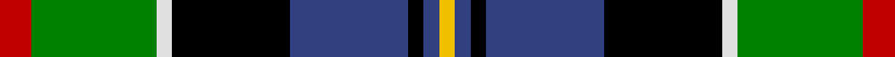
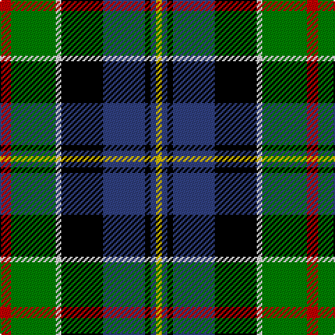

In pattern [RGWKBKBY](/stripes/rgwkbkby/).

This was sourced from weddslist.  It is a [8 stripe tartan](/stripes/stripes8/).

Original link http://www.weddslist.com/cgi-bin/tartans/pg.pl?source=sts

## Also known as

This cloth is also recorded under:

- Cowan, of Inveresk

## Attestations

This cloth appears in 2 source records; the oldest owns this page.

- undated — Cowan, of Inveresk (weddslist, [record](http://www.weddslist.com/cgi-bin/tartans/pg.pl?source=sts))
- undated — Cowan of Inveresk Family Tartan Tartan Number: 1549. Earliest known date: 1979 This is a modern family tartan designed by the representer of the family of Cowan of Inveresk, in the parish of that name in Musselburgh, Mr Robert Cowan of Atlanta, Georgia. Cowans are a Sept of the Colquhouns, variously spelt Macillechomhghain, Comhain, Comhan and Cowen. Cowans not associated with the Inveresk branch of the family may wear the Colquhoun tartan on which this design is based. See products available Copyright © Blair Urquhart, Comrie, 2015 (house-of-tartan, [record](http://www.house-of-tartan.scotland.net/house/TartanViewjs.asp?colr=Def&tnam=1549))

## Thread count
R/8 G32 LN4 K30 B30 K4 B4 Y/4

## Palette
Each colour and the base-6 reference it is a variant of.

| Colour | Shade | Base |
|---|---|---|
| B | <code style="background-color:#304080;">#304080</code> `oklch(39.4% 0.109 270.2)` <small>#304080</small> | B <code style="background-color:#2A418A;">#2A418A</code> |
| G | <code style="background-color:#008000;">#008000</code> `oklch(52.0% 0.177 142.5)` <small>#008000</small> | G <code style="background-color:#006100;">#006100</code> |
| K | <code style="background-color:#000000;">#000000</code> `oklch(0.0% 0.000 0.0)` <small>#000000</small> | K <code style="background-color:#000000;">#000000</code> |
| LN | <code style="background-color:#E0E0E0;">#E0E0E0</code> `oklch(90.7% 0.000 89.9)` <small>#E0E0E0</small> | W <code style="background-color:#F7F7F7;">#F7F7F7</code> |
| R | <code style="background-color:#C00000;">#C00000</code> `oklch(50.7% 0.208 29.2)` <small>#C00000</small> | R <code style="background-color:#CC0000;">#CC0000</code> |
| Y | <code style="background-color:#F0C000;">#F0C000</code> `oklch(82.7% 0.169 90.5)` <small>#F0C000</small> | Y <code style="background-color:#F2BF00;">#F2BF00</code> |

# Sample pattern

## Nearest tartans

The nearest existing variants by ΔTartan distance.

1. [Birch (Personal) (Estimated threadcount)](/setts/s9/g2dp2g10k6r2k6t10k1lb2~x2/) — ΔT 0.69
1. [Cowan of Inveresk (Personal)](/setts/s8/r4dg16w2k15db15k2db2ly2~x2/) — ΔT 0.69
1. [Council of Scottish Clans & Ass. (Co](/setts/s7/w2r2db16k14g15r2ly2~x2/) — ΔT 0.77
1. [Borrodale](/setts/s8/r5db3r3db29k29g29w4r4~x2/) — ΔT 0.93
1. [Blairmore](/setts/s8/db34w5db5r5db5dr26g33o6~x2/) — ΔT 0.95
1. [Colquhoun](/setts/s7/r2g8w1k8db8k1db1~x4/) — ΔT 0.97
1. [Stirling, and Bannockburn](/setts/s10/r3g18r4t3r4k13r3db18g2ly3~x2/) — ΔT 0.97
1. [MacCraig](/setts/s9/dr2lb1g7r1k7g1db7r1g2~x8/) — ΔT 1.02
1. [Kagame (Personal)](/setts/s10/k5lb14k3k7g3k3g7k6db24w3~x2/) — ΔT 1.02
1. [Unnamed 4](/setts/s10/k6g14t2r3t2k16ly2b16g16r3~x2/) — ΔT 1.03

## Neighbour map

Every grey dot is one of 14299 variants placed by the first two principal components of the ΔTartan feature space (44% of its variance). Red is this tartan; blue dots are its nearest — click one to open its page.

<svg viewBox="0 0 640 380" role="img" style="max-width:100%;height:auto;border:1px solid #e0e0e0;border-radius:4px;display:block" xmlns="http://www.w3.org/2000/svg"><image href="/nn/cloud.v1.png" width="640" height="380"/><a href="/setts/s9/g2dp2g10k6r2k6t10k1lb2~x2/"><circle cx="76.7" cy="158.2" r="4" fill="#3465a4"><title>Birch (Personal) (Estimated threadcount)</title></circle></a><a href="/setts/s8/r4dg16w2k15db15k2db2ly2~x2/"><circle cx="88.3" cy="167.4" r="4" fill="#3465a4"><title>Cowan of Inveresk (Personal)</title></circle></a><a href="/setts/s7/w2r2db16k14g15r2ly2~x2/"><circle cx="84.7" cy="167.4" r="4" fill="#3465a4"><title>Council of Scottish Clans &amp; Ass. (Co</title></circle></a><a href="/setts/s8/r5db3r3db29k29g29w4r4~x2/"><circle cx="114.3" cy="167.9" r="4" fill="#3465a4"><title>Borrodale</title></circle></a><a href="/setts/s8/db34w5db5r5db5dr26g33o6~x2/"><circle cx="119.3" cy="179.1" r="4" fill="#3465a4"><title>Blairmore</title></circle></a><a href="/setts/s7/r2g8w1k8db8k1db1~x4/"><circle cx="110.8" cy="192.2" r="4" fill="#3465a4"><title>Colquhoun</title></circle></a><a href="/setts/s10/r3g18r4t3r4k13r3db18g2ly3~x2/"><circle cx="71.3" cy="145.1" r="4" fill="#3465a4"><title>Stirling, and Bannockburn</title></circle></a><a href="/setts/s9/dr2lb1g7r1k7g1db7r1g2~x8/"><circle cx="102.8" cy="177.0" r="4" fill="#3465a4"><title>MacCraig</title></circle></a><a href="/setts/s10/k5lb14k3k7g3k3g7k6db24w3~x2/"><circle cx="58.0" cy="150.7" r="4" fill="#3465a4"><title>Kagame (Personal)</title></circle></a><a href="/setts/s10/k6g14t2r3t2k16ly2b16g16r3~x2/"><circle cx="92.1" cy="157.3" r="4" fill="#3465a4"><title>Unnamed 4</title></circle></a><circle cx="79.4" cy="162.8" r="5" fill="#c00000"/></svg>

ID: /setts/s8/r4g16w2k15db15k2db2ly2~x2/
