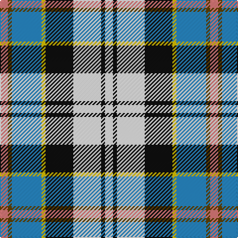

In pattern [RGBYKWKW](/patterns/rgbykwkw/).

This was sourced from tartans-authority.  It is a [8 stripes tartan](/stripes/stripes8/).

Original link http://www.tartansauthority.com/tartan-ferret/display/1655/

## Thread count
LR/8 T4 B30 Y4 K28 W28 K4 W/8

## Palette
Each colour and its ΔE from the base-6 reference it is a variant of.

| Colour | Shade | Base | ΔE (OKLab) |
|---|---|---|---|
| B | <code style="background-color:#2888C4;">#2888C4</code> `#2888C4` | B <code style="background-color:#2A418A;">#2A418A</code> | 0.21 |
| K | <code style="background-color:#101010;">#101010</code> `#101010` | K <code style="background-color:#000000;">#000000</code> | 0.17 |
| LR | <code style="background-color:#E87878;">#E87878</code> `#E87878` | R <code style="background-color:#CC0000;">#CC0000</code> | 0.19 |
| T | <code style="background-color:#604000;">#604000</code> `#604000` | G <code style="background-color:#006100;">#006100</code> | 0.14 |
| W | <code style="background-color:#FCFCFC;">#FCFCFC</code> `#FCFCFC` | W <code style="background-color:#F7F7F7;">#F7F7F7</code> | 0.01 |
| Y | <code style="background-color:#E8C000;">#E8C000</code> `#E8C000` | Y <code style="background-color:#F2BF00;">#F2BF00</code> | 0.02 |

# Sample pattern

## Nearest tartans

The nearest existing variants by ΔTartan distance.

1. [Culloden Blue, Stirling](/setts/s8/r4g2b15y2k14w14k2w4x2~b0596fa-g503c14-k101010-rc82828-we0e0e0-ye8c000/) — ΔT 0.36
1. [Culloden, Stirling](/setts/s8/r4ra2b15y2k14w14k2w4x2~b8080d0-k000000-rd03030-ra806050-we0e0e0-yf0c000/) — ΔT 0.84
1. [Sound of Iona](/setts/s9/w30b4ba6bb4ba6g6ba12g13wa4x2~b2888c4-ba202060-bb780078-g0098a0-wfcfcfc-wa98c8e8/) — ΔT 0.96
1. [Sound of Iona](/setts/s9/w30wa4b6r4b6g6b12g13wb4x2~b003c64-g408060-rb458ac-wf8f4d0-wa98c8e8-wb00fcfc/) — ΔT 0.98
1. [Gillies, dress Blue](/setts/s10/y6k2b15r5b9k13w25ba2w3ba2x2~b5480b0-ba304080-k000000-rc00000-we0e0e0-yf0c000/) — ΔT 0.99
1. [Elora (District)](/setts/s8/b2g2b11r2w8ba12y2ba2x2~b003c64-ba5c8ca8-g006818-r888888-wfcfcfc-yfccc00/) — ΔT 1.05
1. [Curd (2013)](/setts/s8/b1ba9w3y3b9y1g1r1x4~b202060-ba2888c4-g006818-rc80000-wfcfcfc-ye8c000/) — ΔT 1.10
1. [Haymarket, dress Blue](/setts/s9/g5b22g6k10w24y2b2w2r2x2~b304080-g008000-k000000-rc00000-we0e0e0-yf0c000/) — ΔT 1.15
1. [Haymarket Dress Blue Trade Tartan Tartan Number: 713. Earliest known date: pre 1992 One of a number of dress tartans produced by Hugh Macpherson, a kiltmaker in Edinburgh, whose shop is a short walk from Haymarket railway station. See products available Copyright © Blair Urquhart, Comrie, 2015](/setts/s9/g5b22g6k10w24y2b2w2r2x2~b2c2c80-g006818-k101010-rc80000-we0e0e0-ye8c000/) — ΔT 1.16
1. [Alexander Brothers - 2007? (Corp.)](/setts/s8/g5y2b20w2k20w20k2w5x2~b5c8ca8-g289c18-k101010-we0e0e0-ye8c000/) — ΔT 1.16

## Neighbour map

Every grey dot is one of 15726 variants placed by the first two principal components of the ΔTartan feature space (44% of its variance). Red is this tartan; blue dots are its nearest — click one to open its page.

<svg viewBox="0 0 640 380" role="img" style="max-width:100%;height:auto;border:1px solid #e0e0e0;border-radius:4px;display:block" xmlns="http://www.w3.org/2000/svg"><image href="/nn/cloud.v1.png" width="640" height="380"/><a href="/setts/s8/r4g2b15y2k14w14k2w4x2~b0596fa-g503c14-k101010-rc82828-we0e0e0-ye8c000/"><circle cx="60.2" cy="153.1" r="4" fill="#3465a4"><title>Culloden Blue, Stirling</title></circle></a><a href="/setts/s8/r4ra2b15y2k14w14k2w4x2~b8080d0-k000000-rd03030-ra806050-we0e0e0-yf0c000/"><circle cx="58.9" cy="150.3" r="4" fill="#3465a4"><title>Culloden, Stirling</title></circle></a><a href="/setts/s9/w30b4ba6bb4ba6g6ba12g13wa4x2~b2888c4-ba202060-bb780078-g0098a0-wfcfcfc-wa98c8e8/"><circle cx="73.9" cy="143.3" r="4" fill="#3465a4"><title>Sound of Iona</title></circle></a><a href="/setts/s9/w30wa4b6r4b6g6b12g13wb4x2~b003c64-g408060-rb458ac-wf8f4d0-wa98c8e8-wb00fcfc/"><circle cx="79.0" cy="145.9" r="4" fill="#3465a4"><title>Sound of Iona</title></circle></a><a href="/setts/s10/y6k2b15r5b9k13w25ba2w3ba2x2~b5480b0-ba304080-k000000-rc00000-we0e0e0-yf0c000/"><circle cx="84.4" cy="116.1" r="4" fill="#3465a4"><title>Gillies, dress Blue</title></circle></a><a href="/setts/s8/b2g2b11r2w8ba12y2ba2x2~b003c64-ba5c8ca8-g006818-r888888-wfcfcfc-yfccc00/"><circle cx="78.9" cy="168.6" r="4" fill="#3465a4"><title>Elora (District)</title></circle></a><a href="/setts/s8/b1ba9w3y3b9y1g1r1x4~b202060-ba2888c4-g006818-rc80000-wfcfcfc-ye8c000/"><circle cx="105.7" cy="143.1" r="4" fill="#3465a4"><title>Curd (2013)</title></circle></a><a href="/setts/s9/g5b22g6k10w24y2b2w2r2x2~b304080-g008000-k000000-rc00000-we0e0e0-yf0c000/"><circle cx="101.7" cy="118.5" r="4" fill="#3465a4"><title>Haymarket, dress Blue</title></circle></a><a href="/setts/s9/g5b22g6k10w24y2b2w2r2x2~b2c2c80-g006818-k101010-rc80000-we0e0e0-ye8c000/"><circle cx="106.9" cy="119.7" r="4" fill="#3465a4"><title>Haymarket Dress Blue Trade Tartan Tartan Number: 713. Earliest known date: pre 1992 One of a number of dress tartans produced by Hugh Macpherson, a kiltmaker in Edinburgh, whose shop is a short walk from Haymarket railway station. See products available Copyright © Blair Urquhart, Comrie, 2015</title></circle></a><a href="/setts/s8/g5y2b20w2k20w20k2w5x2~b5c8ca8-g289c18-k101010-we0e0e0-ye8c000/"><circle cx="117.5" cy="155.3" r="4" fill="#3465a4"><title>Alexander Brothers - 2007? (Corp.)</title></circle></a><circle cx="56.4" cy="150.3" r="5" fill="#c00000"/></svg>

ID: /setts/s8/r4g2b15y2k14w14k2w4x2~b2888c4-g604000-k101010-re87878-wfcfcfc-ye8c000/
