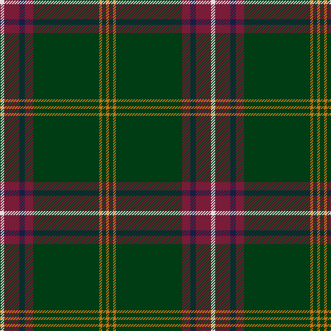

In pattern [RGRGRBRW](/patterns/rgrgrbrw/).

This was sourced from register-of-tartans.  It is a [8 stripes tartan](/stripes/stripes8/).

Original link https://www.tartanregister.gov.uk/tartanDetails.aspx?ref=1573

## Thread count
LN/6 DR22 DB8 DR12 DG96 O4 DG6 O/4

## Palette
Each colour and its ΔE from the base-6 reference it is a variant of.

| Colour | Shade | Base | ΔE (OKLab) |
|---|---|---|---|
| DB | <code style="background-color:#141E46;">#141E46</code> `#141E46` | B <code style="background-color:#2C4084;">#2C4084</code> | 0.15 |
| DG | <code style="background-color:#003C14;">#003C14</code> `#003C14` | G <code style="background-color:#006400;">#006400</code> | 0.14 |
| DR | <code style="background-color:#781C38;">#781C38</code> `#781C38` | R <code style="background-color:#C80000;">#C80000</code> | 0.17 |
| LN | <code style="background-color:#E0E0E0;">#E0E0E0</code> `#E0E0E0` | W <code style="background-color:#F4F4F0;">#F4F4F0</code> | 0.06 |
| O | <code style="background-color:#C87814;">#C87814</code> `#C87814` | R <code style="background-color:#C80000;">#C80000</code> | 0.18 |

# Sample pattern

ID: /setts/s8/r4g6r4g96ra12b8ra22w6-b141e46-g003c14-rc87814-ra781c38-we0e0e0/
