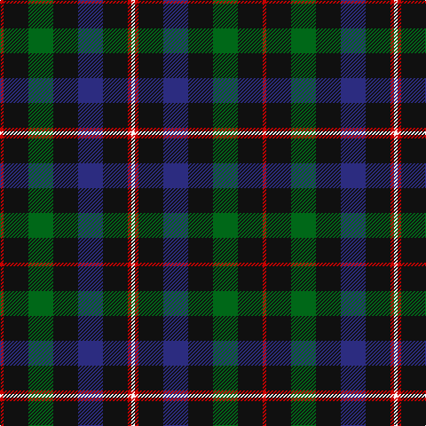

In pattern [RKGKBKRW](/patterns/rkgkbkrw/).

This was sourced from tartans-authority.  It is a [8 stripes tartan](/stripes/stripes8/).

Original link http://www.tartansauthority.com/tartan-ferret/display/6741/

## Attestations

This cloth appears in 2 source records; the oldest owns this page.

- December 2004 — Tennent (Personal) (tartans-authority, [record](http://www.tartansauthority.com/tartan-ferret/display/6741/))
- undated — Tennent from Strathaven (register-of-tartans, [record](https://www.tartanregister.gov.uk/tartanDetails.aspx?ref=5060))

## Thread count
R/4 K28 G28 K28 DB28 K28 R4 W/4

## Palette
Each colour and its ΔE from the base-6 reference it is a variant of.

| Colour | Shade | Base | ΔE (OKLab) |
|---|---|---|---|
| DB | <code style="background-color:#2C2C80;">#2C2C80</code> `#2C2C80` | B <code style="background-color:#2C4084;">#2C4084</code> | 0.05 |
| G | <code style="background-color:#006818;">#006818</code> `#006818` | G <code style="background-color:#006400;">#006400</code> | 0.02 |
| K | <code style="background-color:#101010;">#101010</code> `#101010` | K <code style="background-color:#000000;">#000000</code> | 0.17 |
| R | <code style="background-color:#C80000;">#C80000</code> `#C80000` | R <code style="background-color:#C80000;">#C80000</code> | 0.00 |
| W | <code style="background-color:#F8F8F8;">#F8F8F8</code> `#F8F8F8` | W <code style="background-color:#F4F4F0;">#F4F4F0</code> | 0.01 |

# Sample pattern

## Nearest tartans

The nearest existing variants by ΔTartan distance.

1. [Blackrock (Corporate)](/setts/s8/g20w8r8k16g40ka12g6ka20-g003820-k101010-ka00002c-r880000-wfcfcfc/) — ΔT 0.74
1. [BlackRock (Symmetrical)](/setts/s8/g20w8r8k16g40ka12g6ka20-g003820-k101010-ka00002c-r880000-wffffff/) — ΔT 0.75
1. [Duncan](/setts/s6/k8g42y6g42b42r8-b000052-g11450d-k000000-raa0000-yaaaaaa/) — ΔT 1.14
1. [Duncan](/setts/s6/k4g21y3g21b21r4-b000052-g11450d-k000000-raa0000-yaaaaaa/) — ΔT 1.14
1. [Forbes - 1947 (Lyon Court)](/setts/s7/b6k36b36k36g36k6w6-b2c2c80-g006818-k101010-wfcfcfc/) — ΔT 1.18
1. [Forbes Ancient Clan Tartan Tartan Number: 212. Earliest known date: Logan 1831 Lord Lyon includes the word 'Ancient' in register entry. The Clan Forbes is said to originate from one Ochonochar, who slew a bear to gain possession of the Braes of Forbes in Aberdeenshire. The charter for the land was granted later in 1271. See products available Copyright © Blair Urquhart, Comrie, 2015](/setts/s7/b2k12b12k12g12k2w2-b2c2c80-g006818-k101010-we0e0e0/) — ΔT 1.19
1. [Duncan](/setts/s6/k4g21w3g21b21r4-b000064-g004c00-k000000-rc80000-wd0d0d0/) — ΔT 1.24
1. [Glen Nevis #1 (Fashion)](/setts/s8/g16r4g4r6g16b24g4y4-b1c0070-g003820-r880000-ye8c000/) — ΔT 1.30
1. [Brodie Hunting Clan Tartan Tartan Number: 1334. Earliest known date: 1891 The Hunting Brodie first appears in Whyte's first edition of 1891, published by W. and A.K. Johnston, at which time it seems to have been a recent design. D.W. Stewart remarks in his book, 'Old And Rare..'(1893), "of late a green tartan has been sold as undress or hunting Brodie..." See products available Copyright © Blair Urquhart, Comrie, 2015](/setts/s7/r4b16g16k16y2k16r4-b2c2c80-g006818-k101010-rc80000-ye8c000/) — ΔT 1.32
1. [Cameron Hunting](/setts/s7/r6g20r6g28b32g6y4-b000052-g11450d-raa0000-yaaaa00/) — ΔT 1.34

## Neighbour map

Every grey dot is one of 15726 variants placed by the first two principal components of the ΔTartan feature space (44% of its variance). Red is this tartan; blue dots are its nearest — click one to open its page.

<svg viewBox="0 0 640 380" role="img" style="max-width:100%;height:auto;border:1px solid #e0e0e0;border-radius:4px;display:block" xmlns="http://www.w3.org/2000/svg"><image href="/nn/cloud.v1.png" width="640" height="380"/><a href="/setts/s8/g20w8r8k16g40ka12g6ka20-g003820-k101010-ka00002c-r880000-wfcfcfc/"><circle cx="200.7" cy="228.4" r="4" fill="#3465a4"><title>Blackrock (Corporate)</title></circle></a><a href="/setts/s8/g20w8r8k16g40ka12g6ka20-g003820-k101010-ka00002c-r880000-wffffff/"><circle cx="199.8" cy="228.0" r="4" fill="#3465a4"><title>BlackRock (Symmetrical)</title></circle></a><a href="/setts/s6/k8g42y6g42b42r8-b000052-g11450d-k000000-raa0000-yaaaaaa/"><circle cx="275.4" cy="240.7" r="4" fill="#3465a4"><title>Duncan</title></circle></a><a href="/setts/s6/k4g21y3g21b21r4-b000052-g11450d-k000000-raa0000-yaaaaaa/"><circle cx="275.4" cy="240.7" r="4" fill="#3465a4"><title>Duncan</title></circle></a><a href="/setts/s7/b6k36b36k36g36k6w6-b2c2c80-g006818-k101010-wfcfcfc/"><circle cx="213.7" cy="251.1" r="4" fill="#3465a4"><title>Forbes - 1947 (Lyon Court)</title></circle></a><a href="/setts/s7/b2k12b12k12g12k2w2-b2c2c80-g006818-k101010-we0e0e0/"><circle cx="219.8" cy="253.7" r="4" fill="#3465a4"><title>Forbes Ancient Clan Tartan Tartan Number: 212. Earliest known date: Logan 1831 Lord Lyon includes the word 'Ancient' in register entry. The Clan Forbes is said to originate from one Ochonochar, who slew a bear to gain possession of the Braes of Forbes in Aberdeenshire. The charter for the land was granted later in 1271. See products available Copyright © Blair Urquhart, Comrie, 2015</title></circle></a><a href="/setts/s6/k4g21w3g21b21r4-b000064-g004c00-k000000-rc80000-wd0d0d0/"><circle cx="256.2" cy="232.7" r="4" fill="#3465a4"><title>Duncan</title></circle></a><a href="/setts/s8/g16r4g4r6g16b24g4y4-b1c0070-g003820-r880000-ye8c000/"><circle cx="261.3" cy="242.0" r="4" fill="#3465a4"><title>Glen Nevis #1 (Fashion)</title></circle></a><a href="/setts/s7/r4b16g16k16y2k16r4-b2c2c80-g006818-k101010-rc80000-ye8c000/"><circle cx="168.7" cy="224.9" r="4" fill="#3465a4"><title>Brodie Hunting Clan Tartan Tartan Number: 1334. Earliest known date: 1891 The Hunting Brodie first appears in Whyte's first edition of 1891, published by W. and A.K. Johnston, at which time it seems to have been a recent design. D.W. Stewart remarks in his book, 'Old And Rare..'(1893), &quot;of late a green tartan has been sold as undress or hunting Brodie...&quot; See products available Copyright © Blair Urquhart, Comrie, 2015</title></circle></a><a href="/setts/s7/r6g20r6g28b32g6y4-b000052-g11450d-raa0000-yaaaa00/"><circle cx="283.0" cy="237.6" r="4" fill="#3465a4"><title>Cameron Hunting</title></circle></a><circle cx="233.7" cy="228.4" r="5" fill="#c00000"/></svg>

ID: /setts/s8/r4k28g28k28b28k28r4w4-b2c2c80-g006818-k101010-rc80000-wf8f8f8/
