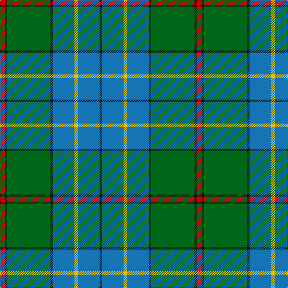

This page is one **sett** — a single exact thread-count. It belongs to the [tartan](/tartans/r4k2g36k2b18ly3b18k2/)
(the same proportion at any scale), whose colour order is pattern [KBYBKGKR](/stripes/kbybkgkr/).

Sourced from register-of-tartans.  It is a [8 stripe tartan](/stripes/stripes8/).

Original link https://www.tartanregister.gov.uk/tartanDetails.aspx?ref=1240

## Also known as

This cloth is also recorded under:

- Fox Hunting

2 attestations — the source records this cloth was collapsed from (oldest owns this page)

<ul>
<li>01/04/2003 — Fox Hunting (register-of-tartans, <a href="https://www.tartanregister.gov.uk/tartanDetails.aspx?ref=1240">record</a>)</li>
<li>April 2003 — Fox Htg (Name) (tartans-authority, <a href="http://www.tartansauthority.com/tartan-ferret/display/5812/">record</a>)</li>
</ul>

## Register references

External register numbers recorded for this tartan.

- Scottish Register of Tartans: [1240](https://www.tartanregister.gov.uk/tartanDetails.aspx?ref=1240)
- Scottish Tartans Authority (ITI): 5812

## Thread count
R/8 K4 G72 K4 B36 Y6 B36 K/4

## Palette

Palette: <strong>Tartan Register</strong>
<table><thead><tr><th>Colour</th><th>Threads</th><th>Shade</th><th>Base</th><th>OKLCh</th></tr></thead><tbody><tr><td>R/</td><td style="text-align:right;font-variant-numeric:tabular-nums">8</td><td><code style="background-color:#C80000;">#C80000</code> <small style="color:#888">#C80000</small></td><td>R <code style="background-color:#CC0000;">#CC0000</code></td><td><small style="color:#888">oklch(52.3% 0.215 29.2)</small></td></tr><tr><td>K</td><td style="text-align:right;font-variant-numeric:tabular-nums">4</td><td><code style="background-color:#101010;">#101010</code> <small style="color:#888">#101010</small></td><td>K <code style="background-color:#000000;">#000000</code></td><td><small style="color:#888">oklch(17.3% 0.000 89.9)</small></td></tr><tr><td>G</td><td style="text-align:right;font-variant-numeric:tabular-nums">72</td><td><code style="background-color:#006818;">#006818</code> <small style="color:#888">#006818</small></td><td>G <code style="background-color:#006100;">#006100</code></td><td><small style="color:#888">oklch(45.0% 0.142 145.0)</small></td></tr><tr><td>K</td><td style="text-align:right;font-variant-numeric:tabular-nums">4</td><td><code style="background-color:#101010;">#101010</code> <small style="color:#888">#101010</small></td><td>K <code style="background-color:#000000;">#000000</code></td><td><small style="color:#888">oklch(17.3% 0.000 89.9)</small></td></tr><tr><td>B</td><td style="text-align:right;font-variant-numeric:tabular-nums">36</td><td><code style="background-color:#1474B4;">#1474B4</code> <small style="color:#888">#1474B4</small></td><td>B <code style="background-color:#2A418A;">#2A418A</code></td><td><small style="color:#888">oklch(54.0% 0.129 245.1)</small></td></tr><tr><td>Y</td><td style="text-align:right;font-variant-numeric:tabular-nums">6</td><td><code style="background-color:#E8C000;">#E8C000</code> <small style="color:#888">#E8C000</small></td><td>Y <code style="background-color:#F2BF00;">#F2BF00</code></td><td><small style="color:#888">oklch(81.9% 0.168 93.7)</small></td></tr><tr><td>B</td><td style="text-align:right;font-variant-numeric:tabular-nums">36</td><td><code style="background-color:#1474B4;">#1474B4</code> <small style="color:#888">#1474B4</small></td><td>B <code style="background-color:#2A418A;">#2A418A</code></td><td><small style="color:#888">oklch(54.0% 0.129 245.1)</small></td></tr><tr><td>K/</td><td style="text-align:right;font-variant-numeric:tabular-nums">4</td><td><code style="background-color:#101010;">#101010</code> <small style="color:#888">#101010</small></td><td>K <code style="background-color:#000000;">#000000</code></td><td><small style="color:#888">oklch(17.3% 0.000 89.9)</small></td></tr></tbody></table>

# Sample pattern

## Nearest tartans

The nearest existing variants by ΔTartan distance, with this tartan at the top so the swatches line up against it.

ΔTartan

Tartan

Sett

—

<a href="/ttd/edit/#slug=r4k2g36k2b18ly3b18k2~x2">Fox Hunting</a> <a class="nn-out" href="/setts/s8/r4k2g36k2b18ly3b18k2~x2/" title="open its dictionary page">↗</a>

0.65

<a href="/ttd/edit/#slug=ly4g3r2g36b30k3b3k3~x2">Chartered Accountants of Scotland</a> <a class="nn-out" href="/setts/s8/ly4g3r2g36b30k3b3k3~x2/" title="open its dictionary page">↗</a>

0.71

<a href="/ttd/edit/#slug=db3r3db36g17ly2g21w2r3~x2">Singh</a> <a class="nn-out" href="/setts/s8/db3r3db36g17ly2g21w2r3~x2/" title="open its dictionary page">↗</a>

0.85

<a href="/ttd/edit/#slug=t24k2r2t2db12g28r4g5t3g3~x2">Downie (Name)</a> <a class="nn-out" href="/setts/s10/t24k2r2t2db12g28r4g5t3g3~x2/" title="open its dictionary page">↗</a>

1.19

<a href="/ttd/edit/#slug=r4db15w2n15g30r2g4~x2">Sinclair Green (Personal)</a> <a class="nn-out" href="/setts/s7/r4db15w2n15g30r2g4~x2/" title="open its dictionary page">↗</a>

1.21

<a href="/ttd/edit/#slug=db3g13t1r3t1db10ly1~x2">Heckenberg Htg (Personal)</a> <a class="nn-out" href="/setts/s7/db3g13t1r3t1db10ly1~x2/" title="open its dictionary page">↗</a>

1.22

<a href="/ttd/edit/#slug=db10k3t65g56ly6">Phoenix Police Honor Guard (Corp.)</a> <a class="nn-out" href="/setts/s5/db10k3t65g56ly6/" title="open its dictionary page">↗</a>

1.22

<a href="/ttd/edit/#slug=db3g13lr1o3lr1db10lo1~x2">Graeme Heckenberg Hunting</a> <a class="nn-out" href="/setts/s7/db3g13lr1o3lr1db10lo1~x2/" title="open its dictionary page">↗</a>

1.22

<a href="/ttd/edit/#slug=k3g36db28r2db2ly3~x2">Carmichael</a> <a class="nn-out" href="/setts/s6/k3g36db28r2db2ly3~x2/" title="open its dictionary page">↗</a>

1.23

<a href="/ttd/edit/#slug=k3r1ly1t11g13t5r1ly1~x4">Snodgrass (Clan)</a> <a class="nn-out" href="/setts/s8/k3r1ly1t11g13t5r1ly1~x4/" title="open its dictionary page">↗</a>

1.23

<a href="/ttd/edit/#slug=r6db27t2g2t2g30w4~x2">MX-5 Owners' Club</a> <a class="nn-out" href="/setts/s7/r6db27t2g2t2g30w4~x2/" title="open its dictionary page">↗</a>

## Neighbour map

Every grey dot is one of 14299 variants placed by the first two principal components of the ΔTartan feature space (44% of its variance). Red is this tartan; blue dots are its nearest — click one to open its page.

<svg viewBox="0 0 640 380" role="img" style="max-width:100%;height:auto;border:1px solid #e0e0e0;border-radius:4px;display:block" xmlns="http://www.w3.org/2000/svg"><image href="/nn/cloud.v1.png" width="640" height="380"/><a href="/setts/s8/ly4g3r2g36b30k3b3k3~x2/"><circle cx="304.2" cy="159.4" r="4" fill="#3465a4"><title>Chartered Accountants of Scotland</title></circle></a><a href="/setts/s8/db3r3db36g17ly2g21w2r3~x2/"><circle cx="281.5" cy="156.5" r="4" fill="#3465a4"><title>Singh</title></circle></a><a href="/setts/s10/t24k2r2t2db12g28r4g5t3g3~x2/"><circle cx="243.8" cy="160.1" r="4" fill="#3465a4"><title>Downie (Name)</title></circle></a><a href="/setts/s7/r4db15w2n15g30r2g4~x2/"><circle cx="255.1" cy="182.9" r="4" fill="#3465a4"><title>Sinclair Green (Personal)</title></circle></a><a href="/setts/s7/db3g13t1r3t1db10ly1~x2/"><circle cx="236.5" cy="178.7" r="4" fill="#3465a4"><title>Heckenberg Htg (Personal)</title></circle></a><a href="/setts/s5/db10k3t65g56ly6/"><circle cx="294.4" cy="185.8" r="4" fill="#3465a4"><title>Phoenix Police Honor Guard (Corp.)</title></circle></a><a href="/setts/s7/db3g13lr1o3lr1db10lo1~x2/"><circle cx="261.7" cy="190.9" r="4" fill="#3465a4"><title>Graeme Heckenberg Hunting</title></circle></a><a href="/setts/s6/k3g36db28r2db2ly3~x2/"><circle cx="296.5" cy="163.5" r="4" fill="#3465a4"><title>Carmichael</title></circle></a><a href="/setts/s8/k3r1ly1t11g13t5r1ly1~x4/"><circle cx="226.4" cy="163.2" r="4" fill="#3465a4"><title>Snodgrass (Clan)</title></circle></a><a href="/setts/s7/r6db27t2g2t2g30w4~x2/"><circle cx="242.9" cy="158.5" r="4" fill="#3465a4"><title>MX-5 Owners' Club</title></circle></a><circle cx="271.2" cy="163.3" r="5" fill="#c00000"/></svg>

ID: /setts/s8/r4k2g36k2b18ly3b18k2~x2/
