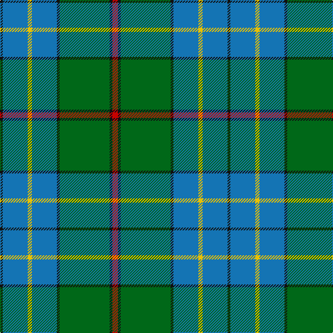

In pattern [KBYBKGKR](/patterns/kbybkgkr/).

This was sourced from register-of-tartans.  It is a [8 stripes tartan](/stripes/stripes8/).

Original link https://www.tartanregister.gov.uk/tartanDetails.aspx?ref=1240

## Attestations

This cloth appears in 2 source records; the oldest owns this page.

- 01/04/2003 — Fox Hunting (register-of-tartans, [record](https://www.tartanregister.gov.uk/tartanDetails.aspx?ref=1240))
- April 2003 — Fox Htg (Name) (tartans-authority, [record](http://www.tartansauthority.com/tartan-ferret/display/5812/))

## Thread count
K/4 B36 Y6 B36 K4 G72 K4 R/8

## Palette
Each colour and its ΔE from the base-6 reference it is a variant of.

| Colour | Shade | Base | ΔE (OKLab) |
|---|---|---|---|
| B | <code style="background-color:#1474B4;">#1474B4</code> `#1474B4` | B <code style="background-color:#2A418A;">#2A418A</code> | 0.15 |
| G | <code style="background-color:#006818;">#006818</code> `#006818` | G <code style="background-color:#006100;">#006100</code> | 0.02 |
| K | <code style="background-color:#101010;">#101010</code> `#101010` | K <code style="background-color:#000000;">#000000</code> | 0.17 |
| R | <code style="background-color:#C80000;">#C80000</code> `#C80000` | R <code style="background-color:#CC0000;">#CC0000</code> | 0.01 |
| Y | <code style="background-color:#E8C000;">#E8C000</code> `#E8C000` | Y <code style="background-color:#F2BF00;">#F2BF00</code> | 0.02 |

# Sample pattern

## Nearest tartans

The nearest existing variants by ΔTartan distance.

1. [Chartered Accountants of Scotland](/setts/s8/y4g3r2g36b30k3b3k3x2~b1870a4-g006818-k101010-rc8002c-ye8c000/) — ΔT 0.65
1. [Singh](/setts/s8/b3r3b36g17y2g21w2r3x2~b304080-g008000-rc00000-we0e0e0-yf0c000/) — ΔT 0.71
1. [Downie (Name)](/setts/s10/b24k2r2b2ba12g28r4g5b3g3x2~b5c8ca8-ba202060-g006818-k101010-rc80000/) — ΔT 0.85
1. [Singh Name Tartan Tartan Number: 2600. Earliest known date: 1999 Created for the use of those with the name Singh. The proposer was Sirdar Iqubal Singh, Lord of Butley See products available Copyright © Blair Urquhart, Comrie, 2015](/setts/s8/b3r3b36g17y2g21w2r3x2~b2c2c80-g006818-rc80000-we0e0e0-ye8c000/) — ΔT 1.06
1. [Carmichael Family Tartan Tartan Number: 1078. Earliest known date: 1907 It was the Carmichael of Artherstone who, in 1907, sealed a sample of the Carmichael tartan in the Collection of the Highland Society. This is the first known appearance of the tartan. This sett is sometimes woven in slightly different proportions, most noticable in the black and green stripes. Carmichaels are associated with the Stewarts of Appin and with the MacDougalls (MacMichaels), but all of the name, Carmichael, have the chiefs approval for the wearing of the Carmichael tartan. See products available Copyright © Blair Urquhart, Comrie, 2015](/setts/s6/k3g36b28r2b2y3x2~b2c2c80-g006818-k101010-rc80000-ye8c000/) — ΔT 1.14
1. [Sinclair Green (Personal)](/setts/s7/g4r2g30b15w2ba15r4x2~b5c5c5c-ba1c0070-g006818-r880000-wfcfcfc/) — ΔT 1.19
1. [Heckenberg Htg (Personal)](/setts/s7/b3g13ba1r3ba1b10y1x2~b2c2c80-ba5c8ca8-g006818-rc80000-yfccc00/) — ΔT 1.20
1. [Lowry Clan Tartan Tartan Number: 3203. Earliest known date: 2000 One of a set of three similar designs for Laurie, Lawrie and Lowry, designed by Peter MacDonald for Iain Laurie. See products available Copyright © Blair Urquhart, Comrie, 2015](/setts/s7/b6y2b1g25ba16k2ba4x2~b440044-ba2c2c80-g006818-k101010-ye8c000/) — ΔT 1.21
1. [Graeme Heckenberg Hunting](/setts/s7/b3g13y1r3y1b10ya1x2~b1f3d7a-g4d7326-r761a1a-y8397a7-yafaa706/) — ΔT 1.21
1. [Phoenix Police Honor Guard (Corp.)](/setts/s5/b10k3ba65g56y6~b202060-ba2888c4-g006818-k101010-ye8c000/) — ΔT 1.22

## Neighbour map

Every grey dot is one of 15726 variants placed by the first two principal components of the ΔTartan feature space (44% of its variance). Red is this tartan; blue dots are its nearest — click one to open its page.

<svg viewBox="0 0 640 380" role="img" style="max-width:100%;height:auto;border:1px solid #e0e0e0;border-radius:4px;display:block" xmlns="http://www.w3.org/2000/svg"><image href="/nn/cloud.v1.png" width="640" height="380"/><a href="/setts/s8/y4g3r2g36b30k3b3k3x2~b1870a4-g006818-k101010-rc8002c-ye8c000/"><circle cx="301.2" cy="153.3" r="4" fill="#3465a4"><title>Chartered Accountants of Scotland</title></circle></a><a href="/setts/s8/b3r3b36g17y2g21w2r3x2~b304080-g008000-rc00000-we0e0e0-yf0c000/"><circle cx="278.6" cy="153.5" r="4" fill="#3465a4"><title>Singh</title></circle></a><a href="/setts/s10/b24k2r2b2ba12g28r4g5b3g3x2~b5c8ca8-ba202060-g006818-k101010-rc80000/"><circle cx="240.9" cy="154.2" r="4" fill="#3465a4"><title>Downie (Name)</title></circle></a><a href="/setts/s8/b3r3b36g17y2g21w2r3x2~b2c2c80-g006818-rc80000-we0e0e0-ye8c000/"><circle cx="280.8" cy="154.7" r="4" fill="#3465a4"><title>Singh Name Tartan Tartan Number: 2600. Earliest known date: 1999 Created for the use of those with the name Singh. The proposer was Sirdar Iqubal Singh, Lord of Butley See products available Copyright © Blair Urquhart, Comrie, 2015</title></circle></a><a href="/setts/s6/k3g36b28r2b2y3x2~b2c2c80-g006818-k101010-rc80000-ye8c000/"><circle cx="310.3" cy="168.5" r="4" fill="#3465a4"><title>Carmichael Family Tartan Tartan Number: 1078. Earliest known date: 1907 It was the Carmichael of Artherstone who, in 1907, sealed a sample of the Carmichael tartan in the Collection of the Highland Society. This is the first known appearance of the tartan. This sett is sometimes woven in slightly different proportions, most noticable in the black and green stripes. Carmichaels are associated with the Stewarts of Appin and with the MacDougalls (MacMichaels), but all of the name, Carmichael, have the chiefs approval for the wearing of the Carmichael tartan. See products available Copyright © Blair Urquhart, Comrie, 2015</title></circle></a><a href="/setts/s7/g4r2g30b15w2ba15r4x2~b5c5c5c-ba1c0070-g006818-r880000-wfcfcfc/"><circle cx="252.3" cy="178.2" r="4" fill="#3465a4"><title>Sinclair Green (Personal)</title></circle></a><a href="/setts/s7/b3g13ba1r3ba1b10y1x2~b2c2c80-ba5c8ca8-g006818-rc80000-yfccc00/"><circle cx="233.5" cy="175.0" r="4" fill="#3465a4"><title>Heckenberg Htg (Personal)</title></circle></a><a href="/setts/s7/b6y2b1g25ba16k2ba4x2~b440044-ba2c2c80-g006818-k101010-ye8c000/"><circle cx="282.7" cy="155.1" r="4" fill="#3465a4"><title>Lowry Clan Tartan Tartan Number: 3203. Earliest known date: 2000 One of a set of three similar designs for Laurie, Lawrie and Lowry, designed by Peter MacDonald for Iain Laurie. See products available Copyright © Blair Urquhart, Comrie, 2015</title></circle></a><a href="/setts/s7/b3g13y1r3y1b10ya1x2~b1f3d7a-g4d7326-r761a1a-y8397a7-yafaa706/"><circle cx="259.2" cy="184.4" r="4" fill="#3465a4"><title>Graeme Heckenberg Hunting</title></circle></a><a href="/setts/s5/b10k3ba65g56y6~b202060-ba2888c4-g006818-k101010-ye8c000/"><circle cx="291.2" cy="181.3" r="4" fill="#3465a4"><title>Phoenix Police Honor Guard (Corp.)</title></circle></a><circle cx="268.0" cy="157.9" r="5" fill="#c00000"/></svg>

ID: /setts/s8/r4k2g36k2b18y3b18k2x2~b1474b4-g006818-k101010-rc80000-ye8c000/
