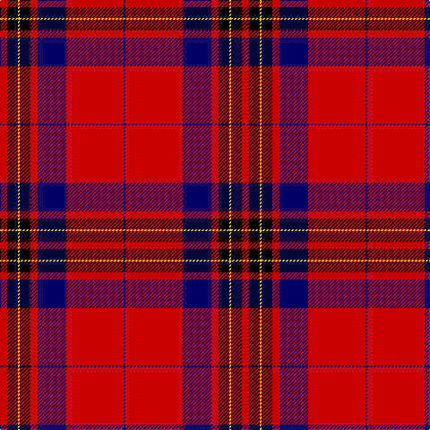

This page is one **sett** — a single exact thread-count. It belongs to the [tartan](/tartans/r4k6ly1k6r4db16r32db1/)
(the same proportion at any scale), whose colour order is pattern [BRBRKYKR](/stripes/brbrkykr/).

Sourced from weddslist.  It is a [8 stripe tartan](/stripes/stripes8/).

Original link http://www.weddslist.com/cgi-bin/tartans/pg.pl?source=rb

## Thread count
R/8 K12 Y2 K12 R8 DB32 R64 DB/2

## Palette

Palette: <strong>Tartan Register</strong> <small style="color:#888">(3 of 4 colours)</small>
<table><thead><tr><th>Colour</th><th>Threads</th><th>Shade</th><th>Base</th><th>OKLCh</th></tr></thead><tbody><tr><td>R/</td><td style="text-align:right;font-variant-numeric:tabular-nums">8</td><td><code style="background-color:#C80000;">#C80000</code> <small style="color:#888">#C80000</small></td><td>R <code style="background-color:#CC0000;">#CC0000</code></td><td><small style="color:#888">oklch(52.3% 0.215 29.2)</small></td></tr><tr><td>K</td><td style="text-align:right;font-variant-numeric:tabular-nums">12</td><td><code style="background-color:#000000;">#000000</code> <small style="color:#888">#000000</small></td><td>K <code style="background-color:#000000;">#000000</code></td><td><small style="color:#888">oklch(0.0% 0.000 0.0)</small></td></tr><tr><td>Y</td><td style="text-align:right;font-variant-numeric:tabular-nums">2</td><td><code style="background-color:#FFC800;">#FFC800</code> <small style="color:#888">#FFC800</small></td><td>Y <code style="background-color:#F2BF00;">#F2BF00</code></td><td><small style="color:#888">oklch(85.7% 0.175 88.5)</small></td></tr><tr><td>K</td><td style="text-align:right;font-variant-numeric:tabular-nums">12</td><td><code style="background-color:#000000;">#000000</code> <small style="color:#888">#000000</small></td><td>K <code style="background-color:#000000;">#000000</code></td><td><small style="color:#888">oklch(0.0% 0.000 0.0)</small></td></tr><tr><td>R</td><td style="text-align:right;font-variant-numeric:tabular-nums">8</td><td><code style="background-color:#C80000;">#C80000</code> <small style="color:#888">#C80000</small></td><td>R <code style="background-color:#CC0000;">#CC0000</code></td><td><small style="color:#888">oklch(52.3% 0.215 29.2)</small></td></tr><tr><td>DB</td><td style="text-align:right;font-variant-numeric:tabular-nums">32</td><td><code style="background-color:#000064;">#000064</code> <small style="color:#888">#000064</small></td><td>B <code style="background-color:#2A418A;">#2A418A</code></td><td><small style="color:#888">oklch(22.7% 0.158 264.1)</small></td></tr><tr><td>R</td><td style="text-align:right;font-variant-numeric:tabular-nums">64</td><td><code style="background-color:#C80000;">#C80000</code> <small style="color:#888">#C80000</small></td><td>R <code style="background-color:#CC0000;">#CC0000</code></td><td><small style="color:#888">oklch(52.3% 0.215 29.2)</small></td></tr><tr><td>DB/</td><td style="text-align:right;font-variant-numeric:tabular-nums">2</td><td><code style="background-color:#000064;">#000064</code> <small style="color:#888">#000064</small></td><td>B <code style="background-color:#2A418A;">#2A418A</code></td><td><small style="color:#888">oklch(22.7% 0.158 264.1)</small></td></tr></tbody></table>

# Sample pattern

## Nearest tartans

The nearest existing variants by ΔTartan distance, with this tartan at the top so the swatches line up against it.

ΔTartan

Tartan

Sett

—

<a href="/ttd/edit/#slug=r4k6ly1k6r4db16r32db1~x2">Leslie Dress</a> <a class="nn-out" href="/setts/s8/r4k6ly1k6r4db16r32db1~x2/" title="open its dictionary page">↗</a>

0.43

<a href="/ttd/edit/#slug=r4k6ly1k6r4db16r32k1~x2">Leslie</a> <a class="nn-out" href="/setts/s8/r4k6ly1k6r4db16r32k1~x2/" title="open its dictionary page">↗</a>

0.91

<a href="/ttd/edit/#slug=lo4k17r1k4r2k4r33w3~x2">Mens Bigi</a> <a class="nn-out" href="/setts/s8/lo4k17r1k4r2k4r33w3~x2/" title="open its dictionary page">↗</a>

1.02

<a href="/ttd/edit/#slug=k3r1k30r28db1r1w3~x2">Cunningham #3</a> <a class="nn-out" href="/setts/s7/k3r1k30r28db1r1w3~x2/" title="open its dictionary page">↗</a>

1.12

<a href="/ttd/edit/#slug=w10k2w2k66ly6r48k5r8">Sutherland de Albergaria (Personal)</a> <a class="nn-out" href="/setts/s8/w10k2w2k66ly6r48k5r8/" title="open its dictionary page">↗</a>

1.26

<a href="/ttd/edit/#slug=k4w1k28r30dp1r3~x2">Ramsay (Red)</a> <a class="nn-out" href="/setts/s6/k4w1k28r30dp1r3~x2/" title="open its dictionary page">↗</a>

1.26

<a href="/ttd/edit/#slug=r4k12w1k12r4k4r24g1r4~x4">Wemyss</a> <a class="nn-out" href="/setts/s9/r4k12w1k12r4k4r24g1r4~x4/" title="open its dictionary page">↗</a>

1.28

<a href="/ttd/edit/#slug=r60db8r4k11w2k11w2k11db1r4~x2">Robberstad #2</a> <a class="nn-out" href="/setts/s10/r60db8r4k11w2k11w2k11db1r4~x2/" title="open its dictionary page">↗</a>

1.28

<a href="/ttd/edit/#slug=r11w1r32k8db6k1db16k1~x2">Ostermeier (2015)</a> <a class="nn-out" href="/setts/s8/r11w1r32k8db6k1db16k1~x2/" title="open its dictionary page">↗</a>

1.29

<a href="/ttd/edit/#slug=r4k12lb1k12r4k4r24dg1r4~x2">Wemyss</a> <a class="nn-out" href="/setts/s9/r4k12lb1k12r4k4r24dg1r4~x2/" title="open its dictionary page">↗</a>

1.30

<a href="/ttd/edit/#slug=r4k12w1k12r4k4r24g1r4~x2">Wemyss</a> <a class="nn-out" href="/setts/s9/r4k12w1k12r4k4r24g1r4~x2/" title="open its dictionary page">↗</a>

## Neighbour map

Every grey dot is one of 14299 variants placed by the first two principal components of the ΔTartan feature space (44% of its variance). Red is this tartan; blue dots are its nearest — click one to open its page.

<svg viewBox="0 0 640 380" role="img" style="max-width:100%;height:auto;border:1px solid #e0e0e0;border-radius:4px;display:block" xmlns="http://www.w3.org/2000/svg"><image href="/nn/cloud.v1.png" width="640" height="380"/><a href="/setts/s8/r4k6ly1k6r4db16r32k1~x2/"><circle cx="360.2" cy="119.4" r="4" fill="#3465a4"><title>Leslie</title></circle></a><a href="/setts/s8/lo4k17r1k4r2k4r33w3~x2/"><circle cx="364.9" cy="122.5" r="4" fill="#3465a4"><title>Mens Bigi</title></circle></a><a href="/setts/s7/k3r1k30r28db1r1w3~x2/"><circle cx="350.0" cy="117.7" r="4" fill="#3465a4"><title>Cunningham #3</title></circle></a><a href="/setts/s8/w10k2w2k66ly6r48k5r8/"><circle cx="321.3" cy="107.1" r="4" fill="#3465a4"><title>Sutherland de Albergaria (Personal)</title></circle></a><a href="/setts/s6/k4w1k28r30dp1r3~x2/"><circle cx="367.7" cy="140.7" r="4" fill="#3465a4"><title>Ramsay (Red)</title></circle></a><a href="/setts/s9/r4k12w1k12r4k4r24g1r4~x4/"><circle cx="359.2" cy="141.0" r="4" fill="#3465a4"><title>Wemyss</title></circle></a><a href="/setts/s10/r60db8r4k11w2k11w2k11db1r4~x2/"><circle cx="400.4" cy="69.3" r="4" fill="#3465a4"><title>Robberstad #2</title></circle></a><a href="/setts/s8/r11w1r32k8db6k1db16k1~x2/"><circle cx="352.7" cy="113.8" r="4" fill="#3465a4"><title>Ostermeier (2015)</title></circle></a><a href="/setts/s9/r4k12lb1k12r4k4r24dg1r4~x2/"><circle cx="340.9" cy="135.6" r="4" fill="#3465a4"><title>Wemyss</title></circle></a><a href="/setts/s9/r4k12w1k12r4k4r24g1r4~x2/"><circle cx="341.5" cy="136.9" r="4" fill="#3465a4"><title>Wemyss</title></circle></a><circle cx="353.0" cy="117.3" r="5" fill="#c00000"/></svg>

ID: /setts/s8/r4k6ly1k6r4db16r32db1~x2/
