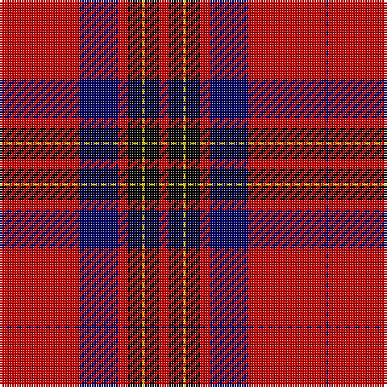

In pattern [BRBRKYKR](/patterns/brbrkykr/).

This was sourced from weddslist.  It is a [8 stripes tartan](/stripes/stripes8/).

Original link http://www.weddslist.com/cgi-bin/tartans/pg.pl?source=rb

## Thread count
DB/1 R32 DB16 R4 K6 Y1 K6 R/4

## Palette
Each colour and its ΔE from the base-6 reference it is a variant of.

| Colour | Shade | Base | ΔE (OKLab) |
|---|---|---|---|
| DB | <code style="background-color:#000064;">#000064</code> `#000064` | B <code style="background-color:#2C4084;">#2C4084</code> | 0.17 |
| K | <code style="background-color:#000000;">#000000</code> `#000000` | K <code style="background-color:#000000;">#000000</code> | 0.00 |
| R | <code style="background-color:#C80000;">#C80000</code> `#C80000` | R <code style="background-color:#C80000;">#C80000</code> | 0.00 |
| Y | <code style="background-color:#FFC800;">#FFC800</code> `#FFC800` | Y <code style="background-color:#E8C000;">#E8C000</code> | 0.04 |

# Sample pattern

## Nearest tartans

The nearest existing variants by ΔTartan distance.

1. [Leslie](/setts/s8/r8k12y2k12r8b32r64k2-b304080-k000000-rc00000-yf0c000/) — ΔT 0.43
1. [Leslie Dress](/setts/s8/r8k12y2k12r8b32r64k2-b000052-k000000-raa0000-yaaaa00/) — ΔT 0.57
1. [Mens Bigi](/setts/s8/y8k34r2k8r4k8r66w6-k101010-r901c38-wfcfcfc-yd87c00/) — ΔT 0.90
1. [Cunningham #3](/setts/s7/k6r2k60r56b2r2w6-b2c4084-k101010-rdc0000-we0e0e0/) — ΔT 1.03
1. [Leslie Clan Tartan Tartan Number: 1142. Earliest known date: 1842 The Vestarium Scoticum See products available Copyright © Blair Urquhart, Comrie, 2015](/setts/s8/r8k12y2k12r8b32r64k2-b2c2c80-k101010-rc80000-ye8c000/) — ΔT 1.03
1. [Cunningham (VS) Clan Tartan Tartan Number: 1200. Earliest known date: 1842 The origin of the name comes from the district of Cunningham in Ayrshire. Alexander de Cunningham was created 1st Earl of Glencairn in 1488. The family is now widespread throughout Scotland. Cunningham was one of the names adopted by the MacGregors when their own was proscribed. There is a similarity with the MacGregor tartan but the true origin is unknown as the claims of antiquity made in the Vestiarium Scoticum, where the Cunningham tartan was first recorded, are unreliable. See products available Copyright © Blair Urquhart, Comrie, 2015](/setts/s7/k6r2k60r56b2r2w6-b2c2c80-k101010-rc80000-we0e0e0/) — ΔT 1.06
1. [Sutherland de Albergaria (Personal)](/setts/s8/w10k2w2k66y6r48k5r8-k101010-rc80000-wfcfcfc-ye8c000/) — ΔT 1.12
1. [Ramsay (Red)](/setts/s6/k8w2k56r60b2r6-b440044-k101010-rc80000-wf8f8f8/) — ΔT 1.26
1. [Wemyss](/setts/s9/r16k48w4k48r16k16r96g4r16-g006818-k101010-rc80000-wfcfcfc/) — ΔT 1.26
1. [Ostermeier (2015)](/setts/s8/r22w2r64k16b12k2b32k2-b2c2c80-k101010-rff0000-wffffff/) — ΔT 1.27

## Neighbour map

Every grey dot is one of 15726 variants placed by the first two principal components of the ΔTartan feature space (44% of its variance). Red is this tartan; blue dots are its nearest — click one to open its page.

<svg viewBox="0 0 640 380" role="img" style="max-width:100%;height:auto;border:1px solid #e0e0e0;border-radius:4px;display:block" xmlns="http://www.w3.org/2000/svg"><image href="/nn/cloud.v1.png" width="640" height="380"/><a href="/setts/s8/r8k12y2k12r8b32r64k2-b304080-k000000-rc00000-yf0c000/"><circle cx="359.1" cy="120.8" r="4" fill="#3465a4"><title>Leslie</title></circle></a><a href="/setts/s8/r8k12y2k12r8b32r64k2-b000052-k000000-raa0000-yaaaa00/"><circle cx="360.8" cy="127.1" r="4" fill="#3465a4"><title>Leslie Dress</title></circle></a><a href="/setts/s8/y8k34r2k8r4k8r66w6-k101010-r901c38-wfcfcfc-yd87c00/"><circle cx="362.9" cy="122.5" r="4" fill="#3465a4"><title>Mens Bigi</title></circle></a><a href="/setts/s7/k6r2k60r56b2r2w6-b2c4084-k101010-rdc0000-we0e0e0/"><circle cx="348.6" cy="119.5" r="4" fill="#3465a4"><title>Cunningham #3</title></circle></a><a href="/setts/s8/r8k12y2k12r8b32r64k2-b2c2c80-k101010-rc80000-ye8c000/"><circle cx="376.4" cy="125.9" r="4" fill="#3465a4"><title>Leslie Clan Tartan Tartan Number: 1142. Earliest known date: 1842 The Vestarium Scoticum See products available Copyright © Blair Urquhart, Comrie, 2015</title></circle></a><a href="/setts/s7/k6r2k60r56b2r2w6-b2c2c80-k101010-rc80000-we0e0e0/"><circle cx="353.8" cy="123.6" r="4" fill="#3465a4"><title>Cunningham (VS) Clan Tartan Tartan Number: 1200. Earliest known date: 1842 The origin of the name comes from the district of Cunningham in Ayrshire. Alexander de Cunningham was created 1st Earl of Glencairn in 1488. The family is now widespread throughout Scotland. Cunningham was one of the names adopted by the MacGregors when their own was proscribed. There is a similarity with the MacGregor tartan but the true origin is unknown as the claims of antiquity made in the Vestiarium Scoticum, where the Cunningham tartan was first recorded, are unreliable. See products available Copyright © Blair Urquhart, Comrie, 2015</title></circle></a><a href="/setts/s8/w10k2w2k66y6r48k5r8-k101010-rc80000-wfcfcfc-ye8c000/"><circle cx="319.2" cy="108.9" r="4" fill="#3465a4"><title>Sutherland de Albergaria (Personal)</title></circle></a><a href="/setts/s6/k8w2k56r60b2r6-b440044-k101010-rc80000-wf8f8f8/"><circle cx="366.8" cy="141.8" r="4" fill="#3465a4"><title>Ramsay (Red)</title></circle></a><a href="/setts/s9/r16k48w4k48r16k16r96g4r16-g006818-k101010-rc80000-wfcfcfc/"><circle cx="358.9" cy="142.4" r="4" fill="#3465a4"><title>Wemyss</title></circle></a><a href="/setts/s8/r22w2r64k16b12k2b32k2-b2c2c80-k101010-rff0000-wffffff/"><circle cx="352.6" cy="116.6" r="4" fill="#3465a4"><title>Ostermeier (2015)</title></circle></a><circle cx="351.7" cy="119.1" r="5" fill="#c00000"/></svg>

ID: /setts/s8/r4k6y1k6r4b16r32b1-b000064-k000000-rc80000-yffc800/
