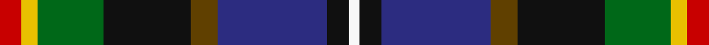
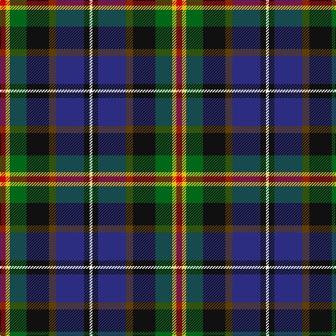

In pattern [RYGKGBKW](/stripes/rygkgbkw/).

This was sourced from tartans-authority.  It is a [8 stripe tartan](/stripes/stripes8/).

Original link http://www.tartansauthority.com/tartan-ferret/display/6051/

## Thread count
R/8 Y6 G24 K32 T10 DB40 K8 W/4

## Palette
Each colour and its ΔE from the base-6 reference it is a variant of.

| Colour | Shade | Base | ΔE (OKLab) |
|---|---|---|---|
| DB | <code style="background-color:#2C2C80;">#2C2C80</code> `#2C2C80` | B <code style="background-color:#2A418A;">#2A418A</code> | 0.06 |
| G | <code style="background-color:#006818;">#006818</code> `#006818` | G <code style="background-color:#006100;">#006100</code> | 0.02 |
| K | <code style="background-color:#101010;">#101010</code> `#101010` | K <code style="background-color:#000000;">#000000</code> | 0.17 |
| R | <code style="background-color:#C80000;">#C80000</code> `#C80000` | R <code style="background-color:#CC0000;">#CC0000</code> | 0.01 |
| T | <code style="background-color:#604000;">#604000</code> `#604000` | G <code style="background-color:#006100;">#006100</code> | 0.14 |
| W | <code style="background-color:#F8F8F8;">#F8F8F8</code> `#F8F8F8` | W <code style="background-color:#F7F7F7;">#F7F7F7</code> | 0.00 |
| Y | <code style="background-color:#E8C000;">#E8C000</code> `#E8C000` | Y <code style="background-color:#F2BF00;">#F2BF00</code> | 0.02 |

# Sample pattern

## Nearest tartans

The nearest existing variants by ΔTartan distance.

1. [Young](/setts/s8/k3db3g15db15dp5o3y2dp1~x2/) — ΔT 0.96
1. [Culloden 1746 - Original](/setts/s8/r5lb1dt10w2k10y10k1ly3~x4/) — ΔT 0.97
1. [Young Family Tartan Tartan Number: 2048. Earliest known date: 1991 Based on the Christina Young blanket dating from 1726 and preserved at the Scottish Tartans Society museum in Keith, Banffshire. The design retains the unusual purple - yellow - orange box check of the original blanket and changes only the ground colour to the greens and blues of the Douglas tartan. There are 7 colours. Black is normally replaced by dark blue in commercial weaving. See products available Copyright © Blair Urquhart, Comrie, 2015](/setts/s8/k3db3g15db15m5lo3ly2m1~x2/) — ΔT 0.98
1. [Coats (New Zealand)](/setts/s9/k9ly6db9lr2o3lr2dg17db17lb5~x2/) — ΔT 0.98
1. [Harvey of Cornwall (Personal)](/setts/s7/w10k52db52dg24ly10dg5r5/) — ΔT 1.05
1. [Julien Pigeut Tartan Tartan Number: 6574. Earliest known date: 2004 For the wedding of Julien and Sylvia Piguet. Also worn by Roland Mathez best man of Julien. See products available Copyright © Blair Urquhart, Comrie, 2015](/setts/s8/k40n15o10ly3t5w5db10t20/) — ΔT 1.07
1. [Coats (New Zealand)](/setts/s9/k9lo6db9o2do3o2dg17db17lg5~x2/) — ΔT 1.08
1. [Wisconsin (US State)](/setts/s10/n11r3n2o3k12dg20ly2k12n11lo3~x2/) — ΔT 1.09
1. [Rust (Personal)](/setts/s12/r3k2dp12w2dp12k12g12lo2g12k2r1db2~x2/) — ΔT 1.10
1. [Stuart/Stewart Black #3](/setts/s12/db20t6k8ly2k4w4k4dg13r7k4r3w2~x2/) — ΔT 1.11

## Neighbour map

Every grey dot is one of 14299 variants placed by the first two principal components of the ΔTartan feature space (44% of its variance). Red is this tartan; blue dots are its nearest — click one to open its page.

<svg viewBox="0 0 640 380" role="img" style="max-width:100%;height:auto;border:1px solid #e0e0e0;border-radius:4px;display:block" xmlns="http://www.w3.org/2000/svg"><image href="/nn/cloud.v1.png" width="640" height="380"/><a href="/setts/s8/k3db3g15db15dp5o3y2dp1~x2/"><circle cx="102.5" cy="127.3" r="4" fill="#3465a4"><title>Young</title></circle></a><a href="/setts/s8/r5lb1dt10w2k10y10k1ly3~x4/"><circle cx="44.4" cy="147.7" r="4" fill="#3465a4"><title>Culloden 1746 - Original</title></circle></a><a href="/setts/s8/k3db3g15db15m5lo3ly2m1~x2/"><circle cx="118.6" cy="132.1" r="4" fill="#3465a4"><title>Young Family Tartan Tartan Number: 2048. Earliest known date: 1991 Based on the Christina Young blanket dating from 1726 and preserved at the Scottish Tartans Society museum in Keith, Banffshire. The design retains the unusual purple - yellow - orange box check of the original blanket and changes only the ground colour to the greens and blues of the Douglas tartan. There are 7 colours. Black is normally replaced by dark blue in commercial weaving. See products available Copyright © Blair Urquhart, Comrie, 2015</title></circle></a><a href="/setts/s9/k9ly6db9lr2o3lr2dg17db17lb5~x2/"><circle cx="86.1" cy="161.8" r="4" fill="#3465a4"><title>Coats (New Zealand)</title></circle></a><a href="/setts/s7/w10k52db52dg24ly10dg5r5/"><circle cx="123.6" cy="167.4" r="4" fill="#3465a4"><title>Harvey of Cornwall (Personal)</title></circle></a><a href="/setts/s8/k40n15o10ly3t5w5db10t20/"><circle cx="108.5" cy="135.7" r="4" fill="#3465a4"><title>Julien Pigeut Tartan Tartan Number: 6574. Earliest known date: 2004 For the wedding of Julien and Sylvia Piguet. Also worn by Roland Mathez best man of Julien. See products available Copyright © Blair Urquhart, Comrie, 2015</title></circle></a><a href="/setts/s9/k9lo6db9o2do3o2dg17db17lg5~x2/"><circle cx="97.4" cy="171.2" r="4" fill="#3465a4"><title>Coats (New Zealand)</title></circle></a><a href="/setts/s10/n11r3n2o3k12dg20ly2k12n11lo3~x2/"><circle cx="99.2" cy="159.7" r="4" fill="#3465a4"><title>Wisconsin (US State)</title></circle></a><a href="/setts/s12/r3k2dp12w2dp12k12g12lo2g12k2r1db2~x2/"><circle cx="114.7" cy="136.0" r="4" fill="#3465a4"><title>Rust (Personal)</title></circle></a><a href="/setts/s12/db20t6k8ly2k4w4k4dg13r7k4r3w2~x2/"><circle cx="38.1" cy="128.6" r="4" fill="#3465a4"><title>Stuart/Stewart Black #3</title></circle></a><circle cx="81.9" cy="156.7" r="5" fill="#c00000"/></svg>

ID: /setts/s8/r4ly3g12k16dy5db20k4w2~x2/
