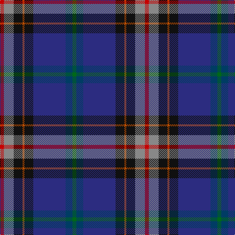

This page is one **sett** — a single exact thread-count. It belongs to the [tartan](/tartans/r4o10k9o2k9db33dt7g4/)
(the same proportion at any scale), whose colour order is pattern [GBBKRKRR](/stripes/gbbkrkrr/).

Sourced from register-of-tartans.  It is a [8 stripe tartan](/stripes/stripes8/).

Original link https://www.tartanregister.gov.uk/tartanDetails.aspx?ref=93

2 attestations — the source records this cloth was collapsed from (oldest owns this page)

<ul>
<li>16/02/1998 — Anne Arundel County (register-of-tartans, <a href="https://www.tartanregister.gov.uk/tartanDetails.aspx?ref=93">record</a>)</li>
<li>1998 — Anne Arundel County (District) (tartans-authority, <a href="http://www.tartansauthority.com/tartan-ferret/display/2453/">record</a>)</li>
</ul>

## Register references

External register numbers recorded for this tartan.

- Scottish Register of Tartans: [93](https://www.tartanregister.gov.uk/tartanDetails.aspx?ref=93)
- Scottish Tartans Authority (ITI): 2453
- Scottish Tartans World Register: 2453

## Thread count
R/8 N20 K18 DO4 K18 DBa66 DB14 G/8

## Palette

Palette: <strong>Tartan Register</strong> <small style="color:#888">(6 of 7 colours)</small>
<table><thead><tr><th>Colour</th><th>Threads</th><th>Shade</th><th>Base</th><th>OKLCh</th></tr></thead><tbody><tr><td>R/</td><td style="text-align:right;font-variant-numeric:tabular-nums">8</td><td><code style="background-color:#C80000;">#C80000</code> <small style="color:#888">#C80000</small></td><td>R <code style="background-color:#CC0000;">#CC0000</code></td><td><small style="color:#888">oklch(52.3% 0.215 29.2)</small></td></tr><tr><td>N</td><td style="text-align:right;font-variant-numeric:tabular-nums">20</td><td><code style="background-color:#888888;">#888888</code> <small style="color:#888">#888888</small></td><td>R <code style="background-color:#CC0000;">#CC0000</code></td><td><small style="color:#888">oklch(62.7% 0.000 89.9)</small></td></tr><tr><td>K</td><td style="text-align:right;font-variant-numeric:tabular-nums">18</td><td><code style="background-color:#101010;">#101010</code> <small style="color:#888">#101010</small></td><td>K <code style="background-color:#000000;">#000000</code></td><td><small style="color:#888">oklch(17.3% 0.000 89.9)</small></td></tr><tr><td>DO</td><td style="text-align:right;font-variant-numeric:tabular-nums">4</td><td><code style="background-color:#B84C00;">#B84C00</code> <small style="color:#888">#B84C00</small></td><td>R <code style="background-color:#CC0000;">#CC0000</code></td><td><small style="color:#888">oklch(55.1% 0.156 45.5)</small></td></tr><tr><td>K</td><td style="text-align:right;font-variant-numeric:tabular-nums">18</td><td><code style="background-color:#101010;">#101010</code> <small style="color:#888">#101010</small></td><td>K <code style="background-color:#000000;">#000000</code></td><td><small style="color:#888">oklch(17.3% 0.000 89.9)</small></td></tr><tr><td>DBa</td><td style="text-align:right;font-variant-numeric:tabular-nums">66</td><td><code style="background-color:#2C2C80;">#2C2C80</code> <small style="color:#888">#2C2C80</small></td><td>B <code style="background-color:#2A418A;">#2A418A</code></td><td><small style="color:#888">oklch(35.0% 0.138 276.6)</small></td></tr><tr><td>DB</td><td style="text-align:right;font-variant-numeric:tabular-nums">14</td><td><code style="background-color:#003C64;">#003C64</code> <small style="color:#888">#003C64</small></td><td>B <code style="background-color:#2A418A;">#2A418A</code></td><td><small style="color:#888">oklch(34.5% 0.089 246.0)</small></td></tr><tr><td>G/</td><td style="text-align:right;font-variant-numeric:tabular-nums">8</td><td><code style="background-color:#006818;">#006818</code> <small style="color:#888">#006818</small></td><td>G <code style="background-color:#006100;">#006100</code></td><td><small style="color:#888">oklch(45.0% 0.142 145.0)</small></td></tr></tbody></table>

# Sample pattern

## Nearest tartans

The nearest existing variants by ΔTartan distance, with this tartan at the top so the swatches line up against it.

ΔTartan

Tartan

Sett

—

<a href="/ttd/edit/#slug=r4o10k9o2k9db33dt7g4~x2">Anne Arundel County</a> <a class="nn-out" href="/setts/s8/r4o10k9o2k9db33dt7g4~x2/" title="open its dictionary page">↗</a>

0.88

<a href="/ttd/edit/#slug=db11dt5g4w3r3k16dt28lb2~x2">Scottish Italian</a> <a class="nn-out" href="/setts/s8/db11dt5g4w3r3k16dt28lb2~x2/" title="open its dictionary page">↗</a>

1.09

<a href="/ttd/edit/#slug=db20y1w1lo3g14n4y1dp4~x2">St. Columba (one green)</a> <a class="nn-out" href="/setts/s8/db20y1w1lo3g14n4y1dp4~x2/" title="open its dictionary page">↗</a>

1.11

<a href="/ttd/edit/#slug=k4db16lb2db16r4dp7dg21r3dg4do3~x2">Scottish Lion Name Tartan Tartan Number: 3184. Earliest known date: Not Specified Designed by Arthur Mackie of Strathmore Woollen Co. to celebrate the long working relationship with the Scottish Lion Import Shop and Mail Order Catalogue. Personal to the Scottish Lion Shop. See products available Copyright © Blair Urquhart, Comrie, 2015</a> <a class="nn-out" href="/setts/s10/k4db16lb2db16r4dp7dg21r3dg4do3~x2/" title="open its dictionary page">↗</a>

1.14

<a href="/ttd/edit/#slug=r3db15db8g5k2w1~x2">Nicolson of Harris (Clan?)</a> <a class="nn-out" href="/setts/s6/r3db15db8g5k2w1~x2/" title="open its dictionary page">↗</a>

1.17

<a href="/ttd/edit/#slug=dp2dg8r1lo1db4db16lb1~x4">Ellan Vannin (1958)</a> <a class="nn-out" href="/setts/s7/dp2dg8r1lo1db4db16lb1~x4/" title="open its dictionary page">↗</a>

1.21

<a href="/ttd/edit/#slug=db39dy3k14dy3t14ly4w2dy2~x2">Unidentified Lady's kilt</a> <a class="nn-out" href="/setts/s8/db39dy3k14dy3t14ly4w2dy2~x2/" title="open its dictionary page">↗</a>

1.25

<a href="/ttd/edit/#slug=lo4k28r2db22b8dy3~x2">Loch Long One Design (Corporate)</a> <a class="nn-out" href="/setts/s6/lo4k28r2db22b8dy3~x2/" title="open its dictionary page">↗</a>

1.26

<a href="/ttd/edit/#slug=dr4db16lb2db16r4dp7dg21r3dg4do3~x2">Scottish Lion (Corporate)</a> <a class="nn-out" href="/setts/s10/dr4db16lb2db16r4dp7dg21r3dg4do3~x2/" title="open its dictionary page">↗</a>

1.28

<a href="/ttd/edit/#slug=dt8ly4w2db25dy25db2r5~x2">Kildrummie (Name)</a> <a class="nn-out" href="/setts/s7/dt8ly4w2db25dy25db2r5~x2/" title="open its dictionary page">↗</a>

1.28

<a href="/ttd/edit/#slug=p4g30db12g3db2t3db26dp4db2">Begg (Personal)</a> <a class="nn-out" href="/setts/s9/p4g30db12g3db2t3db26dp4db2/" title="open its dictionary page">↗</a>

## Neighbour map

Every grey dot is one of 14299 variants placed by the first two principal components of the ΔTartan feature space (44% of its variance). Red is this tartan; blue dots are its nearest — click one to open its page.

<svg viewBox="0 0 640 380" role="img" style="max-width:100%;height:auto;border:1px solid #e0e0e0;border-radius:4px;display:block" xmlns="http://www.w3.org/2000/svg"><image href="/nn/cloud.v1.png" width="640" height="380"/><a href="/setts/s8/db11dt5g4w3r3k16dt28lb2~x2/"><circle cx="195.4" cy="146.9" r="4" fill="#3465a4"><title>Scottish Italian</title></circle></a><a href="/setts/s8/db20y1w1lo3g14n4y1dp4~x2/"><circle cx="206.6" cy="121.1" r="4" fill="#3465a4"><title>St. Columba (one green)</title></circle></a><a href="/setts/s10/k4db16lb2db16r4dp7dg21r3dg4do3~x2/"><circle cx="173.9" cy="166.7" r="4" fill="#3465a4"><title>Scottish Lion Name Tartan Tartan Number: 3184. Earliest known date: Not Specified Designed by Arthur Mackie of Strathmore Woollen Co. to celebrate the long working relationship with the Scottish Lion Import Shop and Mail Order Catalogue. Personal to the Scottish Lion Shop. See products available Copyright © Blair Urquhart, Comrie, 2015</title></circle></a><a href="/setts/s6/r3db15db8g5k2w1~x2/"><circle cx="222.3" cy="184.8" r="4" fill="#3465a4"><title>Nicolson of Harris (Clan?)</title></circle></a><a href="/setts/s7/dp2dg8r1lo1db4db16lb1~x4/"><circle cx="248.3" cy="140.9" r="4" fill="#3465a4"><title>Ellan Vannin (1958)</title></circle></a><a href="/setts/s8/db39dy3k14dy3t14ly4w2dy2~x2/"><circle cx="231.5" cy="114.8" r="4" fill="#3465a4"><title>Unidentified Lady's kilt</title></circle></a><a href="/setts/s6/lo4k28r2db22b8dy3~x2/"><circle cx="216.4" cy="177.8" r="4" fill="#3465a4"><title>Loch Long One Design (Corporate)</title></circle></a><a href="/setts/s10/dr4db16lb2db16r4dp7dg21r3dg4do3~x2/"><circle cx="187.0" cy="171.9" r="4" fill="#3465a4"><title>Scottish Lion (Corporate)</title></circle></a><a href="/setts/s7/dt8ly4w2db25dy25db2r5~x2/"><circle cx="149.0" cy="142.8" r="4" fill="#3465a4"><title>Kildrummie (Name)</title></circle></a><a href="/setts/s9/p4g30db12g3db2t3db26dp4db2/"><circle cx="183.0" cy="141.1" r="4" fill="#3465a4"><title>Begg (Personal)</title></circle></a><circle cx="196.4" cy="143.2" r="5" fill="#c00000"/></svg>

ID: /setts/s8/r4o10k9o2k9db33dt7g4~x2/
