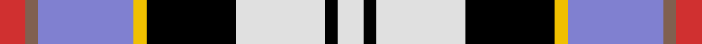
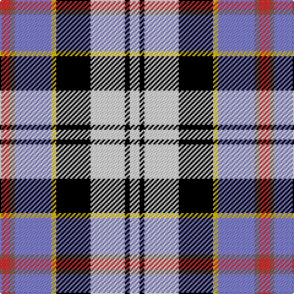

This page is one **sett** — a single exact thread-count. It belongs to the [tartan](/tartans/r4o2b15ly2k14w14k2w4/)
(the same proportion at any scale), whose colour order is pattern [RRBYKWKW](/stripes/rrbykwkw/).

Sourced from weddslist.  It is a [8 stripe tartan](/stripes/stripes8/).

Original link http://www.weddslist.com/cgi-bin/tartans/pg.pl?source=sts

## Thread count
R/8 LT4 B30 Y4 K28 LN28 K4 LN/8

## Palette

Palette: <strong>Tartan Register</strong> <small style="color:#888">(2 of 6 colours)</small>
<table><thead><tr><th>Colour</th><th>Threads</th><th>Shade</th><th>Base</th><th>OKLCh</th></tr></thead><tbody><tr><td>R/</td><td style="text-align:right;font-variant-numeric:tabular-nums">8</td><td><code style="background-color:#D03030;">#D03030</code> <small style="color:#888">#D03030</small></td><td>R <code style="background-color:#CC0000;">#CC0000</code></td><td><small style="color:#888">oklch(56.4% 0.196 26.2)</small></td></tr><tr><td>LT</td><td style="text-align:right;font-variant-numeric:tabular-nums">4</td><td><code style="background-color:#806050;">#806050</code> <small style="color:#888">#806050</small></td><td>R <code style="background-color:#CC0000;">#CC0000</code></td><td><small style="color:#888">oklch(51.7% 0.049 47.8)</small></td></tr><tr><td>B</td><td style="text-align:right;font-variant-numeric:tabular-nums">30</td><td><code style="background-color:#8080D0;">#8080D0</code> <small style="color:#888">#8080D0</small></td><td>B <code style="background-color:#2A418A;">#2A418A</code></td><td><small style="color:#888">oklch(63.4% 0.119 282.5)</small></td></tr><tr><td>Y</td><td style="text-align:right;font-variant-numeric:tabular-nums">4</td><td><code style="background-color:#F0C000;">#F0C000</code> <small style="color:#888">#F0C000</small></td><td>Y <code style="background-color:#F2BF00;">#F2BF00</code></td><td><small style="color:#888">oklch(82.7% 0.169 90.5)</small></td></tr><tr><td>K</td><td style="text-align:right;font-variant-numeric:tabular-nums">28</td><td><code style="background-color:#000000;">#000000</code> <small style="color:#888">#000000</small></td><td>K <code style="background-color:#000000;">#000000</code></td><td><small style="color:#888">oklch(0.0% 0.000 0.0)</small></td></tr><tr><td>LN</td><td style="text-align:right;font-variant-numeric:tabular-nums">28</td><td><code style="background-color:#E0E0E0;">#E0E0E0</code> <small style="color:#888">#E0E0E0</small></td><td>W <code style="background-color:#F7F7F7;">#F7F7F7</code></td><td><small style="color:#888">oklch(90.7% 0.000 89.9)</small></td></tr><tr><td>K</td><td style="text-align:right;font-variant-numeric:tabular-nums">4</td><td><code style="background-color:#000000;">#000000</code> <small style="color:#888">#000000</small></td><td>K <code style="background-color:#000000;">#000000</code></td><td><small style="color:#888">oklch(0.0% 0.000 0.0)</small></td></tr><tr><td>LN/</td><td style="text-align:right;font-variant-numeric:tabular-nums">8</td><td><code style="background-color:#E0E0E0;">#E0E0E0</code> <small style="color:#888">#E0E0E0</small></td><td>W <code style="background-color:#F7F7F7;">#F7F7F7</code></td><td><small style="color:#888">oklch(90.7% 0.000 89.9)</small></td></tr></tbody></table>

# Sample pattern

## Nearest tartans

The nearest existing variants by ΔTartan distance, with this tartan at the top so the swatches line up against it.

ΔTartan

Tartan

Sett

—

<a href="/ttd/edit/#slug=r4o2b15ly2k14w14k2w4~x2">Culloden, Stirling</a> <a class="nn-out" href="/setts/s8/r4o2b15ly2k14w14k2w4~x2/" title="open its dictionary page">↗</a>

0.78

<a href="/ttd/edit/#slug=r4dy2b15ly2k14w14k2w4~x2">Culloden Blue, Stirling</a> <a class="nn-out" href="/setts/s8/r4dy2b15ly2k14w14k2w4~x2/" title="open its dictionary page">↗</a>

0.84

<a href="/ttd/edit/#slug=r5t2p16k13ly13k2w3~x2">Casey (Personal)</a> <a class="nn-out" href="/setts/s7/r5t2p16k13ly13k2w3~x2/" title="open its dictionary page">↗</a>

0.85

<a href="/ttd/edit/#slug=r4ly3w12k16g5db20k4w2~x2">Iowa Dress (District)</a> <a class="nn-out" href="/setts/s8/r4ly3w12k16g5db20k4w2~x2/" title="open its dictionary page">↗</a>

0.85

<a href="/ttd/edit/#slug=r4dy2t15ly2k14w14k2w4~x2">Culloden - 2000 (Fashion)</a> <a class="nn-out" href="/setts/s8/r4dy2t15ly2k14w14k2w4~x2/" title="open its dictionary page">↗</a>

0.91

<a href="/ttd/edit/#slug=w5k26ly4lb24dp8k3r4~x2">Pengelly, The Cornish</a> <a class="nn-out" href="/setts/s7/w5k26ly4lb24dp8k3r4~x2/" title="open its dictionary page">↗</a>

1.05

<a href="/ttd/edit/#slug=r6t3dp24ly2k23w23k2w6~x2">Culloden Dress</a> <a class="nn-out" href="/setts/s8/r6t3dp24ly2k23w23k2w6~x2/" title="open its dictionary page">↗</a>

1.09

<a href="/ttd/edit/#slug=r6t3m20ly2k20w20k2w5~x2">Humming Bird (Fashion)</a> <a class="nn-out" href="/setts/s8/r6t3m20ly2k20w20k2w5~x2/" title="open its dictionary page">↗</a>

1.11

<a href="/ttd/edit/#slug=k1w7r6db7r1g1r1g1w1~x4">Oliver Dress (Dance)</a> <a class="nn-out" href="/setts/s9/k1w7r6db7r1g1r1g1w1~x4/" title="open its dictionary page">↗</a>

1.12

<a href="/ttd/edit/#slug=r5w2db20ly2k16w18k2w5~x2">Ailsa, Craig</a> <a class="nn-out" href="/setts/s8/r5w2db20ly2k16w18k2w5~x2/" title="open its dictionary page">↗</a>

1.13

<a href="/ttd/edit/#slug=ly6k2t15r5t9k13w25db2w3db2~x2">Gillies, dress Blue</a> <a class="nn-out" href="/setts/s10/ly6k2t15r5t9k13w25db2w3db2~x2/" title="open its dictionary page">↗</a>

## Neighbour map

Every grey dot is one of 14299 variants placed by the first two principal components of the ΔTartan feature space (44% of its variance). Red is this tartan; blue dots are its nearest — click one to open its page.

<svg viewBox="0 0 640 380" role="img" style="max-width:100%;height:auto;border:1px solid #e0e0e0;border-radius:4px;display:block" xmlns="http://www.w3.org/2000/svg"><image href="/nn/cloud.v1.png" width="640" height="380"/><a href="/setts/s8/r4dy2b15ly2k14w14k2w4~x2/"><circle cx="63.7" cy="152.2" r="4" fill="#3465a4"><title>Culloden Blue, Stirling</title></circle></a><a href="/setts/s7/r5t2p16k13ly13k2w3~x2/"><circle cx="62.7" cy="159.1" r="4" fill="#3465a4"><title>Casey (Personal)</title></circle></a><a href="/setts/s8/r4ly3w12k16g5db20k4w2~x2/"><circle cx="68.7" cy="148.9" r="4" fill="#3465a4"><title>Iowa Dress (District)</title></circle></a><a href="/setts/s8/r4dy2t15ly2k14w14k2w4~x2/"><circle cx="59.7" cy="148.9" r="4" fill="#3465a4"><title>Culloden - 2000 (Fashion)</title></circle></a><a href="/setts/s7/w5k26ly4lb24dp8k3r4~x2/"><circle cx="118.6" cy="146.7" r="4" fill="#3465a4"><title>Pengelly, The Cornish</title></circle></a><a href="/setts/s8/r6t3dp24ly2k23w23k2w6~x2/"><circle cx="97.5" cy="122.4" r="4" fill="#3465a4"><title>Culloden Dress</title></circle></a><a href="/setts/s8/r6t3m20ly2k20w20k2w5~x2/"><circle cx="91.0" cy="133.3" r="4" fill="#3465a4"><title>Humming Bird (Fashion)</title></circle></a><a href="/setts/s9/k1w7r6db7r1g1r1g1w1~x4/"><circle cx="95.5" cy="150.3" r="4" fill="#3465a4"><title>Oliver Dress (Dance)</title></circle></a><a href="/setts/s8/r5w2db20ly2k16w18k2w5~x2/"><circle cx="116.9" cy="154.0" r="4" fill="#3465a4"><title>Ailsa, Craig</title></circle></a><a href="/setts/s10/ly6k2t15r5t9k13w25db2w3db2~x2/"><circle cx="87.5" cy="114.8" r="4" fill="#3465a4"><title>Gillies, dress Blue</title></circle></a><circle cx="62.0" cy="148.2" r="5" fill="#c00000"/></svg>

ID: /setts/s8/r4o2b15ly2k14w14k2w4~x2/
