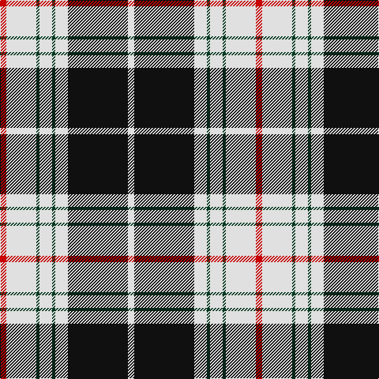

This page is one **sett** — a single exact thread-count. It belongs to the [tartan](/tartans/r4ln19dg2ln8dg2ln8k38ln4/)
(the same proportion at any scale), whose colour order is pattern [RWGWGWKW](/stripes/rwgwgwkw/).

Sourced from register-of-tartans.  It is a [8 stripe tartan](/stripes/stripes8/).

Original link https://www.tartanregister.gov.uk/tartanDetails.aspx?ref=3904

## Also known as

This cloth is also recorded under:

- St Piran, Cornish dress
- St. Piran Dress

4 attestations — the source records this cloth was collapsed from (oldest owns this page)

<ul>
<li>01/01/1985 — St. Piran Dress (register-of-tartans, <a href="https://www.tartanregister.gov.uk/tartanDetails.aspx?ref=3904">record</a>)</li>
<li>pre 1985 — St. Piran Dress (District) (tartans-authority, <a href="http://www.tartansauthority.com/tartan-ferret/display/1685/">record</a>)</li>
<li>undated — St Piran, Cornish dress (weddslist, <a href="http://www.weddslist.com/cgi-bin/tartans/pg.pl?source=sts">record</a>)</li>
<li>undated — St Piran Dress District Tartan Tartan Number: 1685. Earliest known date: 1984 Padstow, Cornwall See products available Copyright © Blair Urquhart, Comrie, 2015 (house-of-tartan, <a href="http://www.house-of-tartan.scotland.net/house/TartanViewjs.asp?colr=Def&tnam=1685">record</a>)</li>
</ul>

## Register references

External register numbers recorded for this tartan.

- Scottish Register of Tartans: [3904](https://www.tartanregister.gov.uk/tartanDetails.aspx?ref=3904)
- Scottish Tartans Authority (ITI): 1685
- Scottish Tartans World Register: 1685

## Thread count
R/8 LN38 DG4 LN16 DG4 LN16 K76 LN/8

## Palette
Each colour and the base-6 reference it is a variant of.

| Colour | Shade | Base |
|---|---|---|
| DG | <code style="background-color:#003820;">#003820</code> `oklch(30.0% 0.070 158.3)` <small>#003820</small> | G <code style="background-color:#006100;">#006100</code> |
| K | <code style="background-color:#101010;">#101010</code> `oklch(17.3% 0.000 89.9)` <small>#101010</small> | K <code style="background-color:#000000;">#000000</code> |
| LN | <code style="background-color:#E0E0E0;">#E0E0E0</code> `oklch(90.7% 0.000 89.9)` <small>#E0E0E0</small> | W <code style="background-color:#F7F7F7;">#F7F7F7</code> |
| R | <code style="background-color:#C80000;">#C80000</code> `oklch(52.3% 0.215 29.2)` <small>#C80000</small> | R <code style="background-color:#CC0000;">#CC0000</code> |

# Sample pattern

## Nearest tartans

The nearest existing variants by ΔTartan distance, with this tartan at the top so the swatches line up against it.

ΔTartan

Tartan

Sett

—

<a href="/ttd/edit/#slug=r4w19dg2w8dg2w8k38w4~x2">St. Piran Dress</a> <a class="nn-out" href="/setts/s8/r4w19dg2w8dg2w8k38w4~x2/" title="open its dictionary page">↗</a>

0.82

<a href="/ttd/edit/#slug=w1m2w17k11w2k4ly1~x4">MacPherson - 1842 (VS) Dress</a> <a class="nn-out" href="/setts/s7/w1m2w17k11w2k4ly1~x4/" title="open its dictionary page">↗</a>

0.93

<a href="/ttd/edit/#slug=r2w30k15lo2k15r2~x2">Brodie (WCWM)</a> <a class="nn-out" href="/setts/s6/r2w30k15lo2k15r2~x2/" title="open its dictionary page">↗</a>

1.01

<a href="/ttd/edit/#slug=k9w4k2w4k2w30k9w4db14ly2~x2">Hannay</a> <a class="nn-out" href="/setts/s10/k9w4k2w4k2w30k9w4db14ly2~x2/" title="open its dictionary page">↗</a>

1.03

<a href="/ttd/edit/#slug=ly35db3r4db3r8db30w3db4~x2">Clemens and August (Personal)</a> <a class="nn-out" href="/setts/s8/ly35db3r4db3r8db30w3db4~x2/" title="open its dictionary page">↗</a>

1.09

<a href="/ttd/edit/#slug=db19w1db6w1db2w2ly2w1ly18~x4">Highland Park High School (Texas)</a> <a class="nn-out" href="/setts/s9/db19w1db6w1db2w2ly2w1ly18~x4/" title="open its dictionary page">↗</a>

1.11

<a href="/ttd/edit/#slug=r2w6db2w16db3w1k16w1db2k4r2~x2">Scott, (MacRae)</a> <a class="nn-out" href="/setts/s11/r2w6db2w16db3w1k16w1db2k4r2~x2/" title="open its dictionary page">↗</a>

1.12

<a href="/ttd/edit/#slug=k30w2lr4lo10w9k3lr5~x2">Virginia Commonwealth University</a> <a class="nn-out" href="/setts/s7/k30w2lr4lo10w9k3lr5~x2/" title="open its dictionary page">↗</a>

1.13

<a href="/ttd/edit/#slug=k9lb4k2lb4k2lb30k9lb4b14lo2~x2">Hannay (Clan)</a> <a class="nn-out" href="/setts/s10/k9lb4k2lb4k2lb30k9lb4b14lo2~x2/" title="open its dictionary page">↗</a>

1.15

<a href="/ttd/edit/#slug=db19w1db6w1db2w2lo2w1lo18~x4">Highland Park High School (Texas)</a> <a class="nn-out" href="/setts/s9/db19w1db6w1db2w2lo2w1lo18~x4/" title="open its dictionary page">↗</a>

1.20

<a href="/ttd/edit/#slug=w3r1w30k20w3k9ly1~x2">MacPherson Dress (1842)</a> <a class="nn-out" href="/setts/s7/w3r1w30k20w3k9ly1~x2/" title="open its dictionary page">↗</a>

## Neighbour map

Every grey dot is one of 14299 variants placed by the first two principal components of the ΔTartan feature space (44% of its variance). Red is this tartan; blue dots are its nearest — click one to open its page.

<svg viewBox="0 0 640 380" role="img" style="max-width:100%;height:auto;border:1px solid #e0e0e0;border-radius:4px;display:block" xmlns="http://www.w3.org/2000/svg"><image href="/nn/cloud.v1.png" width="640" height="380"/><a href="/setts/s7/w1m2w17k11w2k4ly1~x4/"><circle cx="281.9" cy="139.9" r="4" fill="#3465a4"><title>MacPherson - 1842 (VS) Dress</title></circle></a><a href="/setts/s6/r2w30k15lo2k15r2~x2/"><circle cx="242.9" cy="159.2" r="4" fill="#3465a4"><title>Brodie (WCWM)</title></circle></a><a href="/setts/s10/k9w4k2w4k2w30k9w4db14ly2~x2/"><circle cx="243.1" cy="130.9" r="4" fill="#3465a4"><title>Hannay</title></circle></a><a href="/setts/s8/ly35db3r4db3r8db30w3db4~x2/"><circle cx="227.4" cy="145.3" r="4" fill="#3465a4"><title>Clemens and August (Personal)</title></circle></a><a href="/setts/s9/db19w1db6w1db2w2ly2w1ly18~x4/"><circle cx="306.4" cy="136.1" r="4" fill="#3465a4"><title>Highland Park High School (Texas)</title></circle></a><a href="/setts/s11/r2w6db2w16db3w1k16w1db2k4r2~x2/"><circle cx="208.5" cy="123.5" r="4" fill="#3465a4"><title>Scott, (MacRae)</title></circle></a><a href="/setts/s7/k30w2lr4lo10w9k3lr5~x2/"><circle cx="248.2" cy="152.4" r="4" fill="#3465a4"><title>Virginia Commonwealth University</title></circle></a><a href="/setts/s10/k9lb4k2lb4k2lb30k9lb4b14lo2~x2/"><circle cx="252.5" cy="131.2" r="4" fill="#3465a4"><title>Hannay (Clan)</title></circle></a><a href="/setts/s9/db19w1db6w1db2w2lo2w1lo18~x4/"><circle cx="315.8" cy="139.8" r="4" fill="#3465a4"><title>Highland Park High School (Texas)</title></circle></a><a href="/setts/s7/w3r1w30k20w3k9ly1~x2/"><circle cx="322.5" cy="120.7" r="4" fill="#3465a4"><title>MacPherson Dress (1842)</title></circle></a><circle cx="257.8" cy="131.7" r="5" fill="#c00000"/></svg>

ID: /setts/s8/r4w19dg2w8dg2w8k38w4~x2/
