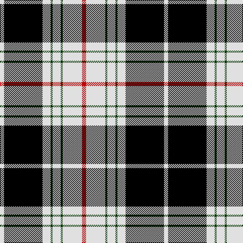

In pattern [RWGWGWKW](/patterns/rwgwgwkw/).

This was sourced from weddslist.  It is a [8 stripes tartan](/stripes/stripes8/).

Original link http://www.weddslist.com/cgi-bin/tartans/pg.pl?source=sts

## Thread count
LN/8 K76 LN16 DG4 LN16 DG4 LN38 R/8

## Palette
Each colour and its ΔE from the base-6 reference it is a variant of.

| Colour | Shade | Base | ΔE (OKLab) |
|---|---|---|---|
| DG | <code style="background-color:#003000;">#003000</code> `#003000` | G <code style="background-color:#006100;">#006100</code> | 0.17 |
| K | <code style="background-color:#000000;">#000000</code> `#000000` | K <code style="background-color:#000000;">#000000</code> | 0.00 |
| LN | <code style="background-color:#E0E0E0;">#E0E0E0</code> `#E0E0E0` | W <code style="background-color:#F7F7F7;">#F7F7F7</code> | 0.07 |
| R | <code style="background-color:#C00000;">#C00000</code> `#C00000` | R <code style="background-color:#CC0000;">#CC0000</code> | 0.03 |

# Sample pattern

## Nearest tartans

The nearest existing variants by ΔTartan distance.

1. [St. Piran Dress](/setts/s8/r4w19g2w8g2w8k38w4x2~g003820-k101010-rc80000-we0e0e0/) — ΔT 0.70
1. [Gordon Dress (MacGregor-Hastie)](/setts/s9/w4k2w16k4w4k37g12k4y4x2~g005020-k101010-we0e0e0-ye8c000/) — ΔT 0.91
1. [Gordon Dress (Variation) Trade Tartan Tartan Number: 1831. Earliest known date: pre 2003 This sample comes from the MacGregor-Hastie collection which forms the basis of the cloth archive of the Scottish Tartans Society. Some of the samples, including this one, were unmarked. One can assume that the sample dates between 1930 and 1950. See products available Copyright © Blair Urquhart, Comrie, 2015](/setts/s9/w4k2w16k4w4k37g12k4y4x2~g006818-k101010-we0e0e0-ye8c000/) — ΔT 0.95
1. [Phantom](/setts/s7/w3r10k38wa11r6k2w3x2~k101010-r945067-wf7feee-waeeeeec/) — ΔT 0.97
1. [Virginia Commonwealth University](/setts/s7/k30w2y4ya10w9k3y5x2~k101010-wffffff-ya0a0a0-yad87c00/) — ΔT 1.05
1. [Scott, (MacRae)](/setts/s11/r2w6b2w16b3w1k16w1b2k4r2x2~b304080-k000000-rc00000-we0e0e0/) — ΔT 1.07
1. [Merric, Dark Camel..](/setts/s7/r2w8k14ra25w2k2w2x2~k000000-rc00000-ra806050-we0e0e0/) — ΔT 1.12
1. [MacPherson Dress](/setts/s7/w3r1w30k20w3k9y1~k000000-rc80000-wd0d0d0-yffc800/) — ΔT 1.15
1. [Unidentified #49](/setts/s10/w16k4r1k2w1k6g6k1g6w1x4~g003014-k000000-rb43c00-wc8c8c8/) — ΔT 1.17
1. [MacPherson Dress](/setts/s7/y3r1y30k20y3k9ya1x2~k000000-raa0000-yaaaaaa-yaaaaa00/) — ΔT 1.18

## Neighbour map

Every grey dot is one of 15726 variants placed by the first two principal components of the ΔTartan feature space (44% of its variance). Red is this tartan; blue dots are its nearest — click one to open its page.

<svg viewBox="0 0 640 380" role="img" style="max-width:100%;height:auto;border:1px solid #e0e0e0;border-radius:4px;display:block" xmlns="http://www.w3.org/2000/svg"><image href="/nn/cloud.v1.png" width="640" height="380"/><a href="/setts/s8/r4w19g2w8g2w8k38w4x2~g003820-k101010-rc80000-we0e0e0/"><circle cx="255.2" cy="137.1" r="4" fill="#3465a4"><title>St. Piran Dress</title></circle></a><a href="/setts/s9/w4k2w16k4w4k37g12k4y4x2~g005020-k101010-we0e0e0-ye8c000/"><circle cx="273.4" cy="140.3" r="4" fill="#3465a4"><title>Gordon Dress (MacGregor-Hastie)</title></circle></a><a href="/setts/s9/w4k2w16k4w4k37g12k4y4x2~g006818-k101010-we0e0e0-ye8c000/"><circle cx="272.4" cy="139.9" r="4" fill="#3465a4"><title>Gordon Dress (Variation) Trade Tartan Tartan Number: 1831. Earliest known date: pre 2003 This sample comes from the MacGregor-Hastie collection which forms the basis of the cloth archive of the Scottish Tartans Society. Some of the samples, including this one, were unmarked. One can assume that the sample dates between 1930 and 1950. See products available Copyright © Blair Urquhart, Comrie, 2015</title></circle></a><a href="/setts/s7/w3r10k38wa11r6k2w3x2~k101010-r945067-wf7feee-waeeeeec/"><circle cx="284.3" cy="145.3" r="4" fill="#3465a4"><title>Phantom</title></circle></a><a href="/setts/s7/k30w2y4ya10w9k3y5x2~k101010-wffffff-ya0a0a0-yad87c00/"><circle cx="245.8" cy="157.6" r="4" fill="#3465a4"><title>Virginia Commonwealth University</title></circle></a><a href="/setts/s11/r2w6b2w16b3w1k16w1b2k4r2x2~b304080-k000000-rc00000-we0e0e0/"><circle cx="205.5" cy="127.9" r="4" fill="#3465a4"><title>Scott, (MacRae)</title></circle></a><a href="/setts/s7/r2w8k14ra25w2k2w2x2~k000000-rc00000-ra806050-we0e0e0/"><circle cx="219.1" cy="161.1" r="4" fill="#3465a4"><title>Merric, Dark Camel..</title></circle></a><a href="/setts/s7/w3r1w30k20w3k9y1~k000000-rc80000-wd0d0d0-yffc800/"><circle cx="320.2" cy="132.0" r="4" fill="#3465a4"><title>MacPherson Dress</title></circle></a><a href="/setts/s10/w16k4r1k2w1k6g6k1g6w1x4~g003014-k000000-rb43c00-wc8c8c8/"><circle cx="191.4" cy="143.0" r="4" fill="#3465a4"><title>Unidentified #49</title></circle></a><a href="/setts/s7/y3r1y30k20y3k9ya1x2~k000000-raa0000-yaaaaaa-yaaaaa00/"><circle cx="326.7" cy="137.5" r="4" fill="#3465a4"><title>MacPherson Dress</title></circle></a><circle cx="253.0" cy="140.0" r="5" fill="#c00000"/></svg>

ID: /setts/s8/r4w19g2w8g2w8k38w4x2~g003000-k000000-rc00000-we0e0e0/
