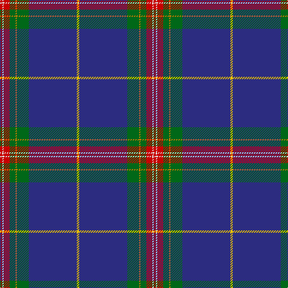

In pattern [RWRGYGBY](/patterns/rwrgygby/).

This was sourced from tartans-authority.  It is a [8 stripes tartan](/stripes/stripes8/).

Original link http://www.tartansauthority.com/tartan-ferret/display/5814/

## Thread count
R/4 LN2 R10 G10 O2 G20 DB80 Y/4

## Palette
Each colour and its ΔE from the base-6 reference it is a variant of.

| Colour | Shade | Base | ΔE (OKLab) |
|---|---|---|---|
| DB | <code style="background-color:#2C2C80;">#2C2C80</code> `#2C2C80` | B <code style="background-color:#2A418A;">#2A418A</code> | 0.06 |
| G | <code style="background-color:#006818;">#006818</code> `#006818` | G <code style="background-color:#006100;">#006100</code> | 0.02 |
| LN | <code style="background-color:#E0E0E0;">#E0E0E0</code> `#E0E0E0` | W <code style="background-color:#F7F7F7;">#F7F7F7</code> | 0.07 |
| O | <code style="background-color:#D87C00;">#D87C00</code> `#D87C00` | Y <code style="background-color:#F2BF00;">#F2BF00</code> | 0.17 |
| R | <code style="background-color:#C80000;">#C80000</code> `#C80000` | R <code style="background-color:#CC0000;">#CC0000</code> | 0.01 |
| Y | <code style="background-color:#E8C000;">#E8C000</code> `#E8C000` | Y <code style="background-color:#F2BF00;">#F2BF00</code> | 0.02 |

# Sample pattern

## Nearest tartans

The nearest existing variants by ΔTartan distance.

1. [Victorian Highland Pipe Band Assoc](/setts/s8/b92y2ya6g26y2r14ga6y2-b202060-g003820-ga006818-r880000-yfccc00-yae8c000/) — ΔT 0.72
1. [Glasgow Clyde College](/setts/s9/b96r2ba20r2b20bb4ba54w2ra6-b5c8ca8-ba202060-bb5c5c5c-rc80000-ra9c68a4-wfcfcfc/) — ΔT 1.11
1. [Lloyd of Astargus](/setts/s6/r4b122k26w4ra40y4-b2c2c80-k101010-rc80000-ra888888-we0e0e0-ybc8c00/) — ΔT 1.13
1. [Hier Family, Kilcreggan (Personal)](/setts/s8/b90w4ba46b20g4r2ra10wa2-b1a1849-ba59859e-g305e53-rc91015-ra940543-wfeffaa-waffffff/) — ΔT 1.14
1. [Wcwm 9275-1510-1](/setts/s10/b120y4b20k18w4k4r4k4g56y6-b1c0070-g006818-k101010-r880000-wc0c0c0-yd09800/) — ΔT 1.18
1. [Russian Scottish (District)](/setts/s9/w4b4w2b80r6y2r20g20r2-b242464-g2c6400-rc80000-we0e0e0-ye8c000/) — ΔT 1.19
1. [Scottish Heritage Society (Corporate](/setts/s12/b76ba6k6b24g17k4r10k4g17b4k2w6-b1c1c50-baa400a4-g006818-k101010-rc80000-we0e0e0/) — ΔT 1.20
1. [St. Andrew Quebec City](/setts/s14/b80g20y2g10r10w2r4w2r10g10y2g20b80ya4-b2c2c80-g006818-rc80000-we0e0e0-yd87c00-yae8c000/) — ΔT 1.20
1. [MacLaurin of Brioch Clan Tartan Tartan Number: 344. Earliest known date: 1856 This sett was approved by the Chief and accepted by the A.G.M. of the Clan MacLaren Society as Dress MacLaren in 1981. The sett has been designed by changing the blue ground of the usual MacLaren sett to white and then centering a blue stripe on the white ground. This illustration is based on a kilt belonging to the designer, Mr I.G.Campbell MacLaren. See products available Copyright © Blair Urquhart, Comrie, 2015](/setts/s7/b72k20g6r6g12k2y4-b2c2c80-g006818-k101010-rc80000-ye8c000/) — ΔT 1.21
1. [Lady Diana Plaid](/setts/s12/b92r6b14g4y4g4w4g22ra12b4ra6w4-b2c4084-g2a2303-rdc0000-rabe7832-we0e0e0-ye8c000/) — ΔT 1.22

## Neighbour map

Every grey dot is one of 15726 variants placed by the first two principal components of the ΔTartan feature space (44% of its variance). Red is this tartan; blue dots are its nearest — click one to open its page.

<svg viewBox="0 0 640 380" role="img" style="max-width:100%;height:auto;border:1px solid #e0e0e0;border-radius:4px;display:block" xmlns="http://www.w3.org/2000/svg"><image href="/nn/cloud.v1.png" width="640" height="380"/><a href="/setts/s8/b92y2ya6g26y2r14ga6y2-b202060-g003820-ga006818-r880000-yfccc00-yae8c000/"><circle cx="385.9" cy="84.0" r="4" fill="#3465a4"><title>Victorian Highland Pipe Band Assoc</title></circle></a><a href="/setts/s9/b96r2ba20r2b20bb4ba54w2ra6-b5c8ca8-ba202060-bb5c5c5c-rc80000-ra9c68a4-wfcfcfc/"><circle cx="366.9" cy="84.3" r="4" fill="#3465a4"><title>Glasgow Clyde College</title></circle></a><a href="/setts/s6/r4b122k26w4ra40y4-b2c2c80-k101010-rc80000-ra888888-we0e0e0-ybc8c00/"><circle cx="366.9" cy="121.7" r="4" fill="#3465a4"><title>Lloyd of Astargus</title></circle></a><a href="/setts/s8/b90w4ba46b20g4r2ra10wa2-b1a1849-ba59859e-g305e53-rc91015-ra940543-wfeffaa-waffffff/"><circle cx="357.8" cy="73.6" r="4" fill="#3465a4"><title>Hier Family, Kilcreggan (Personal)</title></circle></a><a href="/setts/s10/b120y4b20k18w4k4r4k4g56y6-b1c0070-g006818-k101010-r880000-wc0c0c0-yd09800/"><circle cx="342.8" cy="93.0" r="4" fill="#3465a4"><title>Wcwm 9275-1510-1</title></circle></a><a href="/setts/s9/w4b4w2b80r6y2r20g20r2-b242464-g2c6400-rc80000-we0e0e0-ye8c000/"><circle cx="382.5" cy="87.0" r="4" fill="#3465a4"><title>Russian Scottish (District)</title></circle></a><a href="/setts/s12/b76ba6k6b24g17k4r10k4g17b4k2w6-b1c1c50-baa400a4-g006818-k101010-rc80000-we0e0e0/"><circle cx="346.5" cy="82.7" r="4" fill="#3465a4"><title>Scottish Heritage Society (Corporate</title></circle></a><a href="/setts/s14/b80g20y2g10r10w2r4w2r10g10y2g20b80ya4-b2c2c80-g006818-rc80000-we0e0e0-yd87c00-yae8c000/"><circle cx="381.5" cy="70.1" r="4" fill="#3465a4"><title>St. Andrew Quebec City</title></circle></a><a href="/setts/s7/b72k20g6r6g12k2y4-b2c2c80-g006818-k101010-rc80000-ye8c000/"><circle cx="381.0" cy="126.7" r="4" fill="#3465a4"><title>MacLaurin of Brioch Clan Tartan Tartan Number: 344. Earliest known date: 1856 This sett was approved by the Chief and accepted by the A.G.M. of the Clan MacLaren Society as Dress MacLaren in 1981. The sett has been designed by changing the blue ground of the usual MacLaren sett to white and then centering a blue stripe on the white ground. This illustration is based on a kilt belonging to the designer, Mr I.G.Campbell MacLaren. See products available Copyright © Blair Urquhart, Comrie, 2015</title></circle></a><a href="/setts/s12/b92r6b14g4y4g4w4g22ra12b4ra6w4-b2c4084-g2a2303-rdc0000-rabe7832-we0e0e0-ye8c000/"><circle cx="358.4" cy="80.0" r="4" fill="#3465a4"><title>Lady Diana Plaid</title></circle></a><circle cx="376.2" cy="85.5" r="5" fill="#c00000"/></svg>

ID: /setts/s8/r4w2r10g10y2g20b80ya4-b2c2c80-g006818-rc80000-we0e0e0-yd87c00-yae8c000/
