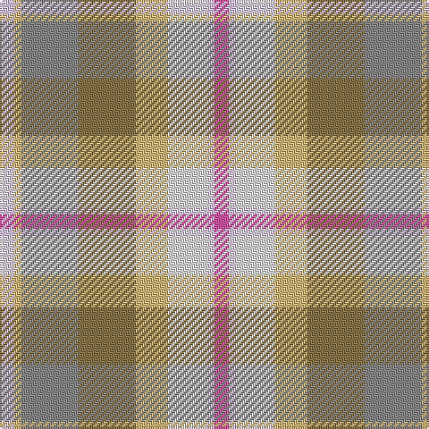

In pattern [RWWYGRYW](/patterns/rwwygryw/).

This was sourced from register-of-tartans.  It is a [8 stripes tartan](/stripes/stripes8/).

Original link https://www.tartanregister.gov.uk/tartanDetails.aspx?ref=4065

## Register references

External register numbers recorded for this tartan.

- Scottish Register of Tartans: [4065](https://www.tartanregister.gov.uk/tartanDetails.aspx?ref=4065)
- Scottish Tartans Authority (ITI): 7092

## Thread count
LN/8 LG4 N32 LT32 LG18 LNa22 LN4 P/8

## Palette
Each colour and its ΔE from the base-6 reference it is a variant of.

| Colour | Shade | Base | ΔE (OKLab) |
|---|---|---|---|
| LG | <code style="background-color:#D0B87C;">#D0B87C</code> `#D0B87C` | Y <code style="background-color:#F2BF00;">#F2BF00</code> | 0.09 |
| LN | <code style="background-color:#D8C4F0;">#D8C4F0</code> `#D8C4F0` | W <code style="background-color:#F7F7F7;">#F7F7F7</code> | 0.14 |
| LNa | <code style="background-color:#E0DCE0;">#E0DCE0</code> `#E0DCE0` | W <code style="background-color:#F7F7F7;">#F7F7F7</code> | 0.08 |
| LT | <code style="background-color:#887448;">#887448</code> `#887448` | G <code style="background-color:#006100;">#006100</code> | 0.19 |
| N | <code style="background-color:#888888;">#888888</code> `#888888` | R <code style="background-color:#CC0000;">#CC0000</code> | 0.24 |
| P | <code style="background-color:#D054A4;">#D054A4</code> `#D054A4` | R <code style="background-color:#CC0000;">#CC0000</code> | 0.19 |

# Sample pattern

## Nearest tartans

The nearest existing variants by ΔTartan distance.

1. [Aberdeenshire Home Colours](/setts/s7/w19y12r4ya8ra4g6yb16~g408060-rec34c4-ra888888-w98c8e8-ydc943c-yae0a126-yb86c87c~x2/) — ΔT 1.53
1. [Susan G Komen 06](/setts/s7/w6y27b6r40ya44w8r4~b581c24-rc46864-wfcf8e0-ya89480-yae09ca0/) — ΔT 1.84
1. [Aberdeenshire Home Colours](/setts/s7/b19y12r4ya8ra4g6ga16~b5c8ca8-g006818-ga408060-rc80000-ra888888-yd87c00-yafccc00~x2/) — ΔT 1.85
1. [Curd (2013)](/setts/s8/b1y9w3ya3b9ya1g1r1~b5f749c-g649848-rc82828-we0e0e0-yafb8bb-yaf8e38c~x4/) — ΔT 1.92
1. [Auld Scotland](/setts/s10/b2y12b3y3b12g12ba12ga12g1ya2~b60082c-ba5c5c5c-g5c6428-ga747c60-ya08858-yad8c888~x2/) — ΔT 1.96
1. [Lakin (Personal)](/setts/s12/r5y1r1ya1r1b5ra6r1ra6b5ya5r1~b5c5c5c-r880000-ra888888-ya0a0a0-ya98acb8~x4/) — ΔT 2.00
1. [O'Monaghan (Personal)](/setts/s10/g25w2b4y7b4w2ya25w2b4y7~b2888c4-g789484-wfcfcfc-yd87c00-yabc8c00~x2/) — ΔT 2.00
1. [Bouguet, Adrian Dress (Personal)](/setts/s11/w16g5y20wa3g3wa3y4ga14y2wa2r1~g306754-ga767e52-ra00000-w98c8e8-wac8c8c8-yebb790~x2/) — ΔT 2.10
1. [Jewel Look JTB (Corporate)](/setts/s15/g4r2ra4w3ra4r4ra6rb21r4g2r2g20r4g2y4~g408060-r888888-rac80000-rb9c68a4-we0e0e0-ye8c000/) — ΔT 2.13
1. [Bouguet, Adrian (Personal)](/setts/s11/w14b9w14y4g3wa3g3y4b14y2wb3~b5c8ca8-g005448-w98c8e8-wac8c8c8-wbffffff-yebb790~x2/) — ΔT 2.13

## Neighbour map

Every grey dot is one of 15726 variants placed by the first two principal components of the ΔTartan feature space (44% of its variance). Red is this tartan; blue dots are its nearest — click one to open its page.

<svg viewBox="0 0 640 380" role="img" style="max-width:100%;height:auto;border:1px solid #e0e0e0;border-radius:4px;display:block" xmlns="http://www.w3.org/2000/svg"><image href="/nn/cloud.v1.png" width="640" height="380"/><a href="/setts/s7/w19y12r4ya8ra4g6yb16~g408060-rec34c4-ra888888-w98c8e8-ydc943c-yae0a126-yb86c87c~x2/"><circle cx="65.8" cy="212.3" r="4" fill="#3465a4"><title>Aberdeenshire Home Colours</title></circle></a><a href="/setts/s7/w6y27b6r40ya44w8r4~b581c24-rc46864-wfcf8e0-ya89480-yae09ca0/"><circle cx="219.3" cy="187.3" r="4" fill="#3465a4"><title>Susan G Komen 06</title></circle></a><a href="/setts/s7/b19y12r4ya8ra4g6ga16~b5c8ca8-g006818-ga408060-rc80000-ra888888-yd87c00-yafccc00~x2/"><circle cx="51.1" cy="211.0" r="4" fill="#3465a4"><title>Aberdeenshire Home Colours</title></circle></a><a href="/setts/s8/b1y9w3ya3b9ya1g1r1~b5f749c-g649848-rc82828-we0e0e0-yafb8bb-yaf8e38c~x4/"><circle cx="163.0" cy="156.4" r="4" fill="#3465a4"><title>Curd (2013)</title></circle></a><a href="/setts/s10/b2y12b3y3b12g12ba12ga12g1ya2~b60082c-ba5c5c5c-g5c6428-ga747c60-ya08858-yad8c888~x2/"><circle cx="128.1" cy="176.9" r="4" fill="#3465a4"><title>Auld Scotland</title></circle></a><a href="/setts/s12/r5y1r1ya1r1b5ra6r1ra6b5ya5r1~b5c5c5c-r880000-ra888888-ya0a0a0-ya98acb8~x4/"><circle cx="155.1" cy="206.0" r="4" fill="#3465a4"><title>Lakin (Personal)</title></circle></a><a href="/setts/s10/g25w2b4y7b4w2ya25w2b4y7~b2888c4-g789484-wfcfcfc-yd87c00-yabc8c00~x2/"><circle cx="211.5" cy="160.1" r="4" fill="#3465a4"><title>O'Monaghan (Personal)</title></circle></a><a href="/setts/s11/w16g5y20wa3g3wa3y4ga14y2wa2r1~g306754-ga767e52-ra00000-w98c8e8-wac8c8c8-yebb790~x2/"><circle cx="192.7" cy="117.7" r="4" fill="#3465a4"><title>Bouguet, Adrian Dress (Personal)</title></circle></a><a href="/setts/s15/g4r2ra4w3ra4r4ra6rb21r4g2r2g20r4g2y4~g408060-r888888-rac80000-rb9c68a4-we0e0e0-ye8c000/"><circle cx="173.1" cy="130.0" r="4" fill="#3465a4"><title>Jewel Look JTB (Corporate)</title></circle></a><a href="/setts/s11/w14b9w14y4g3wa3g3y4b14y2wb3~b5c8ca8-g005448-w98c8e8-wac8c8c8-wbffffff-yebb790~x2/"><circle cx="150.9" cy="177.9" r="4" fill="#3465a4"><title>Bouguet, Adrian (Personal)</title></circle></a><circle cx="109.1" cy="188.2" r="5" fill="#c00000"/></svg>

ID: /setts/s8/r4w2wa11y9g16ra16y2w4~g887448-rd054a4-ra888888-wd8c4f0-wae0dce0-yd0b87c~x2/
