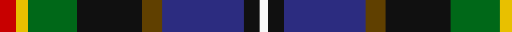

In pattern [RYGKGBKW](/patterns/rygkgbkw/).

This was sourced from tartans-authority.  It is a [8 stripes tartan](/stripes/stripes8/).

Original link http://www.tartansauthority.com/tartan-ferret/display/6051/

## Thread count
R/8 Y6 G24 K32 T10 DB40 K8 W/4

## Palette
Each colour and its ΔE from the base-6 reference it is a variant of.

| Colour | Shade | Base | ΔE (OKLab) |
|---|---|---|---|
| DB | <code style="background-color:#2C2C80;">#2C2C80</code> `#2C2C80` | B <code style="background-color:#2A418A;">#2A418A</code> | 0.06 |
| G | <code style="background-color:#006818;">#006818</code> `#006818` | G <code style="background-color:#006100;">#006100</code> | 0.02 |
| K | <code style="background-color:#101010;">#101010</code> `#101010` | K <code style="background-color:#000000;">#000000</code> | 0.17 |
| R | <code style="background-color:#C80000;">#C80000</code> `#C80000` | R <code style="background-color:#CC0000;">#CC0000</code> | 0.01 |
| T | <code style="background-color:#604000;">#604000</code> `#604000` | G <code style="background-color:#006100;">#006100</code> | 0.14 |
| W | <code style="background-color:#F8F8F8;">#F8F8F8</code> `#F8F8F8` | W <code style="background-color:#F7F7F7;">#F7F7F7</code> | 0.00 |
| Y | <code style="background-color:#E8C000;">#E8C000</code> `#E8C000` | Y <code style="background-color:#F2BF00;">#F2BF00</code> | 0.02 |

# Sample pattern

## Nearest tartans

The nearest existing variants by ΔTartan distance.

1. [Young](/setts/s8/k3b3g15ba15bb5r3ga2bb1x2~b304080-ba000050-bb800070-g008000-ga908000-k000000-rf07040/) — ΔT 0.96
1. [Culloden 1746 - Original](/setts/s8/r5w1b10wa2k10g10k1y3x4~b003c64-g5c6428-k101010-rc80000-w98c8e8-wafcfcfc-ye8c000/) — ΔT 0.97
1. [Young Family Tartan Tartan Number: 2048. Earliest known date: 1991 Based on the Christina Young blanket dating from 1726 and preserved at the Scottish Tartans Society museum in Keith, Banffshire. The design retains the unusual purple - yellow - orange box check of the original blanket and changes only the ground colour to the greens and blues of the Douglas tartan. There are 7 colours. Black is normally replaced by dark blue in commercial weaving. See products available Copyright © Blair Urquhart, Comrie, 2015](/setts/s8/k3b3g15ba15r5y3ya2r1x2~b2c2c80-ba202060-g006818-k101010-rb468ac-yd87c00-yae8c000/) — ΔT 0.98
1. [Coats (New Zealand)](/setts/s9/k9y6b9ya2r3ya2g17b17w5x2~b2c2c80-g005020-k101010-rb07430-w98c8e8-yc89800-yab0b0b0/) — ΔT 0.98
1. [Cowan of Inveresk Family Tartan Tartan Number: 1549. Earliest known date: 1979 This is a modern family tartan designed by the representer of the family of Cowan of Inveresk, in the parish of that name in Musselburgh, Mr Robert Cowan of Atlanta, Georgia. Cowans are a Sept of the Colquhouns, variously spelt Macillechomhghain, Comhain, Comhan and Cowen. Cowans not associated with the Inveresk branch of the family may wear the Colquhoun tartan on which this design is based. See products available Copyright © Blair Urquhart, Comrie, 2015](/setts/s8/r4g16w2k15b15k2b2y2x2~b2c2c80-g006818-k101010-rc80000-we0e0e0-ye8c000/) — ΔT 1.03
1. [Harvey of Cornwall (Personal)](/setts/s7/w10k52b52g24y10g5r5~b2c4084-g003c14-k101010-rdc0000-we0e0e0-ye8c000/) — ΔT 1.05
1. [Julien Pigeut Tartan Tartan Number: 6574. Earliest known date: 2004 For the wedding of Julien and Sylvia Piguet. Also worn by Roland Mathez best man of Julien. See products available Copyright © Blair Urquhart, Comrie, 2015](/setts/s8/k40b15r10y3ba5w5bb10ba20~b5c5c5c-ba2888c4-bb2c2c80-k101010-r888888-we0e0e0-ye8c000/) — ΔT 1.07
1. [Coats (New Zealand)](/setts/s9/k9y6b9r2ba3r2g17b17ya5x2~b1c0070-ba441800-g003820-k101010-r888888-yd09800-ya48a4c0/) — ΔT 1.08
1. [Wisconsin (US State)](/setts/s10/b11r3b2ra3k12g20y2k12b11ya3x2~b506880-g285800-k101010-rc80000-ra888888-ye8c000-yabc8c00/) — ΔT 1.09
1. [Rust (Name)](/setts/s12/r3k2b12w2b12k12g12y2g12k2r1ba2x2~b440044-ba1c0070-g006818-k101010-rc80000-we0e0e0-yd09800/) — ΔT 1.09

## Neighbour map

Every grey dot is one of 15726 variants placed by the first two principal components of the ΔTartan feature space (44% of its variance). Red is this tartan; blue dots are its nearest — click one to open its page.

<svg viewBox="0 0 640 380" role="img" style="max-width:100%;height:auto;border:1px solid #e0e0e0;border-radius:4px;display:block" xmlns="http://www.w3.org/2000/svg"><image href="/nn/cloud.v1.png" width="640" height="380"/><a href="/setts/s8/k3b3g15ba15bb5r3ga2bb1x2~b304080-ba000050-bb800070-g008000-ga908000-k000000-rf07040/"><circle cx="98.6" cy="123.7" r="4" fill="#3465a4"><title>Young</title></circle></a><a href="/setts/s8/r5w1b10wa2k10g10k1y3x4~b003c64-g5c6428-k101010-rc80000-w98c8e8-wafcfcfc-ye8c000/"><circle cx="41.2" cy="144.8" r="4" fill="#3465a4"><title>Culloden 1746 - Original</title></circle></a><a href="/setts/s8/k3b3g15ba15r5y3ya2r1x2~b2c2c80-ba202060-g006818-k101010-rb468ac-yd87c00-yae8c000/"><circle cx="115.3" cy="127.0" r="4" fill="#3465a4"><title>Young Family Tartan Tartan Number: 2048. Earliest known date: 1991 Based on the Christina Young blanket dating from 1726 and preserved at the Scottish Tartans Society museum in Keith, Banffshire. The design retains the unusual purple - yellow - orange box check of the original blanket and changes only the ground colour to the greens and blues of the Douglas tartan. There are 7 colours. Black is normally replaced by dark blue in commercial weaving. See products available Copyright © Blair Urquhart, Comrie, 2015</title></circle></a><a href="/setts/s9/k9y6b9ya2r3ya2g17b17w5x2~b2c2c80-g005020-k101010-rb07430-w98c8e8-yc89800-yab0b0b0/"><circle cx="82.7" cy="157.4" r="4" fill="#3465a4"><title>Coats (New Zealand)</title></circle></a><a href="/setts/s8/r4g16w2k15b15k2b2y2x2~b2c2c80-g006818-k101010-rc80000-we0e0e0-ye8c000/"><circle cx="101.1" cy="169.9" r="4" fill="#3465a4"><title>Cowan of Inveresk Family Tartan Tartan Number: 1549. Earliest known date: 1979 This is a modern family tartan designed by the representer of the family of Cowan of Inveresk, in the parish of that name in Musselburgh, Mr Robert Cowan of Atlanta, Georgia. Cowans are a Sept of the Colquhouns, variously spelt Macillechomhghain, Comhain, Comhan and Cowen. Cowans not associated with the Inveresk branch of the family may wear the Colquhoun tartan on which this design is based. See products available Copyright © Blair Urquhart, Comrie, 2015</title></circle></a><a href="/setts/s7/w10k52b52g24y10g5r5~b2c4084-g003c14-k101010-rdc0000-we0e0e0-ye8c000/"><circle cx="120.0" cy="164.6" r="4" fill="#3465a4"><title>Harvey of Cornwall (Personal)</title></circle></a><a href="/setts/s8/k40b15r10y3ba5w5bb10ba20~b5c5c5c-ba2888c4-bb2c2c80-k101010-r888888-we0e0e0-ye8c000/"><circle cx="104.9" cy="132.2" r="4" fill="#3465a4"><title>Julien Pigeut Tartan Tartan Number: 6574. Earliest known date: 2004 For the wedding of Julien and Sylvia Piguet. Also worn by Roland Mathez best man of Julien. See products available Copyright © Blair Urquhart, Comrie, 2015</title></circle></a><a href="/setts/s9/k9y6b9r2ba3r2g17b17ya5x2~b1c0070-ba441800-g003820-k101010-r888888-yd09800-ya48a4c0/"><circle cx="93.7" cy="165.4" r="4" fill="#3465a4"><title>Coats (New Zealand)</title></circle></a><a href="/setts/s10/b11r3b2ra3k12g20y2k12b11ya3x2~b506880-g285800-k101010-rc80000-ra888888-ye8c000-yabc8c00/"><circle cx="96.1" cy="153.2" r="4" fill="#3465a4"><title>Wisconsin (US State)</title></circle></a><a href="/setts/s12/r3k2b12w2b12k12g12y2g12k2r1ba2x2~b440044-ba1c0070-g006818-k101010-rc80000-we0e0e0-yd09800/"><circle cx="111.2" cy="130.6" r="4" fill="#3465a4"><title>Rust (Name)</title></circle></a><circle cx="78.4" cy="152.2" r="5" fill="#c00000"/></svg>

ID: /setts/s8/r4y3g12k16ga5b20k4w2x2~b2c2c80-g006818-ga604000-k101010-rc80000-wf8f8f8-ye8c000/
