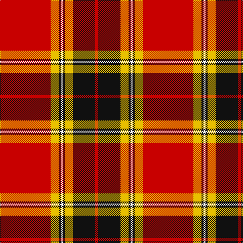

In pattern [RKYKWKYR](/stripes/rkykwkyr/).

This was sourced from tartans-authority.  It is a [8 stripe tartan](/stripes/stripes8/).

Original link http://www.tartansauthority.com/tartan-ferret/display/8741/

## Thread count
R/100 Y16 K4 W4 K4 Y16 K44 R/6

## Palette
Each colour and the base-6 reference it is a variant of.

| Colour | Shade | Base |
|---|---|---|
| K | <code style="background-color:#101010;">#101010</code> `oklch(17.3% 0.000 89.9)` <small>#101010</small> | K <code style="background-color:#000000;">#000000</code> |
| R | <code style="background-color:#C80000;">#C80000</code> `oklch(52.3% 0.215 29.2)` <small>#C80000</small> | R <code style="background-color:#CC0000;">#CC0000</code> |
| W | <code style="background-color:#FCFCFC;">#FCFCFC</code> `oklch(99.1% 0.000 89.9)` <small>#FCFCFC</small> | W <code style="background-color:#F7F7F7;">#F7F7F7</code> |
| Y | <code style="background-color:#E8C000;">#E8C000</code> `oklch(81.9% 0.168 93.7)` <small>#E8C000</small> | Y <code style="background-color:#F2BF00;">#F2BF00</code> |

# Sample pattern

## Nearest tartans

The nearest existing variants by ΔTartan distance.

1. [Lantern, The](/setts/s9/lb6k2r32lo2k6lo2r4k2lb3~x2/) — ΔT 1.16
1. [Motherwell F.C. Fir Park Dress (Spor](/setts/s10/r3ly6k2ly2k2ly2k3r20lb1r3~x4/) — ΔT 1.16
1. [O'Meehan (Name)](/setts/s9/ly27k4w4r64w4r4k4r4k12~x2/) — ΔT 1.18
1. [MacDonell of Keppoch](/setts/s10/dg2r2db1r24lb1db6r3dg12r4db1/) — ΔT 1.21
1. [Barbecue Plaid](/setts/s8/r45k2r2k28w16r4k4lo2/) — ΔT 1.21
1. [Longniddry Burgundy (Dance)](/setts/s8/r42r2w2r2r5r12w32r4~x2/) — ΔT 1.22
1. [Stuart/Stewart of Bute](/setts/s9/r12g6k1g2k1g1k6r24w2~x2/) — ΔT 1.23
1. [Leach, Leech, Leitch, dress](/setts/s9/r33w1k3w1g13r7k3p3w1~x2/) — ΔT 1.23
1. [Livingstone, MacLay MacLeay](/setts/s7/r28g4k4g4k4t6ly1~x2/) — ΔT 1.26
1. [Livingstone MacLay MacLeay](/setts/s7/r28dg4k4dg4k4t6ly1~x2/) — ΔT 1.26

## Neighbour map

Every grey dot is one of 14299 variants placed by the first two principal components of the ΔTartan feature space (44% of its variance). Red is this tartan; blue dots are its nearest — click one to open its page.

<svg viewBox="0 0 640 380" role="img" style="max-width:100%;height:auto;border:1px solid #e0e0e0;border-radius:4px;display:block" xmlns="http://www.w3.org/2000/svg"><image href="/nn/cloud.v1.png" width="640" height="380"/><a href="/setts/s9/lb6k2r32lo2k6lo2r4k2lb3~x2/"><circle cx="369.8" cy="116.8" r="4" fill="#3465a4"><title>Lantern, The</title></circle></a><a href="/setts/s10/r3ly6k2ly2k2ly2k3r20lb1r3~x4/"><circle cx="286.0" cy="96.2" r="4" fill="#3465a4"><title>Motherwell F.C. Fir Park Dress (Spor</title></circle></a><a href="/setts/s9/ly27k4w4r64w4r4k4r4k12~x2/"><circle cx="327.0" cy="109.6" r="4" fill="#3465a4"><title>O'Meehan (Name)</title></circle></a><a href="/setts/s10/dg2r2db1r24lb1db6r3dg12r4db1/"><circle cx="374.6" cy="119.7" r="4" fill="#3465a4"><title>MacDonell of Keppoch</title></circle></a><a href="/setts/s8/r45k2r2k28w16r4k4lo2/"><circle cx="283.7" cy="114.2" r="4" fill="#3465a4"><title>Barbecue Plaid</title></circle></a><a href="/setts/s8/r42r2w2r2r5r12w32r4~x2/"><circle cx="301.7" cy="116.1" r="4" fill="#3465a4"><title>Longniddry Burgundy (Dance)</title></circle></a><a href="/setts/s9/r12g6k1g2k1g1k6r24w2~x2/"><circle cx="396.1" cy="117.3" r="4" fill="#3465a4"><title>Stuart/Stewart of Bute</title></circle></a><a href="/setts/s9/r33w1k3w1g13r7k3p3w1~x2/"><circle cx="375.1" cy="81.7" r="4" fill="#3465a4"><title>Leach, Leech, Leitch, dress</title></circle></a><a href="/setts/s7/r28g4k4g4k4t6ly1~x2/"><circle cx="310.0" cy="107.1" r="4" fill="#3465a4"><title>Livingstone, MacLay MacLeay</title></circle></a><a href="/setts/s7/r28dg4k4dg4k4t6ly1~x2/"><circle cx="325.1" cy="110.2" r="4" fill="#3465a4"><title>Livingstone MacLay MacLeay</title></circle></a><circle cx="337.4" cy="107.2" r="5" fill="#c00000"/></svg>

ID: /setts/s8/r50ly8k2w2k2ly8k22r3~x2/
