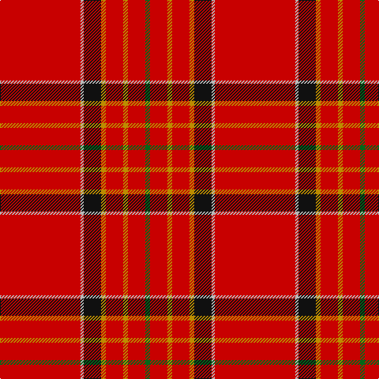

This page is one **sett** — a single exact thread-count. It belongs to the [tartan](/tartans/r51lr2k11lo3r11lo3r11g3/)
(the same proportion at any scale), whose colour order is pattern [GRYRYKYR](/stripes/gryrykyr/).

Sourced from tartans-authority.  It is a [8 stripe tartan](/stripes/stripes8/).

Original link http://www.tartansauthority.com/tartan-ferret/display/907/

## Register references

External register numbers recorded for this tartan.

- Scottish Tartans Authority (ITI): 907

## Thread count
R/102 N4 K22 DY6 R22 DY6 R22 G/6

## Palette

Palette: <strong>Tartan Register</strong> <small style="color:#888">(4 of 5 colours)</small>
<table><thead><tr><th>Colour</th><th>Threads</th><th>Shade</th><th>Base</th><th>OKLCh</th></tr></thead><tbody><tr><td>R/</td><td style="text-align:right;font-variant-numeric:tabular-nums">102</td><td><code style="background-color:#C80000;">#C80000</code> <small style="color:#888">#C80000</small></td><td>R <code style="background-color:#CC0000;">#CC0000</code></td><td><small style="color:#888">oklch(52.3% 0.215 29.2)</small></td></tr><tr><td>N</td><td style="text-align:right;font-variant-numeric:tabular-nums">4</td><td><code style="background-color:#B8B8B8;">#B8B8B8</code> <small style="color:#888">#B8B8B8</small></td><td>Y <code style="background-color:#F2BF00;">#F2BF00</code></td><td><small style="color:#888">oklch(78.3% 0.000 89.9)</small></td></tr><tr><td>K</td><td style="text-align:right;font-variant-numeric:tabular-nums">22</td><td><code style="background-color:#101010;">#101010</code> <small style="color:#888">#101010</small></td><td>K <code style="background-color:#000000;">#000000</code></td><td><small style="color:#888">oklch(17.3% 0.000 89.9)</small></td></tr><tr><td>DY</td><td style="text-align:right;font-variant-numeric:tabular-nums">6</td><td><code style="background-color:#BC8C00;">#BC8C00</code> <small style="color:#888">#BC8C00</small></td><td>Y <code style="background-color:#F2BF00;">#F2BF00</code></td><td><small style="color:#888">oklch(66.8% 0.137 84.1)</small></td></tr><tr><td>R</td><td style="text-align:right;font-variant-numeric:tabular-nums">22</td><td><code style="background-color:#C80000;">#C80000</code> <small style="color:#888">#C80000</small></td><td>R <code style="background-color:#CC0000;">#CC0000</code></td><td><small style="color:#888">oklch(52.3% 0.215 29.2)</small></td></tr><tr><td>DY</td><td style="text-align:right;font-variant-numeric:tabular-nums">6</td><td><code style="background-color:#BC8C00;">#BC8C00</code> <small style="color:#888">#BC8C00</small></td><td>Y <code style="background-color:#F2BF00;">#F2BF00</code></td><td><small style="color:#888">oklch(66.8% 0.137 84.1)</small></td></tr><tr><td>R</td><td style="text-align:right;font-variant-numeric:tabular-nums">22</td><td><code style="background-color:#C80000;">#C80000</code> <small style="color:#888">#C80000</small></td><td>R <code style="background-color:#CC0000;">#CC0000</code></td><td><small style="color:#888">oklch(52.3% 0.215 29.2)</small></td></tr><tr><td>G/</td><td style="text-align:right;font-variant-numeric:tabular-nums">6</td><td><code style="background-color:#006818;">#006818</code> <small style="color:#888">#006818</small></td><td>G <code style="background-color:#006100;">#006100</code></td><td><small style="color:#888">oklch(45.0% 0.142 145.0)</small></td></tr></tbody></table>

# Sample pattern

## Nearest tartans

The nearest existing variants by ΔTartan distance, with this tartan at the top so the swatches line up against it.

ΔTartan

Tartan

Sett

—

<a href="/ttd/edit/#slug=r51lr2k11lo3r11lo3r11g3~x2">Hackston (Green stripe) (Portrait)</a> <a class="nn-out" href="/setts/s8/r51lr2k11lo3r11lo3r11g3~x2/" title="open its dictionary page">↗</a>

0.93

<a href="/ttd/edit/#slug=r72k6lb2k11ly2db2ly2r18~x2">Princess Elizabeth (Royal)</a> <a class="nn-out" href="/setts/s8/r72k6lb2k11ly2db2ly2r18~x2/" title="open its dictionary page">↗</a>

0.95

<a href="/ttd/edit/#slug=r48w3k3g2ly6g2r6~x4">Ferguson the Astronomer</a> <a class="nn-out" href="/setts/s7/r48w3k3g2ly6g2r6~x4/" title="open its dictionary page">↗</a>

0.96

<a href="/ttd/edit/#slug=r36db3w1db6g1k1g1r9~x2">Inverness</a> <a class="nn-out" href="/setts/s8/r36db3w1db6g1k1g1r9~x2/" title="open its dictionary page">↗</a>

0.96

<a href="/ttd/edit/#slug=r36db3w1db6g1k1g1r9~x4">Inverness - 1829 (District)</a> <a class="nn-out" href="/setts/s8/r36db3w1db6g1k1g1r9~x4/" title="open its dictionary page">↗</a>

0.97

<a href="/ttd/edit/#slug=r100dbi10w5dbi14ly4db8ly4r24">Earl of Inverness (Royal)</a> <a class="nn-out" href="/setts/s8/r100dbi10w5dbi14ly4db8ly4r24/" title="open its dictionary page">↗</a>

0.99

<a href="/ttd/edit/#slug=r68db26r5ly3r5g3r13o3~x2">De Nardi (Personal)</a> <a class="nn-out" href="/setts/s8/r68db26r5ly3r5g3r13o3~x2/" title="open its dictionary page">↗</a>

1.00

<a href="/ttd/edit/#slug=r68db27r5ly3r5g3r13t3~x2">De Nardi #2 (Personal)</a> <a class="nn-out" href="/setts/s8/r68db27r5ly3r5g3r13t3~x2/" title="open its dictionary page">↗</a>

1.11

<a href="/ttd/edit/#slug=r114db10w3db16ly3k3ly3r28~x2">Inverness #2</a> <a class="nn-out" href="/setts/s8/r114db10w3db16ly3k3ly3r28~x2/" title="open its dictionary page">↗</a>

1.12

<a href="/ttd/edit/#slug=r60db8w3db10ly3t4ly3r19~x2">Princess Elizabeth #2</a> <a class="nn-out" href="/setts/s8/r60db8w3db10ly3t4ly3r19~x2/" title="open its dictionary page">↗</a>

1.23

<a href="/ttd/edit/#slug=r72k8r4g16r7o2~x2">MacAndrew Dress (Name)</a> <a class="nn-out" href="/setts/s6/r72k8r4g16r7o2~x2/" title="open its dictionary page">↗</a>

## Neighbour map

Every grey dot is one of 14359 variants placed by the first two principal components of the ΔTartan feature space (44% of its variance). Red is this tartan; blue dots are its nearest — click one to open its page.

<svg viewBox="0 0 640 380" role="img" style="max-width:100%;height:auto;border:1px solid #e0e0e0;border-radius:4px;display:block" xmlns="http://www.w3.org/2000/svg"><image href="/nn/cloud.v1.png" width="640" height="380"/><a href="/setts/s8/r72k6lb2k11ly2db2ly2r18~x2/"><circle cx="549.6" cy="84.6" r="4" fill="#3465a4"><title>Princess Elizabeth (Royal)</title></circle></a><a href="/setts/s7/r48w3k3g2ly6g2r6~x4/"><circle cx="516.9" cy="98.7" r="4" fill="#3465a4"><title>Ferguson the Astronomer</title></circle></a><a href="/setts/s8/r36db3w1db6g1k1g1r9~x2/"><circle cx="561.3" cy="96.5" r="4" fill="#3465a4"><title>Inverness</title></circle></a><a href="/setts/s8/r36db3w1db6g1k1g1r9~x4/"><circle cx="555.2" cy="91.8" r="4" fill="#3465a4"><title>Inverness - 1829 (District)</title></circle></a><a href="/setts/s8/r100dbi10w5dbi14ly4db8ly4r24/"><circle cx="483.0" cy="99.7" r="4" fill="#3465a4"><title>Earl of Inverness (Royal)</title></circle></a><a href="/setts/s8/r68db26r5ly3r5g3r13o3~x2/"><circle cx="488.3" cy="118.1" r="4" fill="#3465a4"><title>De Nardi (Personal)</title></circle></a><a href="/setts/s8/r68db27r5ly3r5g3r13t3~x2/"><circle cx="474.1" cy="114.4" r="4" fill="#3465a4"><title>De Nardi #2 (Personal)</title></circle></a><a href="/setts/s8/r114db10w3db16ly3k3ly3r28~x2/"><circle cx="569.3" cy="83.3" r="4" fill="#3465a4"><title>Inverness #2</title></circle></a><a href="/setts/s8/r60db8w3db10ly3t4ly3r19~x2/"><circle cx="462.0" cy="114.9" r="4" fill="#3465a4"><title>Princess Elizabeth #2</title></circle></a><a href="/setts/s6/r72k8r4g16r7o2~x2/"><circle cx="561.8" cy="132.8" r="4" fill="#3465a4"><title>MacAndrew Dress (Name)</title></circle></a><circle cx="521.1" cy="115.3" r="5" fill="#c00000"/></svg>

ID: /setts/s8/r51lr2k11lo3r11lo3r11g3~x2/
