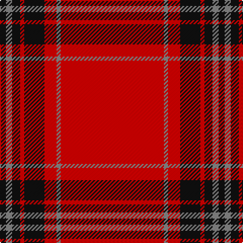

In pattern [KRKRKRRR](/patterns/krkrkrrr/).

This was sourced from register-of-tartans.  It is a [8 stripes tartan](/stripes/stripes8/).

Original link https://www.tartanregister.gov.uk/tartanDetails.aspx?ref=4465

## Attestations

This cloth appears in 2 source records; the oldest owns this page.

- 28/11/2001 — Virgin (register-of-tartans, [record](https://www.tartanregister.gov.uk/tartanDetails.aspx?ref=4465))
- 2001 — Virgin (Corporate) (tartans-authority, [record](http://www.tartansauthority.com/tartan-ferret/display/3915/))

## Register references

External register numbers recorded for this tartan.

- Scottish Register of Tartans: [4465](https://www.tartanregister.gov.uk/tartanDetails.aspx?ref=4465)
- Scottish Tartans Authority (ITI): 3915
- Scottish Tartans World Register: 2880

## Thread count
K/6 N6 K8 R4 K20 R12 N4 R/102

## Palette
Each colour and its ΔE from the base-6 reference it is a variant of.

| Colour | Shade | Base | ΔE (OKLab) |
|---|---|---|---|
| K | <code style="background-color:#101010;">#101010</code> `#101010` | K <code style="background-color:#000000;">#000000</code> | 0.17 |
| N | <code style="background-color:#888888;">#888888</code> `#888888` | R <code style="background-color:#CC0000;">#CC0000</code> | 0.24 |
| R | <code style="background-color:#E80000;">#E80000</code> `#E80000` | R <code style="background-color:#CC0000;">#CC0000</code> | 0.06 |
| Ra | <code style="background-color:#C8002C;">#C8002C</code> `#C8002C` | R <code style="background-color:#CC0000;">#CC0000</code> | 0.03 |

# Sample pattern

## Nearest tartans

The nearest existing variants by ΔTartan distance.

1. [White Stripes Dress, (Corporate)](/setts/s7/k2r1k2r14w1r1w1~k101010-rc80000-wfcfcfc~x8/) — ΔT 1.12
1. [Oilmens (Corporate)](/setts/s8/y4k1r30k15r24k2r4k1~k101010-rc80000-ye8c000~x4/) — ΔT 1.23
1. [Swiss National (Fashion)](/setts/s8/w10r47b2r2b2r18ba3w4~b2c2c80-ba202060-rc80000-we0e0e0~x2/) — ΔT 1.24
1. [Aberdeen Football Club (2002)](/setts/s8/k4r4y2r41k4r4k12w2~k101010-rdc0000-we0e0e0-ye8c000~x2/) — ΔT 1.31
1. [Miyuki #2](/setts/s10/r40w1r1b8r1w1r6w1r1b8~b003c64-rc80000-we0e0e0~x2/) — ΔT 1.33
1. [Duke of Sussex](/setts/s7/r18g1k5g1k1g1r9~g289c18-k000000-rc80000~x2/) — ΔT 1.34
1. [Miyuki, Check Red, 1002A](/setts/s10/r40w1r1k8r1w1r6w1r1k8~k000030-rc00000-we0e0e0~x2/) — ΔT 1.37
1. [Prince of Denmark](/setts/s10/r51g2r2g2r3w3b2w2b2w8~b2c2c80-g503c14-rdc0000-we0e0e0~x2/) — ΔT 1.42
1. [Aberdeen F. C. (2002) (Sports)](/setts/s8/k4r4y2r41k4r4k12w2~k101010-rc80000-wfcfcfc-yfccc00~x2/) — ΔT 1.42
1. [Masai Shuka 05 (Artefact)](/setts/s10/r80w7k2w2k2r3k7r2b12k2~b9050d8-k101010-rc80000-we0e0e0~x2/) — ΔT 1.51

## Neighbour map

Every grey dot is one of 15726 variants placed by the first two principal components of the ΔTartan feature space (44% of its variance). Red is this tartan; blue dots are its nearest — click one to open its page.

<svg viewBox="0 0 640 380" role="img" style="max-width:100%;height:auto;border:1px solid #e0e0e0;border-radius:4px;display:block" xmlns="http://www.w3.org/2000/svg"><image href="/nn/cloud.v1.png" width="640" height="380"/><a href="/setts/s7/k2r1k2r14w1r1w1~k101010-rc80000-wfcfcfc~x8/"><circle cx="477.1" cy="156.3" r="4" fill="#3465a4"><title>White Stripes Dress, (Corporate)</title></circle></a><a href="/setts/s8/y4k1r30k15r24k2r4k1~k101010-rc80000-ye8c000~x4/"><circle cx="495.0" cy="152.3" r="4" fill="#3465a4"><title>Oilmens (Corporate)</title></circle></a><a href="/setts/s8/w10r47b2r2b2r18ba3w4~b2c2c80-ba202060-rc80000-we0e0e0~x2/"><circle cx="513.1" cy="125.0" r="4" fill="#3465a4"><title>Swiss National (Fashion)</title></circle></a><a href="/setts/s8/k4r4y2r41k4r4k12w2~k101010-rdc0000-we0e0e0-ye8c000~x2/"><circle cx="436.5" cy="124.2" r="4" fill="#3465a4"><title>Aberdeen Football Club (2002)</title></circle></a><a href="/setts/s10/r40w1r1b8r1w1r6w1r1b8~b003c64-rc80000-we0e0e0~x2/"><circle cx="547.8" cy="106.0" r="4" fill="#3465a4"><title>Miyuki #2</title></circle></a><a href="/setts/s7/r18g1k5g1k1g1r9~g289c18-k000000-rc80000~x2/"><circle cx="489.8" cy="166.0" r="4" fill="#3465a4"><title>Duke of Sussex</title></circle></a><a href="/setts/s10/r40w1r1k8r1w1r6w1r1k8~k000030-rc00000-we0e0e0~x2/"><circle cx="522.5" cy="99.0" r="4" fill="#3465a4"><title>Miyuki, Check Red, 1002A</title></circle></a><a href="/setts/s10/r51g2r2g2r3w3b2w2b2w8~b2c2c80-g503c14-rdc0000-we0e0e0~x2/"><circle cx="507.9" cy="85.1" r="4" fill="#3465a4"><title>Prince of Denmark</title></circle></a><a href="/setts/s8/k4r4y2r41k4r4k12w2~k101010-rc80000-wfcfcfc-yfccc00~x2/"><circle cx="438.5" cy="127.6" r="4" fill="#3465a4"><title>Aberdeen F. C. (2002) (Sports)</title></circle></a><a href="/setts/s10/r80w7k2w2k2r3k7r2b12k2~b9050d8-k101010-rc80000-we0e0e0~x2/"><circle cx="510.8" cy="71.3" r="4" fill="#3465a4"><title>Masai Shuka 05 (Artefact)</title></circle></a><circle cx="520.1" cy="126.6" r="5" fill="#c00000"/></svg>

ID: /setts/s8/r51ra2r6k10r2k4ra3k3~k101010-re80000-ra888888~x2/
