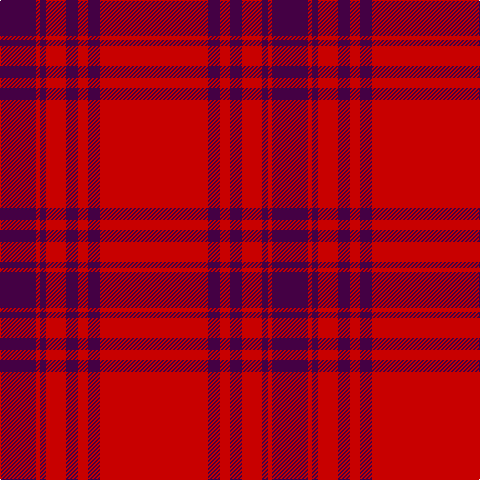

In pattern [BRBRBRBR](/patterns/brbrbrbr/).

This was sourced from register-of-tartans.  It is a [8 stripes tartan](/stripes/stripes8/).

Original link https://www.tartanregister.gov.uk/tartanDetails.aspx?ref=5014

## Thread count
DP/36 R4 DP6 R20 DP12 R10 DP12 R/108

## Palette
Each colour and its ΔE from the base-6 reference it is a variant of.

| Colour | Shade | Base | ΔE (OKLab) |
|---|---|---|---|
| DP | <code style="background-color:#440044;">#440044</code> `#440044` | B <code style="background-color:#2A418A;">#2A418A</code> | 0.18 |
| R | <code style="background-color:#C80000;">#C80000</code> `#C80000` | R <code style="background-color:#CC0000;">#CC0000</code> | 0.01 |

# Sample pattern

## Nearest tartans

The nearest existing variants by ΔTartan distance.

1. [Kyle Blue (Clan)](/setts/s8/r54b6r5b6r10b3r2b18x2~b580058-rc80000/) — ΔT 0.72
1. [Masai Shuka 23 (Artefact)](/setts/s10/r15b4r1b1r1b1r1b1r1b1x4~b2c2c80-rc80000/) — ΔT 1.42
1. [Menzies Dress](/setts/s8/r36y4r3y4r6y2r1y12x2~raa0000-yaaaaaa/) — ΔT 1.53
1. [Menzies Dress](/setts/s8/r36y4r3y4r6y2r1y12~raa0000-yaaaaaa/) — ΔT 1.53
1. [Masai Shuka 27 (Artefact)](/setts/s10/r30b8r2k1r2k1r2k1r2b8x2~b2c2c80-k101010-rc80000/) — ΔT 1.55
1. [Masai Shuka 07 (Artefact)](/setts/s5/r75k15r4k15r4x2~k101010-rc80000/) — ΔT 1.79
1. [Miyuki #2](/setts/s10/r40w1r1b8r1w1r6w1r1b8x2~b003c64-rc80000-we0e0e0/) — ΔT 1.84
1. [MacPherson-Grant](/setts/s11/r90k6r6k6r90g6r6g45r6k4r3~g006818-k101010-rc80000/) — ΔT 1.85
1. [Kyle Green (Name)](/setts/s8/r54g6r5g6r10g3r2g18x2~g006818-rc80000/) — ΔT 1.86
1. [Oilmens (Corporate)](/setts/s8/y4k1r30k15r24k2r4k1x4~k101010-rc80000-ye8c000/) — ΔT 1.86

## Neighbour map

Every grey dot is one of 15726 variants placed by the first two principal components of the ΔTartan feature space (44% of its variance). Red is this tartan; blue dots are its nearest — click one to open its page.

<svg viewBox="0 0 640 380" role="img" style="max-width:100%;height:auto;border:1px solid #e0e0e0;border-radius:4px;display:block" xmlns="http://www.w3.org/2000/svg"><image href="/nn/cloud.v1.png" width="640" height="380"/><a href="/setts/s8/r54b6r5b6r10b3r2b18x2~b580058-rc80000/"><circle cx="567.9" cy="179.7" r="4" fill="#3465a4"><title>Kyle Blue (Clan)</title></circle></a><a href="/setts/s10/r15b4r1b1r1b1r1b1r1b1x4~b2c2c80-rc80000/"><circle cx="533.3" cy="166.9" r="4" fill="#3465a4"><title>Masai Shuka 23 (Artefact)</title></circle></a><a href="/setts/s8/r36y4r3y4r6y2r1y12x2~raa0000-yaaaaaa/"><circle cx="535.8" cy="155.6" r="4" fill="#3465a4"><title>Menzies Dress</title></circle></a><a href="/setts/s8/r36y4r3y4r6y2r1y12~raa0000-yaaaaaa/"><circle cx="535.8" cy="155.6" r="4" fill="#3465a4"><title>Menzies Dress</title></circle></a><a href="/setts/s10/r30b8r2k1r2k1r2k1r2b8x2~b2c2c80-k101010-rc80000/"><circle cx="496.6" cy="125.5" r="4" fill="#3465a4"><title>Masai Shuka 27 (Artefact)</title></circle></a><a href="/setts/s5/r75k15r4k15r4x2~k101010-rc80000/"><circle cx="541.2" cy="202.9" r="4" fill="#3465a4"><title>Masai Shuka 07 (Artefact)</title></circle></a><a href="/setts/s10/r40w1r1b8r1w1r6w1r1b8x2~b003c64-rc80000-we0e0e0/"><circle cx="547.8" cy="106.0" r="4" fill="#3465a4"><title>Miyuki #2</title></circle></a><a href="/setts/s11/r90k6r6k6r90g6r6g45r6k4r3~g006818-k101010-rc80000/"><circle cx="557.0" cy="134.6" r="4" fill="#3465a4"><title>MacPherson-Grant</title></circle></a><a href="/setts/s8/r54g6r5g6r10g3r2g18x2~g006818-rc80000/"><circle cx="537.5" cy="176.0" r="4" fill="#3465a4"><title>Kyle Green (Name)</title></circle></a><a href="/setts/s8/y4k1r30k15r24k2r4k1x4~k101010-rc80000-ye8c000/"><circle cx="495.0" cy="152.3" r="4" fill="#3465a4"><title>Oilmens (Corporate)</title></circle></a><circle cx="547.9" cy="173.2" r="5" fill="#c00000"/></svg>

ID: /setts/s8/r54b6r5b6r10b3r2b18x2~b440044-rc80000/
