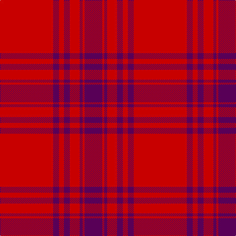

In pattern [BRBRBRBR](/stripes/brbrbrbr/).

This was sourced from tartans-authority.  It is a [8 stripe tartan](/stripes/stripes8/).

Original link http://www.tartansauthority.com/tartan-ferret/display/3616/

## Also known as

This cloth is also recorded under:

- Kyle Blue

## Attestations

This cloth appears in 2 source records; the oldest owns this page.

- 1984 — Kyle Blue (Clan) (tartans-authority, [record](http://www.tartansauthority.com/tartan-ferret/display/3616/))
- undated — Kyle (Blue) (register-of-tartans, [record](https://www.tartanregister.gov.uk/tartanDetails.aspx?ref=5014))

## Register references

External register numbers recorded for this tartan.

- Scottish Register of Tartans: [5014](https://www.tartanregister.gov.uk/tartanDetails.aspx?ref=5014)
- Scottish Tartans Authority (ITI): 3616

## Thread count
R/108 DP12 R10 DP12 R20 DP6 R4 DP/36

## Palette
Each colour and its ΔE from the base-6 reference it is a variant of.

| Colour | Shade | Base | ΔE (OKLab) |
|---|---|---|---|
| DP | <code style="background-color:#580058;">#580058</code> `#580058` | B <code style="background-color:#2A418A;">#2A418A</code> | 0.16 |
| R | <code style="background-color:#C80000;">#C80000</code> `#C80000` | R <code style="background-color:#CC0000;">#CC0000</code> | 0.01 |

# Sample pattern

## Nearest tartans

The nearest existing variants by ΔTartan distance.

1. [Masai Shuka 23 (Artefact)](/setts/s10/r15db4r1db1r1db1r1db1r1db1~x4/) — ΔT 1.76
1. [Menzies Dress](/setts/s8/r36lr4r3lr4r6lr2r1lr12~x2/) — ΔT 1.84
1. [Menzies Dress](/setts/s8/r36lr4r3lr4r6lr2r1lr12/) — ΔT 1.84
1. [Masai Shuka 06 (Artefact)](/setts/s10/r50dp1r4dp3r8dp15r2dp2r3dp4~x2/) — ΔT 1.86
1. [Lomond](/setts/s8/r32n5r2n5r6n2r1n7~x4/) — ΔT 1.89
1. [Masai Shuka 27 (Artefact)](/setts/s10/r30db8r2k1r2k1~x2/) — ΔT 1.97
1. [Kyle Green (Name)](/setts/s8/r54g6r5g6r10g3r2g18~x2/) — ΔT 2.10
1. [Masai Shuka 21 (Artefact)](/setts/s4/r40db2r6db15~x2/) — ΔT 2.11
1. [MacPherson-Grant](/setts/s11/r90k6r6k6r90g6r6g45r6k4r3/) — ΔT 2.13
1. [Bennet](/setts/s11/m64db18m2db3m2db3m14t8m2t4m2~x2/) — ΔT 2.15

## Neighbour map

Every grey dot is one of 14299 variants placed by the first two principal components of the ΔTartan feature space (44% of its variance). Red is this tartan; blue dots are its nearest — click one to open its page.

<svg viewBox="0 0 640 380" role="img" style="max-width:100%;height:auto;border:1px solid #e0e0e0;border-radius:4px;display:block" xmlns="http://www.w3.org/2000/svg"><image href="/nn/cloud.v1.png" width="640" height="380"/><a href="/setts/s10/r15db4r1db1r1db1r1db1r1db1~x4/"><circle cx="532.2" cy="161.2" r="4" fill="#3465a4"><title>Masai Shuka 23 (Artefact)</title></circle></a><a href="/setts/s8/r36lr4r3lr4r6lr2r1lr12~x2/"><circle cx="534.4" cy="150.0" r="4" fill="#3465a4"><title>Menzies Dress</title></circle></a><a href="/setts/s8/r36lr4r3lr4r6lr2r1lr12/"><circle cx="534.4" cy="150.0" r="4" fill="#3465a4"><title>Menzies Dress</title></circle></a><a href="/setts/s10/r50dp1r4dp3r8dp15r2dp2r3dp4~x2/"><circle cx="626.0" cy="149.8" r="4" fill="#3465a4"><title>Masai Shuka 06 (Artefact)</title></circle></a><a href="/setts/s8/r32n5r2n5r6n2r1n7~x4/"><circle cx="608.2" cy="193.4" r="4" fill="#3465a4"><title>Lomond</title></circle></a><a href="/setts/s10/r30db8r2k1r2k1~x2/"><circle cx="495.9" cy="120.8" r="4" fill="#3465a4"><title>Masai Shuka 27 (Artefact)</title></circle></a><a href="/setts/s8/r54g6r5g6r10g3r2g18~x2/"><circle cx="536.2" cy="171.9" r="4" fill="#3465a4"><title>Kyle Green (Name)</title></circle></a><a href="/setts/s4/r40db2r6db15~x2/"><circle cx="547.7" cy="225.4" r="4" fill="#3465a4"><title>Masai Shuka 21 (Artefact)</title></circle></a><a href="/setts/s11/r90k6r6k6r90g6r6g45r6k4r3/"><circle cx="555.3" cy="129.6" r="4" fill="#3465a4"><title>MacPherson-Grant</title></circle></a><a href="/setts/s11/m64db18m2db3m2db3m14t8m2t4m2~x2/"><circle cx="549.4" cy="131.0" r="4" fill="#3465a4"><title>Bennet</title></circle></a><circle cx="565.8" cy="176.7" r="5" fill="#c00000"/></svg>

ID: /setts/s8/r54dp6r5dp6r10dp3r2dp18~x2/
