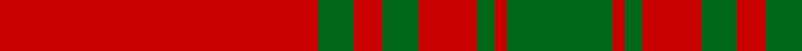
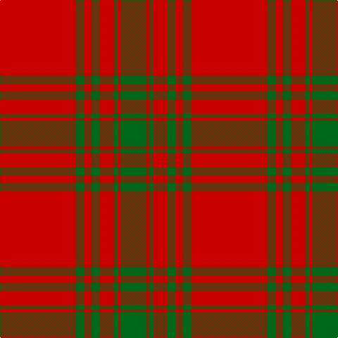

In pattern [GRGRGRGR](/stripes/grgrgrgr/).

This was sourced from tartans-authority.  It is a [8 stripe tartan](/stripes/stripes8/).

Original link http://www.tartansauthority.com/tartan-ferret/display/3615/

## Also known as

This cloth is also recorded under:

- Kyle Green

## Thread count
R/108 G12 R10 G12 R20 G6 R4 G/36

## Palette
Each colour and its ΔE from the base-6 reference it is a variant of.

| Colour | Shade | Base | ΔE (OKLab) |
|---|---|---|---|
| G | <code style="background-color:#006818;">#006818</code> `#006818` | G <code style="background-color:#006100;">#006100</code> | 0.02 |
| R | <code style="background-color:#C80000;">#C80000</code> `#C80000` | R <code style="background-color:#CC0000;">#CC0000</code> | 0.01 |

# Sample pattern

## Nearest tartans

The nearest existing variants by ΔTartan distance.

1. [Menzies Dress](/setts/s8/r36lr4r3lr4r6lr2r1lr12~x2/) — ΔT 1.11
1. [Menzies Dress](/setts/s8/r36lr4r3lr4r6lr2r1lr12/) — ΔT 1.11
1. [Cameron, Ancient](/setts/s7/r58ly3r6g16r12g16r6/) — ΔT 1.19
1. [MacKintosh, Red](/setts/s6/r24g5r3g9r3db1~x4/) — ΔT 1.21
1. [Kyle (Green)](/setts/s14/r54g6r5g6r10g3r2g18~x2/) — ΔT 1.23
1. [MacKintosh 2](/setts/s6/r48db2r3g28r4db2~x2/) — ΔT 1.38
1. [Cameron Ancient](/setts/s7/r58ly3r6dg16r12dg16r6/) — ΔT 1.40
1. [MacPherson-Grant](/setts/s11/r90k6r6k6r90g6r6g45r6k4r3/) — ΔT 1.42
1. [MacKintosh #3](/setts/s6/r48db2r3dg28r4db2~x2/) — ΔT 1.46
1. [MacQuarrie #5](/setts/s6/r16g1r1g1r4g12~x4/) — ΔT 1.49

## Neighbour map

Every grey dot is one of 14299 variants placed by the first two principal components of the ΔTartan feature space (44% of its variance). Red is this tartan; blue dots are its nearest — click one to open its page.

<svg viewBox="0 0 640 380" role="img" style="max-width:100%;height:auto;border:1px solid #e0e0e0;border-radius:4px;display:block" xmlns="http://www.w3.org/2000/svg"><image href="/nn/cloud.v1.png" width="640" height="380"/><a href="/setts/s8/r36lr4r3lr4r6lr2r1lr12~x2/"><circle cx="534.4" cy="150.0" r="4" fill="#3465a4"><title>Menzies Dress</title></circle></a><a href="/setts/s8/r36lr4r3lr4r6lr2r1lr12/"><circle cx="534.4" cy="150.0" r="4" fill="#3465a4"><title>Menzies Dress</title></circle></a><a href="/setts/s7/r58ly3r6g16r12g16r6/"><circle cx="495.9" cy="181.3" r="4" fill="#3465a4"><title>Cameron, Ancient</title></circle></a><a href="/setts/s6/r24g5r3g9r3db1~x4/"><circle cx="489.9" cy="183.7" r="4" fill="#3465a4"><title>MacKintosh, Red</title></circle></a><a href="/setts/s14/r54g6r5g6r10g3r2g18~x2/"><circle cx="504.8" cy="143.4" r="4" fill="#3465a4"><title>Kyle (Green)</title></circle></a><a href="/setts/s6/r48db2r3g28r4db2~x2/"><circle cx="466.9" cy="170.2" r="4" fill="#3465a4"><title>MacKintosh 2</title></circle></a><a href="/setts/s7/r58ly3r6dg16r12dg16r6/"><circle cx="488.9" cy="173.0" r="4" fill="#3465a4"><title>Cameron Ancient</title></circle></a><a href="/setts/s11/r90k6r6k6r90g6r6g45r6k4r3/"><circle cx="555.3" cy="129.6" r="4" fill="#3465a4"><title>MacPherson-Grant</title></circle></a><a href="/setts/s6/r48db2r3dg28r4db2~x2/"><circle cx="460.6" cy="162.7" r="4" fill="#3465a4"><title>MacKintosh #3</title></circle></a><a href="/setts/s6/r16g1r1g1r4g12~x4/"><circle cx="456.7" cy="215.1" r="4" fill="#3465a4"><title>MacQuarrie #5</title></circle></a><circle cx="536.2" cy="171.9" r="5" fill="#c00000"/></svg>

ID: /setts/s8/r54g6r5g6r10g3r2g18~x2/
