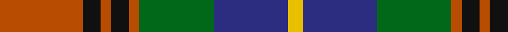

In pattern [RKRKRGBY](/patterns/rkrkrgby/).

This was sourced from register-of-tartans.  It is a [8 stripes tartan](/stripes/stripes8/).

Original link https://www.tartanregister.gov.uk/tartanDetails.aspx?ref=3785

## Register references

External register numbers recorded for this tartan.

- Scottish Register of Tartans: [3785](https://www.tartanregister.gov.uk/tartanDetails.aspx?ref=3785)
- Scottish Tartans Authority (ITI): 2654
- Scottish Tartans World Register: 2654

## Thread count
DO/56 K12 DO7 K12 DO7 G50 DB50 Y/10

## Palette
Each colour and its ΔE from the base-6 reference it is a variant of.

| Colour | Shade | Base | ΔE (OKLab) |
|---|---|---|---|
| DB | <code style="background-color:#2C2C80;">#2C2C80</code> `#2C2C80` | B <code style="background-color:#2A418A;">#2A418A</code> | 0.06 |
| DO | <code style="background-color:#B84C00;">#B84C00</code> `#B84C00` | R <code style="background-color:#CC0000;">#CC0000</code> | 0.08 |
| G | <code style="background-color:#006818;">#006818</code> `#006818` | G <code style="background-color:#006100;">#006100</code> | 0.02 |
| K | <code style="background-color:#101010;">#101010</code> `#101010` | K <code style="background-color:#000000;">#000000</code> | 0.17 |
| Y | <code style="background-color:#E8C000;">#E8C000</code> `#E8C000` | Y <code style="background-color:#F2BF00;">#F2BF00</code> | 0.02 |

# Sample pattern

## Nearest tartans

The nearest existing variants by ΔTartan distance.

1. [Akins Clan (Personal)](/setts/s8/r21ra3r3ra3r3b19g22w3~b00008b-g008000-r800000-radc143c-w87cefa~x2/) — ΔT 0.71
1. [Caledonian Brewery (Corporate)](/setts/s7/w4g13ga6r16wa2r2ga2~g003820-ga006818-r880000-wc0c0c0-waa8ace8~x2/) — ΔT 0.76
1. [Heart of the Highlands](/setts/s9/r18k3r4w3r4k18b20k2ra4~b5c5c5c-k101010-r888888-raa00048-wc0c0c0~x2/) — ΔT 0.84
1. [Akins](/setts/s8/r21ra3r3ra3r3b19g22ba3~b000050-ba8080d0-g008000-r802040-ra900030~x2/) — ΔT 0.87
1. [Canine All Dogs (Fashion)](/setts/s6/r10b6g24ba24r6y3~b2c2c80-ba1c1c50-g006818-rc80000-ye8c000/) — ΔT 0.87
1. [Coffield-Limesand (Personal)](/setts/s9/b8k1g2k1ga2k6g8k1w2~b780078-g006818-ga604000-k101010-we0e0e0~x4/) — ΔT 0.91
1. [Unidentified Canadian Tartan Tartan Number: 276. Earliest known date: 1978 This is a duplicate of 277 using ancient azure blue. See products available Copyright © Blair Urquhart, Comrie, 2015](/setts/s10/r4g7y3g12k16b5r20b5k4b2~b5c8ca8-g006818-k101010-rc80000-ye8c000~x2/) — ΔT 0.91
1. [Rattray of Lude](/setts/s10/k1g8k4r1b8r1b1r8g1w1~b2c2c80-g006818-k101010-rc80000-wfcfcfc~x4/) — ΔT 0.93
1. [Etienne-Carter, Sir George](/setts/s10/r4g6y3g12k14b5r20b5k4b2~b2c2c80-g006818-k101010-rc80000-ye8c000~x2/) — ΔT 0.93
1. [Sikh (Corporate)](/setts/s8/r30k4r3k4r3g20b20y4~b14283c-g006818-k101010-rb84c00-ye8c000~x2/) — ΔT 0.97

## Neighbour map

Every grey dot is one of 15726 variants placed by the first two principal components of the ΔTartan feature space (44% of its variance). Red is this tartan; blue dots are its nearest — click one to open its page.

<svg viewBox="0 0 640 380" role="img" style="max-width:100%;height:auto;border:1px solid #e0e0e0;border-radius:4px;display:block" xmlns="http://www.w3.org/2000/svg"><image href="/nn/cloud.v1.png" width="640" height="380"/><a href="/setts/s8/r21ra3r3ra3r3b19g22w3~b00008b-g008000-r800000-radc143c-w87cefa~x2/"><circle cx="142.9" cy="180.1" r="4" fill="#3465a4"><title>Akins Clan (Personal)</title></circle></a><a href="/setts/s7/w4g13ga6r16wa2r2ga2~g003820-ga006818-r880000-wc0c0c0-waa8ace8~x2/"><circle cx="183.5" cy="194.8" r="4" fill="#3465a4"><title>Caledonian Brewery (Corporate)</title></circle></a><a href="/setts/s9/r18k3r4w3r4k18b20k2ra4~b5c5c5c-k101010-r888888-raa00048-wc0c0c0~x2/"><circle cx="158.5" cy="171.4" r="4" fill="#3465a4"><title>Heart of the Highlands</title></circle></a><a href="/setts/s8/r21ra3r3ra3r3b19g22ba3~b000050-ba8080d0-g008000-r802040-ra900030~x2/"><circle cx="156.1" cy="187.4" r="4" fill="#3465a4"><title>Akins</title></circle></a><a href="/setts/s6/r10b6g24ba24r6y3~b2c2c80-ba1c1c50-g006818-rc80000-ye8c000/"><circle cx="139.5" cy="211.7" r="4" fill="#3465a4"><title>Canine All Dogs (Fashion)</title></circle></a><a href="/setts/s9/b8k1g2k1ga2k6g8k1w2~b780078-g006818-ga604000-k101010-we0e0e0~x4/"><circle cx="125.8" cy="181.6" r="4" fill="#3465a4"><title>Coffield-Limesand (Personal)</title></circle></a><a href="/setts/s10/r4g7y3g12k16b5r20b5k4b2~b5c8ca8-g006818-k101010-rc80000-ye8c000~x2/"><circle cx="113.5" cy="168.0" r="4" fill="#3465a4"><title>Unidentified Canadian Tartan Tartan Number: 276. Earliest known date: 1978 This is a duplicate of 277 using ancient azure blue. See products available Copyright © Blair Urquhart, Comrie, 2015</title></circle></a><a href="/setts/s10/k1g8k4r1b8r1b1r8g1w1~b2c2c80-g006818-k101010-rc80000-wfcfcfc~x4/"><circle cx="121.1" cy="163.8" r="4" fill="#3465a4"><title>Rattray of Lude</title></circle></a><a href="/setts/s10/r4g6y3g12k14b5r20b5k4b2~b2c2c80-g006818-k101010-rc80000-ye8c000~x2/"><circle cx="122.5" cy="170.7" r="4" fill="#3465a4"><title>Etienne-Carter, Sir George</title></circle></a><a href="/setts/s8/r30k4r3k4r3g20b20y4~b14283c-g006818-k101010-rb84c00-ye8c000~x2/"><circle cx="193.7" cy="173.2" r="4" fill="#3465a4"><title>Sikh (Corporate)</title></circle></a><circle cx="140.2" cy="186.1" r="5" fill="#c00000"/></svg>

ID: /setts/s8/r56k12r7k12r7g50b50y10~b2c2c80-g006818-k101010-rb84c00-ye8c000/
