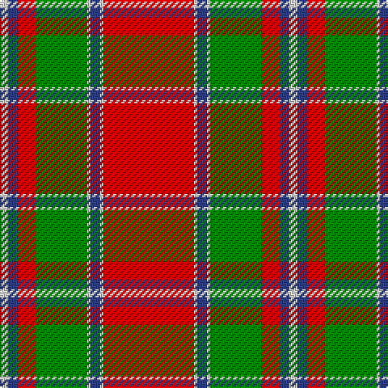

In pattern [RWBWGRBW](/patterns/rwbwgrbw/).

This was sourced from weddslist.  It is a [8 stripes tartan](/stripes/stripes8/).

Original link http://www.weddslist.com/cgi-bin/tartans/pg.pl?source=sts

## Thread count
LN/5 B6 R11 G32 LN2 B6 LN2 R/56

## Palette
Each colour and its ΔE from the base-6 reference it is a variant of.

| Colour | Shade | Base | ΔE (OKLab) |
|---|---|---|---|
| B | <code style="background-color:#304080;">#304080</code> `#304080` | B <code style="background-color:#2A418A;">#2A418A</code> | 0.02 |
| G | <code style="background-color:#008000;">#008000</code> `#008000` | G <code style="background-color:#006100;">#006100</code> | 0.10 |
| LN | <code style="background-color:#E0E0E0;">#E0E0E0</code> `#E0E0E0` | W <code style="background-color:#F7F7F7;">#F7F7F7</code> | 0.07 |
| R | <code style="background-color:#C00000;">#C00000</code> `#C00000` | R <code style="background-color:#CC0000;">#CC0000</code> | 0.03 |

# Sample pattern

## Nearest tartans

The nearest existing variants by ΔTartan distance.

1. [Spens Family Tartan Tartan Number: 1671. Earliest known date: c.1815 The Spens tartan is similar in many respects to the Perthshire District sett, which is in turn, a variation of one of the Drummond tartans. The Perthshire sett was being woven by Wilson's of Bannockburn in the early years of the nineteenth century. The name, Spens, is linked to a specimen preserved in the collection of the Highland Society of London. See products available Copyright © Blair Urquhart, Comrie, 2015](/setts/s8/r56w2b6w2g32r11b6w5~b2c2c80-g006818-rc80000-we0e0e0/) — ΔT 0.32
1. [Chisholm - 1842 (Clan)](/setts/s10/r6w1r24b6g2b1g2b1g12r1~b2c2c80-g00881c-rc80000-wfcfcfc~x2/) — ΔT 0.57
1. [Chisholm, The](/setts/s10/r6w1r24b6g2b1g2b1g12r1~b304080-g008000-rc00000-we0e0e0~x2/) — ΔT 0.71
1. [Chisholm](/setts/s10/r6w1r24b6g2b1g2b1g12r1~b2c2c80-g006818-rc80000-wfcfcfc~x2/) — ΔT 0.76
1. [Buccleuch](/setts/s7/r107k9r5b41r5g51r14~b304080-g008000-k000000-rc00000/) — ΔT 0.87
1. [Scott - 1842 (Clan)](/setts/s10/g4r3k1r28g14r4g4w3g4r4~g006818-k101010-rc80000-wfcfcfc~x2/) — ΔT 0.87
1. [MacDonell of Keppoch (artefact)](/setts/s11/r6b1r1g28r4b8w1r32g1r4g2~b2c4084-g005020-rdc0000-we0e0e0~x2/) — ΔT 0.94
1. [Carrick](/setts/s9/r28b12r3g20ba1g2ba1g2r7~b304080-ba800080-g008000-rc00000~x2/) — ΔT 0.94
1. [Scott, red](/setts/s10/g4r3k1r28g14r4g4w3g4r4~g008000-k000000-rc00000-we0e0e0~x2/) — ΔT 0.98
1. [MacDonell of Keppoch](/setts/s10/g2r2b1r24ba1b6r3g12r4b1~b304080-ba5480b0-g008000-rc00000~x2/) — ΔT 0.98

## Neighbour map

Every grey dot is one of 15726 variants placed by the first two principal components of the ΔTartan feature space (44% of its variance). Red is this tartan; blue dots are its nearest — click one to open its page.

<svg viewBox="0 0 640 380" role="img" style="max-width:100%;height:auto;border:1px solid #e0e0e0;border-radius:4px;display:block" xmlns="http://www.w3.org/2000/svg"><image href="/nn/cloud.v1.png" width="640" height="380"/><a href="/setts/s8/r56w2b6w2g32r11b6w5~b2c2c80-g006818-rc80000-we0e0e0/"><circle cx="359.9" cy="126.0" r="4" fill="#3465a4"><title>Spens Family Tartan Tartan Number: 1671. Earliest known date: c.1815 The Spens tartan is similar in many respects to the Perthshire District sett, which is in turn, a variation of one of the Drummond tartans. The Perthshire sett was being woven by Wilson's of Bannockburn in the early years of the nineteenth century. The name, Spens, is linked to a specimen preserved in the collection of the Highland Society of London. See products available Copyright © Blair Urquhart, Comrie, 2015</title></circle></a><a href="/setts/s10/r6w1r24b6g2b1g2b1g12r1~b2c2c80-g00881c-rc80000-wfcfcfc~x2/"><circle cx="356.3" cy="121.3" r="4" fill="#3465a4"><title>Chisholm - 1842 (Clan)</title></circle></a><a href="/setts/s10/r6w1r24b6g2b1g2b1g12r1~b304080-g008000-rc00000-we0e0e0~x2/"><circle cx="367.4" cy="126.8" r="4" fill="#3465a4"><title>Chisholm, The</title></circle></a><a href="/setts/s10/r6w1r24b6g2b1g2b1g12r1~b2c2c80-g006818-rc80000-wfcfcfc~x2/"><circle cx="364.4" cy="124.8" r="4" fill="#3465a4"><title>Chisholm</title></circle></a><a href="/setts/s7/r107k9r5b41r5g51r14~b304080-g008000-k000000-rc00000/"><circle cx="351.9" cy="156.1" r="4" fill="#3465a4"><title>Buccleuch</title></circle></a><a href="/setts/s10/g4r3k1r28g14r4g4w3g4r4~g006818-k101010-rc80000-wfcfcfc~x2/"><circle cx="381.8" cy="126.5" r="4" fill="#3465a4"><title>Scott - 1842 (Clan)</title></circle></a><a href="/setts/s11/r6b1r1g28r4b8w1r32g1r4g2~b2c4084-g005020-rdc0000-we0e0e0~x2/"><circle cx="374.7" cy="106.1" r="4" fill="#3465a4"><title>MacDonell of Keppoch (artefact)</title></circle></a><a href="/setts/s9/r28b12r3g20ba1g2ba1g2r7~b304080-ba800080-g008000-rc00000~x2/"><circle cx="337.6" cy="137.3" r="4" fill="#3465a4"><title>Carrick</title></circle></a><a href="/setts/s10/g4r3k1r28g14r4g4w3g4r4~g008000-k000000-rc00000-we0e0e0~x2/"><circle cx="379.6" cy="126.8" r="4" fill="#3465a4"><title>Scott, red</title></circle></a><a href="/setts/s10/g2r2b1r24ba1b6r3g12r4b1~b304080-ba5480b0-g008000-rc00000~x2/"><circle cx="395.7" cy="131.2" r="4" fill="#3465a4"><title>MacDonell of Keppoch</title></circle></a><circle cx="360.1" cy="126.9" r="5" fill="#c00000"/></svg>

ID: /setts/s8/r56w2b6w2g32r11b6w5~b304080-g008000-rc00000-we0e0e0/
