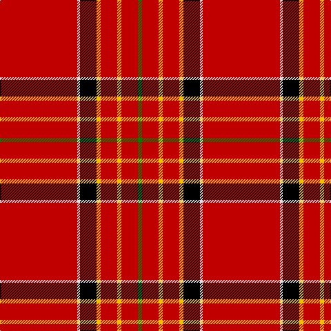

This page is one **sett** — a single exact thread-count. It belongs to the [tartan](/tartans/r56ln2k12y3r12y3r12g3/)
(the same proportion at any scale), whose colour order is pattern [GRYRYKWR](/stripes/gryrykwr/).

Sourced from weddslist.  It is a [8 stripe tartan](/stripes/stripes8/).

Original link http://www.weddslist.com/cgi-bin/tartans/pg.pl?source=sts

## Thread count
R/112 LN4 K24 Y6 R24 Y6 R24 G/6

## Palette
Each colour and the base-6 reference it is a variant of.

| Colour | Shade | Base |
|---|---|---|
| G | <code style="background-color:#008000;">#008000</code> `oklch(52.0% 0.177 142.5)` <small>#008000</small> | G <code style="background-color:#006100;">#006100</code> |
| K | <code style="background-color:#000000;">#000000</code> `oklch(0.0% 0.000 0.0)` <small>#000000</small> | K <code style="background-color:#000000;">#000000</code> |
| LN | <code style="background-color:#E0E0E0;">#E0E0E0</code> `oklch(90.7% 0.000 89.9)` <small>#E0E0E0</small> | W <code style="background-color:#F7F7F7;">#F7F7F7</code> |
| R | <code style="background-color:#C00000;">#C00000</code> `oklch(50.7% 0.208 29.2)` <small>#C00000</small> | R <code style="background-color:#CC0000;">#CC0000</code> |
| Y | <code style="background-color:#F0C000;">#F0C000</code> `oklch(82.7% 0.169 90.5)` <small>#F0C000</small> | Y <code style="background-color:#F2BF00;">#F2BF00</code> |

# Sample pattern

## Nearest tartans

The nearest existing variants by ΔTartan distance, with this tartan at the top so the swatches line up against it.

ΔTartan

Tartan

Sett

—

<a href="/ttd/edit/#slug=r56w2k12ly3r12ly3r12g3~x2">Hackston, or Halkerston</a> <a class="nn-out" href="/setts/s8/r56w2k12ly3r12ly3r12g3~x2/" title="open its dictionary page">↗</a>

0.90

<a href="/ttd/edit/#slug=r42k4w1k6ly1db1ly1r12~x2">Princess Elizabeth</a> <a class="nn-out" href="/setts/s8/r42k4w1k6ly1db1ly1r12~x2/" title="open its dictionary page">↗</a>

1.04

<a href="/ttd/edit/#slug=r48w4db4k4r12db4r1ly4~x2">Brodie (W &amp; A Smith)</a> <a class="nn-out" href="/setts/s8/r48w4db4k4r12db4r1ly4~x2/" title="open its dictionary page">↗</a>

1.05

<a href="/ttd/edit/#slug=r72k6lb2k11ly2db2ly2r18~x2">Princess Elizabeth (Royal)</a> <a class="nn-out" href="/setts/s8/r72k6lb2k11ly2db2ly2r18~x2/" title="open its dictionary page">↗</a>

1.09

<a href="/ttd/edit/#slug=r48lb4db4k4r12db4r1ly4">Brodie</a> <a class="nn-out" href="/setts/s8/r48lb4db4k4r12db4r1ly4/" title="open its dictionary page">↗</a>

1.13

<a href="/ttd/edit/#slug=r48w3k3g2ly6g2r6~x4">Ferguson the Astronomer</a> <a class="nn-out" href="/setts/s7/r48w3k3g2ly6g2r6~x4/" title="open its dictionary page">↗</a>

1.16

<a href="/ttd/edit/#slug=r100db10w5db14ly4db8ly4r24">Earl of Inverness (Royal)</a> <a class="nn-out" href="/setts/s8/r100db10w5db14ly4db8ly4r24/" title="open its dictionary page">↗</a>

1.25

<a href="/ttd/edit/#slug=r51lr2k11lo3r11lo3r11g3~x2">Hackston (Green stripe) (Portrait)</a> <a class="nn-out" href="/setts/s8/r51lr2k11lo3r11lo3r11g3~x2/" title="open its dictionary page">↗</a>

1.29

<a href="/ttd/edit/#slug=w2k2t2ly2k2r7k1r12k2r6w1r23k1~x2">Wilding, Michael John (Personal)</a> <a class="nn-out" href="/setts/s13/w2k2t2ly2k2r7k1r12k2r6w1r23k1~x2/" title="open its dictionary page">↗</a>

1.30

<a href="/ttd/edit/#slug=r48lr4db4k4r12db4r1ly4~x2">Brodie</a> <a class="nn-out" href="/setts/s8/r48lr4db4k4r12db4r1ly4~x2/" title="open its dictionary page">↗</a>

1.30

<a href="/ttd/edit/#slug=r48lr4db4k4r12db4r1ly4">Brodie</a> <a class="nn-out" href="/setts/s8/r48lr4db4k4r12db4r1ly4/" title="open its dictionary page">↗</a>

## Neighbour map

Every grey dot is one of 14299 variants placed by the first two principal components of the ΔTartan feature space (44% of its variance). Red is this tartan; blue dots are its nearest — click one to open its page.

<svg viewBox="0 0 640 380" role="img" style="max-width:100%;height:auto;border:1px solid #e0e0e0;border-radius:4px;display:block" xmlns="http://www.w3.org/2000/svg"><image href="/nn/cloud.v1.png" width="640" height="380"/><a href="/setts/s8/r42k4w1k6ly1db1ly1r12~x2/"><circle cx="544.7" cy="72.2" r="4" fill="#3465a4"><title>Princess Elizabeth</title></circle></a><a href="/setts/s8/r48w4db4k4r12db4r1ly4~x2/"><circle cx="499.0" cy="65.9" r="4" fill="#3465a4"><title>Brodie (W &amp; A Smith)</title></circle></a><a href="/setts/s8/r72k6lb2k11ly2db2ly2r18~x2/"><circle cx="551.5" cy="84.7" r="4" fill="#3465a4"><title>Princess Elizabeth (Royal)</title></circle></a><a href="/setts/s8/r48lb4db4k4r12db4r1ly4/"><circle cx="504.0" cy="68.1" r="4" fill="#3465a4"><title>Brodie</title></circle></a><a href="/setts/s7/r48w3k3g2ly6g2r6~x4/"><circle cx="518.9" cy="98.7" r="4" fill="#3465a4"><title>Ferguson the Astronomer</title></circle></a><a href="/setts/s8/r100db10w5db14ly4db8ly4r24/"><circle cx="484.7" cy="99.6" r="4" fill="#3465a4"><title>Earl of Inverness (Royal)</title></circle></a><a href="/setts/s8/r51lr2k11lo3r11lo3r11g3~x2/"><circle cx="522.8" cy="115.3" r="4" fill="#3465a4"><title>Hackston (Green stripe) (Portrait)</title></circle></a><a href="/setts/s13/w2k2t2ly2k2r7k1r12k2r6w1r23k1~x2/"><circle cx="477.7" cy="95.1" r="4" fill="#3465a4"><title>Wilding, Michael John (Personal)</title></circle></a><a href="/setts/s8/r48lr4db4k4r12db4r1ly4~x2/"><circle cx="517.7" cy="81.3" r="4" fill="#3465a4"><title>Brodie</title></circle></a><a href="/setts/s8/r48lr4db4k4r12db4r1ly4/"><circle cx="517.7" cy="81.3" r="4" fill="#3465a4"><title>Brodie</title></circle></a><circle cx="499.5" cy="95.7" r="5" fill="#c00000"/></svg>

ID: /setts/s8/r56w2k12ly3r12ly3r12g3~x2/
