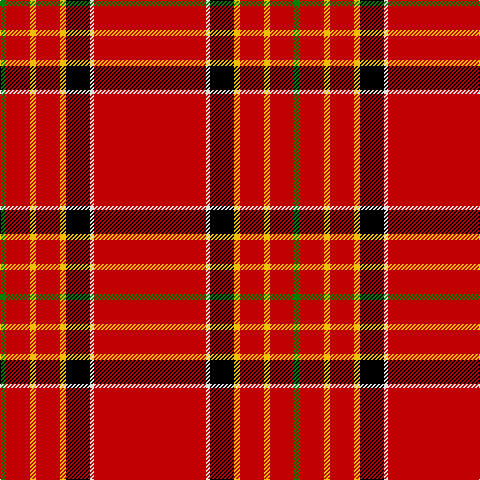

In pattern [GRYRYKWR](/patterns/gryrykwr/).

This was sourced from weddslist.  It is a [8 stripes tartan](/stripes/stripes8/).

Original link http://www.weddslist.com/cgi-bin/tartans/pg.pl?source=sts

## Thread count
G/6 R24 Y6 R24 Y6 K24 LN4 R/112

## Palette
Each colour and its ΔE from the base-6 reference it is a variant of.

| Colour | Shade | Base | ΔE (OKLab) |
|---|---|---|---|
| G | <code style="background-color:#008000;">#008000</code> `#008000` | G <code style="background-color:#006100;">#006100</code> | 0.10 |
| K | <code style="background-color:#000000;">#000000</code> `#000000` | K <code style="background-color:#000000;">#000000</code> | 0.00 |
| LN | <code style="background-color:#E0E0E0;">#E0E0E0</code> `#E0E0E0` | W <code style="background-color:#F7F7F7;">#F7F7F7</code> | 0.07 |
| R | <code style="background-color:#C00000;">#C00000</code> `#C00000` | R <code style="background-color:#CC0000;">#CC0000</code> | 0.03 |
| Y | <code style="background-color:#F0C000;">#F0C000</code> `#F0C000` | Y <code style="background-color:#F2BF00;">#F2BF00</code> | 0.00 |

# Sample pattern

## Nearest tartans

The nearest existing variants by ΔTartan distance.

1. [Princess Elizabeth](/setts/s8/r42k4w1k6y1b1y1r12x2~b304080-k000000-rc00000-we0e0e0-yf0c000/) — ΔT 0.90
1. [Ferguson, Plaid](/setts/s7/r48w3k3g2y6g2r6x4~g008000-k000000-rc00000-we0e0e0-yf0c000/) — ΔT 0.91
1. [Brodie (W & A Smith)](/setts/s8/r48w4b4k4r12b4r1y4x2~b000048-k000000-rc80000-wfcfcfc-ydcbc00/) — ΔT 1.04
1. [Princess Elizabeth (Royal)](/setts/s8/r72k6w2k11y2b2y2r18x2~b2c2c80-k101010-rc80000-wc0c0c0-ye8c000/) — ΔT 1.05
1. [Brodie](/setts/s8/r48w4b4k4r12b4r1y4~b000080-k000000-rc80000-wd0d0d0-yffc800/) — ΔT 1.09
1. [Brodie, of that Ilk and the Burn](/setts/s8/r48w4b4k4r12b4r1y4x2~b304080-k000000-rc00000-we0e0e0-yf0c000/) — ΔT 1.12
1. [Ferguson the Astronomer](/setts/s7/r48w3k3g2y6g2r6x4~g006818-k101010-rc80000-wfcfcfc-ye8c000/) — ΔT 1.13
1. [Earl of Inverness (Royal)](/setts/s8/r100b10w5b14y4ba8y4r24~b1c1c50-ba2c2c80-rc80000-we0e0e0-ye8c000/) — ΔT 1.16
1. [Princess Elizabeth Royal Family Tartan Tartan Number: 1613. Earliest known date: pre 2003 Also Earl of Inverness See products available Copyright © Blair Urquhart, Comrie, 2015](/setts/s8/r42k4w1k6y1b1y1r12x2~b2c2c80-k101010-rc80000-we0e0e0-ye8c000/) — ΔT 1.20
1. [Hackston (Green stripe) (Portrait)](/setts/s8/r51y2k11ya3r11ya3r11g3x2~g006818-k101010-rc80000-yb8b8b8-yabc8c00/) — ΔT 1.26

## Neighbour map

Every grey dot is one of 15726 variants placed by the first two principal components of the ΔTartan feature space (44% of its variance). Red is this tartan; blue dots are its nearest — click one to open its page.

<svg viewBox="0 0 640 380" role="img" style="max-width:100%;height:auto;border:1px solid #e0e0e0;border-radius:4px;display:block" xmlns="http://www.w3.org/2000/svg"><image href="/nn/cloud.v1.png" width="640" height="380"/><a href="/setts/s8/r42k4w1k6y1b1y1r12x2~b304080-k000000-rc00000-we0e0e0-yf0c000/"><circle cx="546.3" cy="81.9" r="4" fill="#3465a4"><title>Princess Elizabeth</title></circle></a><a href="/setts/s7/r48w3k3g2y6g2r6x4~g008000-k000000-rc00000-we0e0e0-yf0c000/"><circle cx="513.7" cy="105.5" r="4" fill="#3465a4"><title>Ferguson, Plaid</title></circle></a><a href="/setts/s8/r48w4b4k4r12b4r1y4x2~b000048-k000000-rc80000-wfcfcfc-ydcbc00/"><circle cx="500.4" cy="75.0" r="4" fill="#3465a4"><title>Brodie (W &amp; A Smith)</title></circle></a><a href="/setts/s8/r72k6w2k11y2b2y2r18x2~b2c2c80-k101010-rc80000-wc0c0c0-ye8c000/"><circle cx="553.4" cy="92.2" r="4" fill="#3465a4"><title>Princess Elizabeth (Royal)</title></circle></a><a href="/setts/s8/r48w4b4k4r12b4r1y4~b000080-k000000-rc80000-wd0d0d0-yffc800/"><circle cx="505.4" cy="76.7" r="4" fill="#3465a4"><title>Brodie</title></circle></a><a href="/setts/s8/r48w4b4k4r12b4r1y4x2~b304080-k000000-rc00000-we0e0e0-yf0c000/"><circle cx="515.4" cy="80.6" r="4" fill="#3465a4"><title>Brodie, of that Ilk and the Burn</title></circle></a><a href="/setts/s7/r48w3k3g2y6g2r6x4~g006818-k101010-rc80000-wfcfcfc-ye8c000/"><circle cx="520.9" cy="106.5" r="4" fill="#3465a4"><title>Ferguson the Astronomer</title></circle></a><a href="/setts/s8/r100b10w5b14y4ba8y4r24~b1c1c50-ba2c2c80-rc80000-we0e0e0-ye8c000/"><circle cx="486.1" cy="105.9" r="4" fill="#3465a4"><title>Earl of Inverness (Royal)</title></circle></a><a href="/setts/s8/r42k4w1k6y1b1y1r12x2~b2c2c80-k101010-rc80000-we0e0e0-ye8c000/"><circle cx="569.5" cy="88.0" r="4" fill="#3465a4"><title>Princess Elizabeth Royal Family Tartan Tartan Number: 1613. Earliest known date: pre 2003 Also Earl of Inverness See products available Copyright © Blair Urquhart, Comrie, 2015</title></circle></a><a href="/setts/s8/r51y2k11ya3r11ya3r11g3x2~g006818-k101010-rc80000-yb8b8b8-yabc8c00/"><circle cx="524.9" cy="120.9" r="4" fill="#3465a4"><title>Hackston (Green stripe) (Portrait)</title></circle></a><circle cx="501.0" cy="105.1" r="5" fill="#c00000"/></svg>

ID: /setts/s8/r56w2k12y3r12y3r12g3x2~g008000-k000000-rc00000-we0e0e0-yf0c000/
