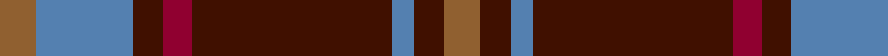
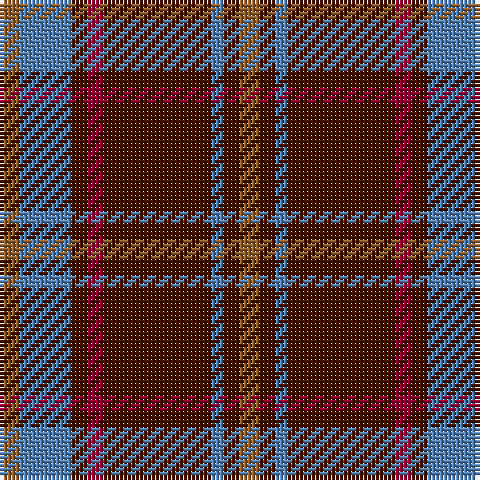

In pattern [RBBBRBBR](/patterns/rbbbrbbr/).

This was sourced from weddslist.  It is a [8 stripes tartan](/stripes/stripes8/).

Original link http://www.weddslist.com/cgi-bin/tartans/pg.pl?source=sts

## Thread count
LT/5 B13 DR4 DRa4 DR27 B3 DR4 LT/5

## Palette
Each colour and its ΔE from the base-6 reference it is a variant of.

| Colour | Shade | Base | ΔE (OKLab) |
|---|---|---|---|
| B | <code style="background-color:#5480B0;">#5480B0</code> `#5480B0` | B <code style="background-color:#2C4084;">#2C4084</code> | 0.20 |
| DR | <code style="background-color:#401000;">#401000</code> `#401000` | B <code style="background-color:#2C4084;">#2C4084</code> | 0.23 |
| DRa | <code style="background-color:#900030;">#900030</code> `#900030` | R <code style="background-color:#C80000;">#C80000</code> | 0.13 |
| LT | <code style="background-color:#906030;">#906030</code> `#906030` | R <code style="background-color:#C80000;">#C80000</code> | 0.15 |

# Sample pattern

## Nearest tartans

The nearest existing variants by ΔTartan distance.

1. [Daks (Blue Loden)](/setts/s8/y6b14ba4r4ba28b4ba4y6-b5c8ca8-ba441800-ra00048-ya08858/) — ΔT 0.78
1. [Balfour #2](/setts/s6/b36y4g12y4g38r6-b2c2c80-g604000-rc80000-ye8c000/) — ΔT 0.87
1. [Balfour (Clan)](/setts/s6/b72y8g24y8g76r12-b2c2c80-g604000-rc80000-ye8c000/) — ΔT 0.87
1. [Fraser Green](/setts/s6/w8b48g24b4ba24b4-b4c0000-ba5c5c5c-g447438-wc0c0c0/) — ΔT 1.05
1. [Montrose (Macnaughton variation)](/setts/s9/b4k4r48g48k24b20r48k4b4-b1c0070-g006818-k101010-r880000/) — ΔT 1.06
1. [Fraser VS](/setts/s6/r2b12r2g12r24y2-b000052-g11450d-raa0000-yaaaaaa/) — ΔT 1.07
1. [Swedish Para Whisky Club (Corporate](/setts/s6/b8g56w12b52y4b8-b680028-g003820-w98c8e8-yc4bc68/) — ΔT 1.08
1. [Gates](/setts/s9/b48r6b8r12g16r6g16r60k6-b2c2c80-g006818-k101010-rc80000/) — ΔT 1.09
1. [Invertere, (Daks)](/setts/s8/r5g12ra4b4ra22g3ra4r5-b000050-g003000-r900030-ra906030/) — ΔT 1.10
1. [Unidentified Plaid #15](/setts/s10/r8b6r64ba60r8g64r6g64r6g6-b3c82af-ba2c4084-g005020-rdc0000/) — ΔT 1.11

## Neighbour map

Every grey dot is one of 15726 variants placed by the first two principal components of the ΔTartan feature space (44% of its variance). Red is this tartan; blue dots are its nearest — click one to open its page.

<svg viewBox="0 0 640 380" role="img" style="max-width:100%;height:auto;border:1px solid #e0e0e0;border-radius:4px;display:block" xmlns="http://www.w3.org/2000/svg"><image href="/nn/cloud.v1.png" width="640" height="380"/><a href="/setts/s8/y6b14ba4r4ba28b4ba4y6-b5c8ca8-ba441800-ra00048-ya08858/"><circle cx="265.6" cy="205.0" r="4" fill="#3465a4"><title>Daks (Blue Loden)</title></circle></a><a href="/setts/s6/b36y4g12y4g38r6-b2c2c80-g604000-rc80000-ye8c000/"><circle cx="295.9" cy="216.1" r="4" fill="#3465a4"><title>Balfour #2</title></circle></a><a href="/setts/s6/b72y8g24y8g76r12-b2c2c80-g604000-rc80000-ye8c000/"><circle cx="295.9" cy="216.1" r="4" fill="#3465a4"><title>Balfour (Clan)</title></circle></a><a href="/setts/s6/w8b48g24b4ba24b4-b4c0000-ba5c5c5c-g447438-wc0c0c0/"><circle cx="287.0" cy="209.8" r="4" fill="#3465a4"><title>Fraser Green</title></circle></a><a href="/setts/s9/b4k4r48g48k24b20r48k4b4-b1c0070-g006818-k101010-r880000/"><circle cx="270.5" cy="195.1" r="4" fill="#3465a4"><title>Montrose (Macnaughton variation)</title></circle></a><a href="/setts/s6/r2b12r2g12r24y2-b000052-g11450d-raa0000-yaaaaaa/"><circle cx="298.0" cy="196.3" r="4" fill="#3465a4"><title>Fraser VS</title></circle></a><a href="/setts/s6/b8g56w12b52y4b8-b680028-g003820-w98c8e8-yc4bc68/"><circle cx="310.9" cy="197.0" r="4" fill="#3465a4"><title>Swedish Para Whisky Club (Corporate</title></circle></a><a href="/setts/s9/b48r6b8r12g16r6g16r60k6-b2c2c80-g006818-k101010-rc80000/"><circle cx="268.9" cy="178.4" r="4" fill="#3465a4"><title>Gates</title></circle></a><a href="/setts/s8/r5g12ra4b4ra22g3ra4r5-b000050-g003000-r900030-ra906030/"><circle cx="284.3" cy="221.4" r="4" fill="#3465a4"><title>Invertere, (Daks)</title></circle></a><a href="/setts/s10/r8b6r64ba60r8g64r6g64r6g6-b3c82af-ba2c4084-g005020-rdc0000/"><circle cx="263.7" cy="181.2" r="4" fill="#3465a4"><title>Unidentified Plaid #15</title></circle></a><circle cx="306.0" cy="199.8" r="5" fill="#c00000"/></svg>

ID: /setts/s8/r5b13ba4ra4ba27b3ba4r5-b5480b0-ba401000-r906030-ra900030/
