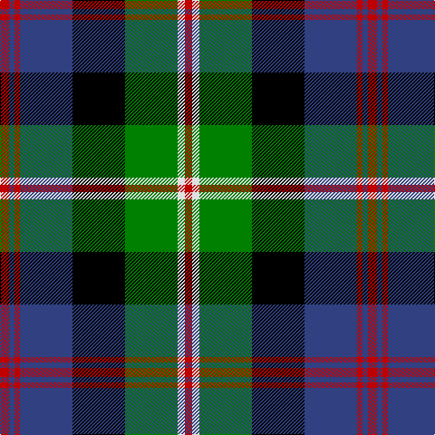

In pattern [RBRBKGWR](/patterns/rbrbkgwr/).

This was sourced from weddslist.  It is a [8 stripes tartan](/stripes/stripes8/).

Original link http://www.weddslist.com/cgi-bin/tartans/pg.pl?source=sts

## Thread count
R/10 B6 R6 B58 K58 G58 LN8 R/8

## Palette
Each colour and its ΔE from the base-6 reference it is a variant of.

| Colour | Shade | Base | ΔE (OKLab) |
|---|---|---|---|
| B | <code style="background-color:#304080;">#304080</code> `#304080` | B <code style="background-color:#2A418A;">#2A418A</code> | 0.02 |
| G | <code style="background-color:#008000;">#008000</code> `#008000` | G <code style="background-color:#006100;">#006100</code> | 0.10 |
| K | <code style="background-color:#000000;">#000000</code> `#000000` | K <code style="background-color:#000000;">#000000</code> | 0.00 |
| LN | <code style="background-color:#E0E0E0;">#E0E0E0</code> `#E0E0E0` | W <code style="background-color:#F7F7F7;">#F7F7F7</code> | 0.07 |
| R | <code style="background-color:#C00000;">#C00000</code> `#C00000` | R <code style="background-color:#CC0000;">#CC0000</code> | 0.03 |

# Sample pattern

## Nearest tartans

The nearest existing variants by ΔTartan distance.

1. [MacDonald of Borrodale (Clan)](/setts/s8/r6b3r3b32k30g30y3r3~b2c2c80-g006818-k000000-rc80000-ye8c000~x2/) — ΔT 0.60
1. [Colquhoun](/setts/s7/r2g8w1k8b8k1b1~b304080-g008000-k000000-rc00000-we0e0e0~x4/) — ΔT 0.63
1. [Offally](/setts/s10/r7b2g5b18g10b2k24b2g10y3~b304080-g008000-k000000-r900030-yf0c000~x2/) — ΔT 0.67
1. [MacLeod, Macleod of Harris](/setts/s7/r3k2g15k10b20k2y2~b304080-g008000-k000000-rc00000-yf0c000~x2/) — ΔT 0.74
1. [Unnamed, No 22](/setts/s11/b2k1b1ba2g8r2k8ba2b1k1b2~b5480b0-ba304080-g008000-k000000-rc00000~x2/) — ΔT 0.82
1. [Grant, hunting](/setts/s11/b11k2b2k2b2k11g11r2g3k1y3~b304080-g008000-k000000-rc00000-yf0c000~x2/) — ΔT 0.82
1. [MacLaren](/setts/s11/b22k4b4k4b4k22g22r6g6k2y3~b304080-g008000-k000000-rc00000-yf0c000~x2/) — ΔT 0.82
1. [Argyll / MacCorquodale](/setts/s7/b2k1g8k8ba8k1r2~b5480b0-ba304080-g008000-k000000-rc00000~x2/) — ΔT 0.84
1. [Biskup](/setts/s10/b12r4b18r2k19g18r4g3y2g8~b304080-g008000-k000000-rc00000-yf0c000~x2/) — ΔT 0.87
1. [Nelson Mandela (Personal)](/setts/s7/b27g5y8k20y3g15r3~b202060-g006818-k101010-rc80000-ye8c000~x2/) — ΔT 0.89

## Neighbour map

Every grey dot is one of 15726 variants placed by the first two principal components of the ΔTartan feature space (44% of its variance). Red is this tartan; blue dots are its nearest — click one to open its page.

<svg viewBox="0 0 640 380" role="img" style="max-width:100%;height:auto;border:1px solid #e0e0e0;border-radius:4px;display:block" xmlns="http://www.w3.org/2000/svg"><image href="/nn/cloud.v1.png" width="640" height="380"/><a href="/setts/s8/r6b3r3b32k30g30y3r3~b2c2c80-g006818-k000000-rc80000-ye8c000~x2/"><circle cx="134.7" cy="165.9" r="4" fill="#3465a4"><title>MacDonald of Borrodale (Clan)</title></circle></a><a href="/setts/s7/r2g8w1k8b8k1b1~b304080-g008000-k000000-rc00000-we0e0e0~x4/"><circle cx="106.7" cy="191.7" r="4" fill="#3465a4"><title>Colquhoun</title></circle></a><a href="/setts/s10/r7b2g5b18g10b2k24b2g10y3~b304080-g008000-k000000-r900030-yf0c000~x2/"><circle cx="114.8" cy="158.8" r="4" fill="#3465a4"><title>Offally</title></circle></a><a href="/setts/s7/r3k2g15k10b20k2y2~b304080-g008000-k000000-rc00000-yf0c000~x2/"><circle cx="147.6" cy="179.0" r="4" fill="#3465a4"><title>MacLeod, Macleod of Harris</title></circle></a><a href="/setts/s11/b2k1b1ba2g8r2k8ba2b1k1b2~b5480b0-ba304080-g008000-k000000-rc00000~x2/"><circle cx="100.8" cy="161.2" r="4" fill="#3465a4"><title>Unnamed, No 22</title></circle></a><a href="/setts/s11/b11k2b2k2b2k11g11r2g3k1y3~b304080-g008000-k000000-rc00000-yf0c000~x2/"><circle cx="115.9" cy="155.3" r="4" fill="#3465a4"><title>Grant, hunting</title></circle></a><a href="/setts/s11/b22k4b4k4b4k22g22r6g6k2y3~b304080-g008000-k000000-rc00000-yf0c000~x2/"><circle cx="123.7" cy="155.8" r="4" fill="#3465a4"><title>MacLaren</title></circle></a><a href="/setts/s7/b2k1g8k8ba8k1r2~b5480b0-ba304080-g008000-k000000-rc00000~x2/"><circle cx="108.3" cy="198.4" r="4" fill="#3465a4"><title>Argyll / MacCorquodale</title></circle></a><a href="/setts/s10/b12r4b18r2k19g18r4g3y2g8~b304080-g008000-k000000-rc00000-yf0c000~x2/"><circle cx="113.0" cy="175.5" r="4" fill="#3465a4"><title>Biskup</title></circle></a><a href="/setts/s7/b27g5y8k20y3g15r3~b202060-g006818-k101010-rc80000-ye8c000~x2/"><circle cx="118.0" cy="194.2" r="4" fill="#3465a4"><title>Nelson Mandela (Personal)</title></circle></a><circle cx="110.5" cy="167.2" r="5" fill="#c00000"/></svg>

ID: /setts/s8/r5b3r3b29k29g29w4r4~b304080-g008000-k000000-rc00000-we0e0e0~x2/
