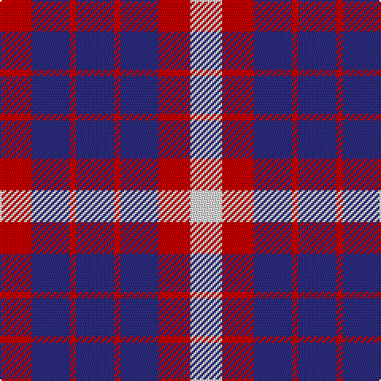

In pattern [RBRBRBRW](/stripes/rbrbrbrw/).

This was sourced from register-of-tartans.  It is a [8 stripe tartan](/stripes/stripes8/).

Original link https://www.tartanregister.gov.uk/tartanDetails.aspx?ref=4184

## Register references

External register numbers recorded for this tartan.

- Scottish Register of Tartans: [4184](https://www.tartanregister.gov.uk/tartanDetails.aspx?ref=4184)
- Scottish Tartans Authority (ITI): 4068

## Thread count
R/20 DB24 R4 DB24 R4 DB24 R20 LN/20

## Palette
Each colour and the base-6 reference it is a variant of.

| Colour | Shade | Base |
|---|---|---|
| DB | <code style="background-color:#2C2C80;">#2C2C80</code> `oklch(35.0% 0.138 276.6)` <small>#2C2C80</small> | B <code style="background-color:#2A418A;">#2A418A</code> |
| LN | <code style="background-color:#E0E0E0;">#E0E0E0</code> `oklch(90.7% 0.000 89.9)` <small>#E0E0E0</small> | W <code style="background-color:#F7F7F7;">#F7F7F7</code> |
| R | <code style="background-color:#C80000;">#C80000</code> `oklch(52.3% 0.215 29.2)` <small>#C80000</small> | R <code style="background-color:#CC0000;">#CC0000</code> |

# Sample pattern

## Nearest tartans

The nearest existing variants by ΔTartan distance.

1. [Coronation](/setts/s7/db7w1r7db4r2db4w2~x2/) — ΔT 0.90
1. [U.S. Coast Guard (Corporate)](/setts/s5/db6r1db6r5w5~x4/) — ΔT 1.13
1. [Johore Regiment](/setts/s8/db20k5db18lo26k6~x2/) — ΔT 1.58
1. [Fiddes (Artefact)](/setts/s11/db18g5db6r25db6r5db5r6db18r12g16~x2/) — ΔT 1.61
1. [Edinburgh Marketing](/setts/s8/db6r1db1r2w1r2db1r3~x4/) — ΔT 1.66
1. [Johore Regiment (Military)](/setts/s5/db20k5db18lo26k6~x2/) — ΔT 1.71
1. [Commonwealth Games 1986](/setts/s10/db6w2r6w3k2w6db10r2db3r2~x4/) — ΔT 1.76
1. [Commonwealth, Games 1986](/setts/s10/db12w4r12w5k4w12db20r4db5r4~x2/) — ΔT 1.77
1. [Hamilton (Clan)](/setts/s5/db8r2db8r15w2~x4/) — ΔT 1.80
1. [Little of Morton Rigg](/setts/s10/k4w4k4w4k4r8k2r8k8lo1~x4/) — ΔT 1.81

## Neighbour map

Every grey dot is one of 14299 variants placed by the first two principal components of the ΔTartan feature space (44% of its variance). Red is this tartan; blue dots are its nearest — click one to open its page.

<svg viewBox="0 0 640 380" role="img" style="max-width:100%;height:auto;border:1px solid #e0e0e0;border-radius:4px;display:block" xmlns="http://www.w3.org/2000/svg"><image href="/nn/cloud.v1.png" width="640" height="380"/><a href="/setts/s7/db7w1r7db4r2db4w2~x2/"><circle cx="276.7" cy="242.7" r="4" fill="#3465a4"><title>Coronation</title></circle></a><a href="/setts/s5/db6r1db6r5w5~x4/"><circle cx="212.0" cy="276.8" r="4" fill="#3465a4"><title>U.S. Coast Guard (Corporate)</title></circle></a><a href="/setts/s8/db20k5db18lo26k6~x2/"><circle cx="196.0" cy="251.8" r="4" fill="#3465a4"><title>Johore Regiment</title></circle></a><a href="/setts/s11/db18g5db6r25db6r5db5r6db18r12g16~x2/"><circle cx="207.5" cy="237.6" r="4" fill="#3465a4"><title>Fiddes (Artefact)</title></circle></a><a href="/setts/s8/db6r1db1r2w1r2db1r3~x4/"><circle cx="260.9" cy="220.1" r="4" fill="#3465a4"><title>Edinburgh Marketing</title></circle></a><a href="/setts/s5/db20k5db18lo26k6~x2/"><circle cx="227.3" cy="274.6" r="4" fill="#3465a4"><title>Johore Regiment (Military)</title></circle></a><a href="/setts/s10/db6w2r6w3k2w6db10r2db3r2~x4/"><circle cx="143.2" cy="204.1" r="4" fill="#3465a4"><title>Commonwealth Games 1986</title></circle></a><a href="/setts/s10/db12w4r12w5k4w12db20r4db5r4~x2/"><circle cx="153.2" cy="206.4" r="4" fill="#3465a4"><title>Commonwealth, Games 1986</title></circle></a><a href="/setts/s5/db8r2db8r15w2~x4/"><circle cx="295.5" cy="245.1" r="4" fill="#3465a4"><title>Hamilton (Clan)</title></circle></a><a href="/setts/s10/k4w4k4w4k4r8k2r8k8lo1~x4/"><circle cx="179.2" cy="209.7" r="4" fill="#3465a4"><title>Little of Morton Rigg</title></circle></a><circle cx="223.5" cy="253.5" r="5" fill="#c00000"/></svg>

ID: /setts/s8/r5db6r1db6r1db6r5w5~x4/
