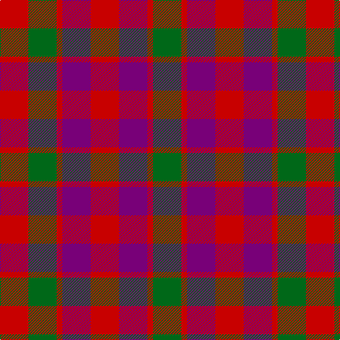

This page is one **sett** — a single exact thread-count. It belongs to the [tartan](/tartans/r5dp5r1g5r5/)
(the same proportion at any scale), whose colour order is pattern [GRBRBRGR](/stripes/grbrbrgr/).

Sourced from register-of-tartans.  It is a [8 stripe tartan](/stripes/stripes8/).

Original link https://www.tartanregister.gov.uk/tartanDetails.aspx?ref=1473

## Register references

External register numbers recorded for this tartan.

- Scottish Register of Tartans: [1473](https://www.tartanregister.gov.uk/tartanDetails.aspx?ref=1473)
- Scottish Tartans Authority (ITI): 1390
- Scottish Tartans World Register: 1390

## Thread count
R/40 G40 R8 P40 R40 P40 R8 G/40

## Palette

Palette: <strong>Tartan Register</strong>
<table><thead><tr><th>Colour</th><th>Threads</th><th>Shade</th><th>Base</th><th>OKLCh</th></tr></thead><tbody><tr><td>R/</td><td style="text-align:right;font-variant-numeric:tabular-nums">40</td><td><code style="background-color:#C80000;">#C80000</code> <small style="color:#888">#C80000</small></td><td>R <code style="background-color:#CC0000;">#CC0000</code></td><td><small style="color:#888">oklch(52.3% 0.215 29.2)</small></td></tr><tr><td>G</td><td style="text-align:right;font-variant-numeric:tabular-nums">40</td><td><code style="background-color:#006818;">#006818</code> <small style="color:#888">#006818</small></td><td>G <code style="background-color:#006100;">#006100</code></td><td><small style="color:#888">oklch(45.0% 0.142 145.0)</small></td></tr><tr><td>R</td><td style="text-align:right;font-variant-numeric:tabular-nums">8</td><td><code style="background-color:#C80000;">#C80000</code> <small style="color:#888">#C80000</small></td><td>R <code style="background-color:#CC0000;">#CC0000</code></td><td><small style="color:#888">oklch(52.3% 0.215 29.2)</small></td></tr><tr><td>P</td><td style="text-align:right;font-variant-numeric:tabular-nums">40</td><td><code style="background-color:#780078;">#780078</code> <small style="color:#888">#780078</small></td><td>B <code style="background-color:#2A418A;">#2A418A</code></td><td><small style="color:#888">oklch(40.2% 0.185 328.4)</small></td></tr><tr><td>R</td><td style="text-align:right;font-variant-numeric:tabular-nums">40</td><td><code style="background-color:#C80000;">#C80000</code> <small style="color:#888">#C80000</small></td><td>R <code style="background-color:#CC0000;">#CC0000</code></td><td><small style="color:#888">oklch(52.3% 0.215 29.2)</small></td></tr><tr><td>P</td><td style="text-align:right;font-variant-numeric:tabular-nums">40</td><td><code style="background-color:#780078;">#780078</code> <small style="color:#888">#780078</small></td><td>B <code style="background-color:#2A418A;">#2A418A</code></td><td><small style="color:#888">oklch(40.2% 0.185 328.4)</small></td></tr><tr><td>R</td><td style="text-align:right;font-variant-numeric:tabular-nums">8</td><td><code style="background-color:#C80000;">#C80000</code> <small style="color:#888">#C80000</small></td><td>R <code style="background-color:#CC0000;">#CC0000</code></td><td><small style="color:#888">oklch(52.3% 0.215 29.2)</small></td></tr><tr><td>G/</td><td style="text-align:right;font-variant-numeric:tabular-nums">40</td><td><code style="background-color:#006818;">#006818</code> <small style="color:#888">#006818</small></td><td>G <code style="background-color:#006100;">#006100</code></td><td><small style="color:#888">oklch(45.0% 0.142 145.0)</small></td></tr></tbody></table>

# Sample pattern

## Nearest tartans

The nearest existing variants by ΔTartan distance, with this tartan at the top so the swatches line up against it.

ΔTartan

Tartan

Sett

—

<a href="/ttd/edit/#slug=r5dp5r1g5r5~x8">Gow (Portrait)</a> <a class="nn-out" href="/setts/s8/r5dp5r1g5r5~x8/" title="open its dictionary page">↗</a>

0.89

<a href="/setts/s8/r4dg4r1db4r4~x12/">Gow</a>

1.14

<a href="/ttd/edit/#slug=dg16r12db16r6db4r6db7r20db8dg8db12~x2">Fiddes #2</a> <a class="nn-out" href="/setts/s11/dg16r12db16r6db4r6db7r20db8dg8db12~x2/" title="open its dictionary page">↗</a>

1.23

<a href="/setts/s8/dg6dp6y1r6dg6r6y1dp6~x4/">Wilson's No.223</a>

1.25

<a href="/ttd/edit/#slug=g16r12db16r6db4r6db7r20db8g8db12~x2">Fiddes</a> <a class="nn-out" href="/setts/s11/g16r12db16r6db4r6db7r20db8g8db12~x2/" title="open its dictionary page">↗</a>

1.49

<a href="/ttd/edit/#slug=dg14db8dg14r14k3r14~x2">Tulsa, City of</a> <a class="nn-out" href="/setts/s6/dg14db8dg14r14k3r14~x2/" title="open its dictionary page">↗</a>

1.63

<a href="/ttd/edit/#slug=g12r11dp12r3dp8g8dp8~x2">Fiddes (Corrected)</a> <a class="nn-out" href="/setts/s7/g12r11dp12r3dp8g8dp8~x2/" title="open its dictionary page">↗</a>

1.65

<a href="/ttd/edit/#slug=dg3dp3dg19dp18r19dp3~x2">MacNab (Macgregor - Hastie)</a> <a class="nn-out" href="/setts/s6/dg3dp3dg19dp18r19dp3~x2/" title="open its dictionary page">↗</a>

1.68

<a href="/ttd/edit/#slug=r10db6k8dg10r6dg3r6~x2">MacDuff #3</a> <a class="nn-out" href="/setts/s7/r10db6k8dg10r6dg3r6~x2/" title="open its dictionary page">↗</a>

1.71

<a href="/ttd/edit/#slug=do16k13do13r30lo4~x2">Highland Pub Company</a> <a class="nn-out" href="/setts/s5/do16k13do13r30lo4~x2/" title="open its dictionary page">↗</a>

1.71

<a href="/ttd/edit/#slug=r3dg3r3dg10db10r3db3r3~x2">Flora MacDonald</a> <a class="nn-out" href="/setts/s8/r3dg3r3dg10db10r3db3r3~x2/" title="open its dictionary page">↗</a>

## Neighbour map

Every grey dot is one of 14299 variants placed by the first two principal components of the ΔTartan feature space (44% of its variance). Red is this tartan; blue dots are its nearest — click one to open its page.

<svg viewBox="0 0 640 380" role="img" style="max-width:100%;height:auto;border:1px solid #e0e0e0;border-radius:4px;display:block" xmlns="http://www.w3.org/2000/svg"><image href="/nn/cloud.v1.png" width="640" height="380"/><a href="/setts/s8/r4dg4r1db4r4~x12/"><circle cx="170.8" cy="295.3" r="4" fill="#3465a4"><title>Gow</title></circle></a><a href="/setts/s11/dg16r12db16r6db4r6db7r20db8dg8db12~x2/"><circle cx="192.8" cy="262.5" r="4" fill="#3465a4"><title>Fiddes #2</title></circle></a><a href="/setts/s8/dg6dp6y1r6dg6r6y1dp6~x4/"><circle cx="142.7" cy="255.5" r="4" fill="#3465a4"><title>Wilson's No.223</title></circle></a><a href="/setts/s11/g16r12db16r6db4r6db7r20db8g8db12~x2/"><circle cx="195.3" cy="265.8" r="4" fill="#3465a4"><title>Fiddes</title></circle></a><a href="/setts/s6/dg14db8dg14r14k3r14~x2/"><circle cx="182.4" cy="290.0" r="4" fill="#3465a4"><title>Tulsa, City of</title></circle></a><a href="/setts/s7/g12r11dp12r3dp8g8dp8~x2/"><circle cx="150.2" cy="281.0" r="4" fill="#3465a4"><title>Fiddes (Corrected)</title></circle></a><a href="/setts/s6/dg3dp3dg19dp18r19dp3~x2/"><circle cx="226.3" cy="251.0" r="4" fill="#3465a4"><title>MacNab (Macgregor - Hastie)</title></circle></a><a href="/setts/s7/r10db6k8dg10r6dg3r6~x2/"><circle cx="136.2" cy="289.3" r="4" fill="#3465a4"><title>MacDuff #3</title></circle></a><a href="/setts/s5/do16k13do13r30lo4~x2/"><circle cx="218.2" cy="256.0" r="4" fill="#3465a4"><title>Highland Pub Company</title></circle></a><a href="/setts/s8/r3dg3r3dg10db10r3db3r3~x2/"><circle cx="175.3" cy="275.0" r="4" fill="#3465a4"><title>Flora MacDonald</title></circle></a><circle cx="188.0" cy="279.0" r="5" fill="#c00000"/></svg>

ID: /setts/s8/r5dp5r1g5r5~x8/
