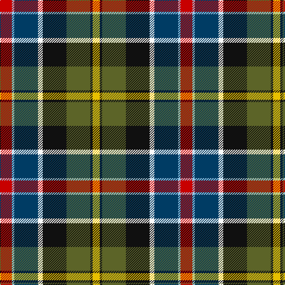

This page is one **sett** — a single exact thread-count. It belongs to the [tartan](/tartans/r5lb1dt10w2k10y10k1ly3/)
(the same proportion at any scale), whose colour order is pattern [RWBWKGKY](/stripes/rwbwkgky/).

Sourced from register-of-tartans.  It is a [8 stripe tartan](/stripes/stripes8/).

Original link https://www.tartanregister.gov.uk/tartanDetails.aspx?ref=5495

## Also known as

This cloth is also recorded under:

- Culloden
- Culloden 1746

2 attestations — the source records this cloth was collapsed from (oldest owns this page)

<ul>
<li>01/01/1746 — Culloden 1746 - Original (register-of-tartans, <a href="https://www.tartanregister.gov.uk/tartanDetails.aspx?ref=5495">record</a>)</li>
<li>1746 — Culloden - 1746 (Original) (tartans-authority, <a href="http://www.tartansauthority.com/tartan-ferret/display/7422/">record</a>)</li>
</ul>

## Register references

External register numbers recorded for this tartan.

- Scottish Register of Tartans: [5495](https://www.tartanregister.gov.uk/tartanDetails.aspx?ref=5495)
- Scottish Tartans Authority (ITI): 7422

## Thread count
R/20 LB4 DB40 W8 K40 G40 K4 Y/12

## Palette

Palette: <strong>Tartan Register</strong>
<table><thead><tr><th>Colour</th><th>Threads</th><th>Shade</th><th>Base</th><th>OKLCh</th></tr></thead><tbody><tr><td>R/</td><td style="text-align:right;font-variant-numeric:tabular-nums">20</td><td><code style="background-color:#C80000;">#C80000</code> <small style="color:#888">#C80000</small></td><td>R <code style="background-color:#CC0000;">#CC0000</code></td><td><small style="color:#888">oklch(52.3% 0.215 29.2)</small></td></tr><tr><td>LB</td><td style="text-align:right;font-variant-numeric:tabular-nums">4</td><td><code style="background-color:#98C8E8;">#98C8E8</code> <small style="color:#888">#98C8E8</small></td><td>W <code style="background-color:#F7F7F7;">#F7F7F7</code></td><td><small style="color:#888">oklch(81.0% 0.068 237.9)</small></td></tr><tr><td>DB</td><td style="text-align:right;font-variant-numeric:tabular-nums">40</td><td><code style="background-color:#003C64;">#003C64</code> <small style="color:#888">#003C64</small></td><td>B <code style="background-color:#2A418A;">#2A418A</code></td><td><small style="color:#888">oklch(34.5% 0.089 246.0)</small></td></tr><tr><td>W</td><td style="text-align:right;font-variant-numeric:tabular-nums">8</td><td><code style="background-color:#FCFCFC;">#FCFCFC</code> <small style="color:#888">#FCFCFC</small></td><td>W <code style="background-color:#F7F7F7;">#F7F7F7</code></td><td><small style="color:#888">oklch(99.1% 0.000 89.9)</small></td></tr><tr><td>K</td><td style="text-align:right;font-variant-numeric:tabular-nums">40</td><td><code style="background-color:#101010;">#101010</code> <small style="color:#888">#101010</small></td><td>K <code style="background-color:#000000;">#000000</code></td><td><small style="color:#888">oklch(17.3% 0.000 89.9)</small></td></tr><tr><td>G</td><td style="text-align:right;font-variant-numeric:tabular-nums">40</td><td><code style="background-color:#5C6428;">#5C6428</code> <small style="color:#888">#5C6428</small></td><td>G <code style="background-color:#006100;">#006100</code></td><td><small style="color:#888">oklch(48.3% 0.084 116.0)</small></td></tr><tr><td>K</td><td style="text-align:right;font-variant-numeric:tabular-nums">4</td><td><code style="background-color:#101010;">#101010</code> <small style="color:#888">#101010</small></td><td>K <code style="background-color:#000000;">#000000</code></td><td><small style="color:#888">oklch(17.3% 0.000 89.9)</small></td></tr><tr><td>Y/</td><td style="text-align:right;font-variant-numeric:tabular-nums">12</td><td><code style="background-color:#E8C000;">#E8C000</code> <small style="color:#888">#E8C000</small></td><td>Y <code style="background-color:#F2BF00;">#F2BF00</code></td><td><small style="color:#888">oklch(81.9% 0.168 93.7)</small></td></tr></tbody></table>

# Sample pattern

## Nearest tartans

The nearest existing variants by ΔTartan distance, with this tartan at the top so the swatches line up against it.

ΔTartan

Tartan

Sett

—

<a href="/ttd/edit/#slug=r5lb1dt10w2k10y10k1ly3~x4">Culloden 1746 - Original</a> <a class="nn-out" href="/setts/s8/r5lb1dt10w2k10y10k1ly3~x4/" title="open its dictionary page">↗</a>

0.72

<a href="/ttd/edit/#slug=k2t6k1db7g13w1k11r14ly2~x2">Teall of Teallach (Personal)</a> <a class="nn-out" href="/setts/s9/k2t6k1db7g13w1k11r14ly2~x2/" title="open its dictionary page">↗</a>

0.78

<a href="/ttd/edit/#slug=k2t6k1db7dg13w1k11r14ly2~x2">Teall of Teallach</a> <a class="nn-out" href="/setts/s9/k2t6k1db7dg13w1k11r14ly2~x2/" title="open its dictionary page">↗</a>

0.90

<a href="/ttd/edit/#slug=r4dy12k12dy1o12ly1k3w2k1b4~x2">Campbell Hunting</a> <a class="nn-out" href="/setts/s10/r4dy12k12dy1o12ly1k3w2k1b4~x2/" title="open its dictionary page">↗</a>

0.97

<a href="/ttd/edit/#slug=r4ly3g12k16dy5db20k4w2~x2">Iowa (District)</a> <a class="nn-out" href="/setts/s8/r4ly3g12k16dy5db20k4w2~x2/" title="open its dictionary page">↗</a>

0.99

<a href="/ttd/edit/#slug=r4w1r4dg10ly1k10t4k2t4~x4">Comyn/Cumming</a> <a class="nn-out" href="/setts/s9/r4w1r4dg10ly1k10t4k2t4~x4/" title="open its dictionary page">↗</a>

1.02

<a href="/ttd/edit/#slug=dt8t1db1t1m12ly6k12w2~x4">Maryland</a> <a class="nn-out" href="/setts/s8/dt8t1db1t1m12ly6k12w2~x4/" title="open its dictionary page">↗</a>

1.04

<a href="/ttd/edit/#slug=k7r22t9dp20lb2g28ly7~x2">Jefferson (Personal)</a> <a class="nn-out" href="/setts/s7/k7r22t9dp20lb2g28ly7~x2/" title="open its dictionary page">↗</a>

1.04

<a href="/ttd/edit/#slug=w3dbi4dg8k5db20g3ly13g4w2~x2">Armagh County Crest (Fashion)</a> <a class="nn-out" href="/setts/s9/w3dbi4dg8k5db20g3ly13g4w2~x2/" title="open its dictionary page">↗</a>

1.05

<a href="/ttd/edit/#slug=w2db3r6k8g12lo1db4k2w2~x2">National (1934), The</a> <a class="nn-out" href="/setts/s9/w2db3r6k8g12lo1db4k2w2~x2/" title="open its dictionary page">↗</a>

1.07

<a href="/ttd/edit/#slug=db20t6k8ly2k4w4k4dg13r7k4r3w2~x2">Stuart/Stewart Black #3</a> <a class="nn-out" href="/setts/s12/db20t6k8ly2k4w4k4dg13r7k4r3w2~x2/" title="open its dictionary page">↗</a>

## Neighbour map

Every grey dot is one of 14359 variants placed by the first two principal components of the ΔTartan feature space (44% of its variance). Red is this tartan; blue dots are its nearest — click one to open its page.

<svg viewBox="0 0 640 380" role="img" style="max-width:100%;height:auto;border:1px solid #e0e0e0;border-radius:4px;display:block" xmlns="http://www.w3.org/2000/svg"><image href="/nn/cloud.v1.png" width="640" height="380"/><a href="/setts/s9/k2t6k1db7g13w1k11r14ly2~x2/"><circle cx="60.9" cy="129.6" r="4" fill="#3465a4"><title>Teall of Teallach (Personal)</title></circle></a><a href="/setts/s9/k2t6k1db7dg13w1k11r14ly2~x2/"><circle cx="61.9" cy="129.6" r="4" fill="#3465a4"><title>Teall of Teallach</title></circle></a><a href="/setts/s10/r4dy12k12dy1o12ly1k3w2k1b4~x2/"><circle cx="88.9" cy="123.1" r="4" fill="#3465a4"><title>Campbell Hunting</title></circle></a><a href="/setts/s8/r4ly3g12k16dy5db20k4w2~x2/"><circle cx="81.8" cy="157.8" r="4" fill="#3465a4"><title>Iowa (District)</title></circle></a><a href="/setts/s9/r4w1r4dg10ly1k10t4k2t4~x4/"><circle cx="85.9" cy="163.7" r="4" fill="#3465a4"><title>Comyn/Cumming</title></circle></a><a href="/setts/s8/dt8t1db1t1m12ly6k12w2~x4/"><circle cx="68.2" cy="126.4" r="4" fill="#3465a4"><title>Maryland</title></circle></a><a href="/setts/s7/k7r22t9dp20lb2g28ly7~x2/"><circle cx="74.3" cy="148.9" r="4" fill="#3465a4"><title>Jefferson (Personal)</title></circle></a><a href="/setts/s9/w3dbi4dg8k5db20g3ly13g4w2~x2/"><circle cx="50.0" cy="132.0" r="4" fill="#3465a4"><title>Armagh County Crest (Fashion)</title></circle></a><a href="/setts/s9/w2db3r6k8g12lo1db4k2w2~x2/"><circle cx="74.6" cy="146.9" r="4" fill="#3465a4"><title>National (1934), The</title></circle></a><a href="/setts/s12/db20t6k8ly2k4w4k4dg13r7k4r3w2~x2/"><circle cx="37.9" cy="129.6" r="4" fill="#3465a4"><title>Stuart/Stewart Black #3</title></circle></a><circle cx="44.1" cy="148.8" r="5" fill="#c00000"/></svg>

ID: /setts/s8/r5lb1dt10w2k10y10k1ly3~x4/
